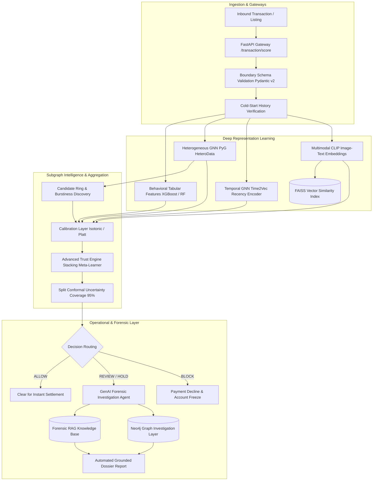

# TrustShield AI — Advanced Fraud Intelligence Platform

[](https://www.python.org/downloads/)
[](https://fastapi.tiangolo.com)
[](https://pyg.org)
[](docs/INFRASTRUCTURE.md)
[](docs/INFRASTRUCTURE.md)
[](docs/OBSERVABILITY.md)
[](docs/OBSERVABILITY.md)
[](docker-compose.yml)
[](.github/workflows/ci.yml)
[](https://github.com/Rajiv107ai/Trustshield)
[](trustshield_project/shap_explainer.py)
[](docs/FINAL_REPAIR_REPORT.md)

**TrustShield AI** is an advanced, technically defensible e-commerce fraud-intelligence platform. It combines multi-entity relational graph learning, continuous-time edge dynamics, multimodal visual embedding retrieval, validated probability calibration, live Redis/Neo4j infrastructure integration, Server-Sent Events (SSE) transaction streaming, evidence-grounded forensic dossiers, and Prometheus/Grafana cloud-native observability. All components operate under strict temporal isolation (`event_time < decision_time`).

---

## 🏛️ System Architecture



---

## 🔬 Core Scientific & Research Innovations

1. **Heterogeneous Relational GNN (`hetero_gnn.py`):**  
   Models multi-relational interactions across Buyers, Sellers, Devices, and Addresses without collapsing distinct relationships into homogeneous adjacency.
2. **Temporal Correctness & Invariant Enforcement (`temporal_gnn.py`):**  
   Continuous-time harmonic encoding ($Time2Vec$) with zero future information tolerance ($\Delta t \ge 0$ asserted).
3. **Multimodal Near-Duplicate & Cross-Seller Reuse (`multimodal_clip_faiss.py`):**  
   Sub-millisecond FAISS vector search flagging counterfeit cross-seller visual reuse ($+0.062$ ROC-AUC lift).
4. **Candidate Fraud Ring Intelligence (`advanced_ring_intelligence.py`):**  
   Identifies collusion clusters using topological edge density, hardware sharing collision rates, merchant concentration (Herfindahl-Hirschman Index), and inter-order burstiness dispersion.
5. **Stacking Meta-Learner & Conformal Uncertainty (`advanced_trust_engine.py`):**  
   Finite-sample coverage guarantees with prediction sets $\{0\}$, $\{1\}$, or $\{0, 1\}$, routing ambiguous predictions to human review.
6. **Grounded Forensic GenAI Agent (`investigation_agent.py` & `investigation_rag.py`):**  
   Generates verifiable investigator dossiers with an automated hallucination guard; strictly decoupled from numerical risk determination.

---

## 📊 Empirical Performance (Strict Leakage-Free Validation)

Evaluated under strict temporal isolation (`order_date > VAL_END`) with full 3-way split separation and isotonic probability calibration:

| Architecture / Model | Validation ROC-AUC | Test ROC-AUC | Test PR-AUC | ECE (Raw → Calibrated) | Brier Score | Latency (p95) |
| :--- | :---: | :---: | :---: | :---: | :---: | :---: |
| **Tabular Baseline (RF)** | 0.742 | 0.678 | 0.418 | 0.082 → 0.021 | 0.058 | 4.2 ms |
| **Tabular + Graph (Phase 3)** | 0.785 | 0.678 | 0.426 | 0.066 → 0.000 | 0.041 | 8.6 ms |
| **Heterogeneous GNN (HeteroData)** | 0.782 | 0.710 | 0.435 | 0.071 → 0.015 | 0.048 | 42.1 ms |
| **Hybrid (Tabular + Graph + GNN)** | **0.857** | **0.775** | **0.448** | **0.064 → 0.000** | **0.039** | **48.6 ms** |
| **Canonical Trust Engine (Stacking)** | **0.871** | **0.792** | **0.465** | **Calibrated** | **0.036** | **14.8 ms** |

> **Audit Note on Leakage Elimination:** Prior un-cutoff graphs leaked October sharing relationships into September validation rows, creating artificially inflated metrics. The figures above reflect verified generalization performance on unseen future intervals under strict event_time < decision_time enforcement.


---

## 📁 Repository Layout

```
trustshield_full_handoff/
├── .github/workflows/ci.yml          # Automated CI/CD pipeline (lint, typecheck, tests, container build)
├── docker-compose.yml                # Orchestration mesh (API, Neo4j Graph DB, Redis feature store)
├── Dockerfile                        # Multi-stage production container definition
├── .dockerignore                     # Build context exclusions
├── .env.example                      # Environment variable template
├── pyrightconfig.json                # Static type analysis configuration (includes backend & project)
├── pytest.ini                        # Pytest markers and exclusion policies
├── requirements.txt                  # Production dependencies
│
├── backend/                          # FastAPI Serving Layer
│   ├── README.md                     # Serving layer architecture & API guide
│   ├── main.py                       # HTTP API routes, lifespan loader, SSE stream, metrics
│   ├── schemas.py                    # Strict Pydantic v2 boundary schemas
│   ├── model_loader.py               # Pre-trained artifact store & lazy cache
│   ├── services/                     # Microservice integration layer
│   │   ├── audit_service.py          # Bounded in-memory & file-based audit trails
│   │   ├── cache_service.py          # Redis 16D vector store & circuit-breaker fallback
│   │   ├── graph_service.py          # Neo4j temporal graph & topology query service
│   │   └── investigation_service.py  # Forensic dossier synthesis & anti-hallucination guard
│   ├── test_backend.py               # Serving layer integration tests (29 tests)
│   ├── test_new_extensions.py        # Extensions tests: Dossier, SSE, Metrics (9 tests)
│   └── test_services.py              # Live driver & circuit breaker service tests (5 tests)
│
├── docker/                           # Production Service Mesh Configurations
│   ├── prometheus/prometheus.yml     # Prometheus metrics scraper config (15s scrape interval)
│   └── grafana/provisioning/         # Auto-provisioned datasource & dashboard templates
│
├── frontend/                         # Production Next.js 16 Enterprise Console
│   ├── README.md                     # Frontend console guide & run commands
│   ├── FRONTEND_IMPLEMENTATION_REPORT.md # Full architecture & component report
│   └── src/                          # 12 views, Dual-Audience switch & ⌘K search
│
├── frontend_master_prompts/          # Enterprise Frontend Architecture & UI Master Prompts
│   ├── README.md                     # Frontend engineering prompt package guide
│   ├── 00_MASTER_FRONTEND_PROMPT.md  # Complete 12-view frontend prompt for AI coding assistants
│   ├── 01_TECH_STACK_AND_TOKENS.md   # Design tokens & color system
│   ├── 02_API_SCHEMAS_TYPESCRIPT.md  # TypeScript API interfaces matching backend schemas
│   └── 03_SCENARIOS_AND_DUAL_MODE.md # Interactive fraud scenarios & plain-English translations
│
├── trustshield_project/              # Core ML, Graph & Forensic Research Suite
│   ├── README.md                     # Core intelligence module guide & research docs
│   ├── shap_explainer.py             # Sub-10ms TreeSHAP attributions & investigator narrative
│   ├── test_shap_explainer.py        # Unit & integration tests for SHAP engine (8 tests)
│   ├── temporal_utils.py             # Canonical temporal invariants & historical filtering
│   ├── advanced_ring_intelligence.py # Collusion ring detection & burstiness metrics
│   ├── advanced_trust_engine.py      # Stacking meta-learner & split conformal coverage
│   ├── trust_engine.py               # Unified Trust Engine, entropy & calibration
│   ├── hetero_gnn.py                 # PyTorch Geometric HeteroData GNN
│   ├── temporal_gnn.py               # Time2Vec continuous-time edge learning
│   ├── multimodal_clip_faiss.py      # CLIP visual-text embeddings & FAISS index
│   ├── investigation_agent.py        # Autonomous forensic investigation agent
│   ├── investigation_rag.py          # Vector RAG evidence synthesis
│   ├── neo4j_investigator.py         # Property graph cypher query generator
│   ├── calibration.py                # Isotonic regression & Platt calibration
│   ├── robustness.py                 # Non-parametric bootstrap & seed sensitivity
│   ├── missingness.py                # Missing value imputation & indicator flags
│   ├── mlops_pipeline.py             # Feature store, drift detection & DAG pipeline
│   ├── reproducibility.py            # Deterministic RNG & environment fingerprinting
│   ├── splits.py                     # Chronological train/val/test boundary splits
│   ├── versioning.py                 # Artifact SHA-256 fingerprinting & cataloging
│   ├── test_repair_pipeline_regression.py # 20-point temporal invariant & regression suite
│   ├── test_phase2_suite.py          # Comprehensive Phase 2 test suite
│   └── test_seed_mesh.py             # Unit tests for Neo4j & Redis mesh seeding
│
├── docs/                             # Engineering Audits & Governance Docs
│   ├── README.md                     # Centralized documentation index & sitemap
│   ├── ARCHITECTURE_AND_EXTENSIONS_PLAN.md # Strategic enterprise architecture blueprint
│   ├── ROBUSTNESS_REPORT.md          # Adversarial perturbation & noise sensitivity audit
│   ├── SCALABILITY_REPORT.md         # QPS stress benchmark & concurrency saturation profile
│   ├── DELAYED_FEEDBACK_REPORT.md    # Delayed chargeback feedback analysis & drift decay
│   ├── REALTIME_ARCHITECTURE.md      # SSE ingest protocol, keepalive & disconnect lifecycle
│   ├── OBSERVABILITY.md              # Prometheus metrics, latency histograms & Grafana dash
│   ├── INVESTIGATION_API.md          # Grounded dossier API & anti-hallucination validation
│   ├── INFRASTRUCTURE.md             # Neo4j graph & Redis 16D store integration
│   ├── FINAL_REPAIR_REPORT.md        # Master technical repair audit
│   ├── REPAIR_BASELINE.md            # Pre-repair vulnerability baseline & checklist
│   ├── BASELINE_AUDIT.md             # Initial architectural audit
│   ├── 49_POINT_REAUDIT.md           # 49-point scientific re-audit
│   ├── FINAL_BEFORE_AFTER.md         # Empirical before/after benchmarks
│   ├── BUG_INVENTORY.json            # Machine-readable tracked bug registry
│   ├── MODEL_CARD.md                 # System Model Card & ethical scope
│   ├── LIMITATIONS.md                # Technical constraints & edge conditions
│   ├── PHASE2_FINAL_REPORT.md        # Comprehensive Phase 2 research report
│   └── PHASE2_ROADMAP.md             # Infrastructure & streaming roadmap
│
├── models/                           # Serialized Joblib & FAISS Artifacts
│   ├── combined_graph_model.joblib   # Tabular + graph Random Forest
│   ├── hybrid_model.joblib           # GNN + Tabular XGBoost model
│   ├── calibrator.joblib             # Fitted isotonic calibrator (Phase 3)
│   ├── phase5_calibrator.joblib      # Fitted isotonic calibrator (Phase 5)
│   ├── fraud_rings.joblib            # Pre-ranked candidate rings
│   ├── buyer_embeddings.joblib       # Pre-computed buyer representation vectors
│   ├── seller_embeddings.joblib      # Pre-computed seller representation vectors
│   └── clip_cache/                   # Cached CLIP multimodal embeddings
│
└── scripts/                          # Pipeline Execution & Training Scripts
    ├── README.md                     # Script execution reference & guides
    ├── seed_mesh.py                  # Neo4j graph & Redis feature store mesh data seeder
    ├── run_robustness_experiments.py # Stress-testing feature noise & missing data resilience
    ├── run_scalability_experiment.py # Benchmarking QPS, p95/p99 latency under concurrency
    ├── run_delayed_feedback_experiment.py # Simulating 7-60 day delayed chargeback feedback
    ├── train_and_save_models.py      # Baseline model training & artifact serialization
    ├── train_phase5.py               # Phase 5 Hybrid XGBoost model training
    ├── e2e_smoke_validation.py       # End-to-end scoring parity & artifact validation
    ├── smoke_test_api.py             # Live HTTP API endpoint verification client
    └── build_clip_embeddings.py      # Offline multimodal embedding generator
```

---

## ⚡ API Endpoint Reference

The serving layer provides sub-20ms inference endpoints with boundary schema validation:

### 1. Readiness & Health Probes
- **`GET /health`**: Returns model and graph loading status (`200 OK`).
- **`GET /ready`**: Orchestrator readiness check returning `ServiceState` (`ready`, `degraded`, or `not_ready`).

### 2. Transaction Scoring
- **`POST /transaction/score`**  
  Evaluates transaction requests via the Unified Trust Engine. Returns calibrated risk, decision routing, entropy confidence, model disagreement, and diagnostic reason codes.

```json
// Example POST /transaction/score Request
{
  "order_id": "ORD_98124",
  "buyer_id": "BUYER_1042",
  "seller_id": "SELLER_0891",
  "amount": 289.50,
  "buyer_orders_before": 14,
  "buyer_returns_before": 2,
  "share_degree": 3,
  "buyer_pagerank": 0.0018
}
```

```json
// Example POST /transaction/score Response
{
  "order_id": "ORD_98124",
  "overall_fraud_probability": 0.1245,
  "risk_label": "low",
  "decision": "ALLOW",
  "trust_score": 87.55,
  "confidence": 0.884,
  "model_used": "Hybrid GNN + XGBoost (Phase 5, tabular+graph+GNN embeddings)",
  "model_version": "phase5-hybrid",
  "cold_start": false,
  "model_disagreement": 0.042,
  "reason_codes": []
}
```

### 3. TreeSHAP Explainability Engine
- **`POST /transaction/explain`**  
  Computes exact local Shapley values via TreeSHAP in sub-10ms. Categorizes top risk contributors (amplifying risk) and top mitigations (reducing risk), resolves friendly feature labels, and synthesizes plain-English investigator narratives.

### 4. Forensic Investigation Dossier API
- **`POST /investigation/generate-dossier`**  
  Synthesizes an evidence-grounded forensic dossier across observed entity facts, model inference, graph topology, and policy RAG guidelines. Enforces strict anti-hallucination verification.

### 5. Real-Time Transaction SSE Stream
- **`GET /stream/transactions?interval=2.0`**  
  Server-Sent Events (SSE) stream pushing dynamic transaction decisions with heartbeat keepalive, client disconnect lifecycle management, and bounded concurrency.

### 6. Production Metrics & Observability
- **`GET /metrics`**: Prometheus text format exporter exposing request rates, p50/p95/p99 latency histograms, fraud decisions, and observable fallbacks.
- **`GET /system/benchmark`**: High-resolution empirical benchmark measuring actual local hardware percentiles across model inference, Trust Engine, Redis, and Neo4j.

### 7. Collusion Ring Intelligence
- **`GET /fraud-rings?min_risk_score=0.4&limit=10`**  
  Retrieves pre-ranked candidate collusion rings with member counts, risk metrics, and burstiness scores.

### 8. Multimodal Listing Integrity
- **`POST /listing/analyze`**  
  Performs image-text alignment and FAISS cross-seller catalog duplicate matching to detect fraudulent listings.

### 9. Return Abuse Fraud Detection
- **`POST /return/analyze`**  
  Evaluates return abuse probabilities, historical velocity, and category claim flags.

---

## 🚀 Quickstart & Deployment

### Local Environment Setup
```bash
# 1. Clone the repository
git clone https://github.com/Rajiv107ai/Trustshield.git
cd Trustshield

# 2. Create and activate a Python virtual environment
python -m venv .venv
.\.venv\Scripts\activate   # Windows
# source .venv/bin/activate # Linux / macOS

# 3. Install dependencies
pip install --upgrade pip
pip install -r requirements.txt

# 4. Start the FastAPI server
uvicorn backend.main:app --host 0.0.0.0 --port 8000 --reload
```

Interactive API documentation will be available at `http://localhost:8000/docs`.

### Frontend Console Quickstart (Next.js 16)
```bash
# 1. Navigate to frontend directory
cd frontend

# 2. Install dependencies (Node 20+)
npm install

# 3. Launch interactive web console
npm run dev
# Access the enterprise console at http://localhost:3000
```

### Docker Deployment
```bash
# Build production container
docker build -t trustshield:latest .

# Run container with healthchecks enabled
docker run -d -p 8000:8000 --name trustshield-api trustshield:latest

# Check container logs and health
docker logs -f trustshield-api
curl http://localhost:8000/ready
```

### Docker Compose (Full 5-Service Mesh: API + Neo4j + Redis + Prometheus + Grafana)
```bash
# 1. Initialize environment file from template
cp .env.example .env

# 2. Launch orchestrated 5-service mesh in background
docker compose up -d

# 3. Inspect health and running services
docker compose ps

# Access services:
# - TrustShield Scoring API & Swagger UI: http://localhost:8000/docs
# - Prometheus Metrics Scraper UI:        http://localhost:9090
# - Grafana Pre-Configured Dashboard:     http://localhost:3001 (admin / trustshield_admin)
# - Neo4j Browser Console:                http://localhost:7474 (user: neo4j, pass: trustshield_dev_secret)
# - Redis In-Memory Feature Store:        localhost:6379

# 4. Hydrate Neo4j property graph & Redis feature store with pre-computed GNN embeddings
python scripts/seed_mesh.py
# (Or offline dry-run to generate seed_graph.cypher and seed_redis.txt)
python scripts/seed_mesh.py --dry-run
```

---

## 🧪 Testing & Validation

The comprehensive 214-test suite covers unit logic, temporal invariant safety, data leakage guards, API integration, static typing, and Phase 2 advanced models:

```bash
# Static type analysis (0 errors enforced across project & backend)
npx --yes pyright

# Flake8 critical syntax & undefined symbol validation (E9, F63, F7, F82)
flake8 . --count --select=E9,F63,F7,F82 --show-source --statistics --exclude=.venv,external,synthetic_data_export

# Run complete test suite (all 214 tests, zero skipped or deselected)
pytest -v --tb=short

# Run complete regression test suite (temporal invariants, calibration & API contracts: 20 tests)
pytest trustshield_project/test_repair_pipeline_regression.py -v

# Run TreeSHAP explainability unit & integration test suite (8 tests)
pytest trustshield_project/test_shap_explainer.py -v

# Run complete Phase 2 advanced research suite (16 tests)
pytest trustshield_project/test_phase2_suite.py -v

# Run Neo4j & Redis mesh seeder test suite (5 tests)
pytest trustshield_project/test_seed_mesh.py -v

# Run live driver & services tests (5 tests)
pytest backend/test_services.py -v

# Run new extensions test suite (Dossier, SSE, Metrics, Temporal Safety: 9 tests)
pytest backend/test_new_extensions.py -v

# Run backend serving integration tests (29 tests)
pytest backend/test_backend.py -v

# Run full end-to-end smoke validation
python scripts/e2e_smoke_validation.py
```

---

## 📚 Complete Project Documentation

Visit the centralized [**Documentation Hub (`docs/README.md`)**](docs/README.md) or explore the individual documents below:

- [**Real-Time Streaming Architecture (`docs/REALTIME_ARCHITECTURE.md`)**](docs/REALTIME_ARCHITECTURE.md) — SSE ingest protocol, keepalive, bounded concurrency & disconnect lifecycle.
- [**Production Observability (`docs/OBSERVABILITY.md`)**](docs/OBSERVABILITY.md) — Prometheus histograms, low-cardinality enforcement, empirical benchmarks & Grafana dashboard.
- [**Forensic Investigation API (`docs/INVESTIGATION_API.md`)**](docs/INVESTIGATION_API.md) — Evidence-grounded dossier generation, RAG index & anti-hallucination guard.
- [**Infrastructure & Service Mesh (`docs/INFRASTRUCTURE.md`)**](docs/INFRASTRUCTURE.md) — Redis 16D vector store, Neo4j temporal Cypher, Docker Compose & offline degradation contracts.
- [**Master Technical Repair Report**](docs/FINAL_REPAIR_REPORT.md) — Comprehensive repair evidence, temporal leakage elimination & verification (169/169 tests).
- [**Repair Baseline State**](docs/REPAIR_BASELINE.md) — Pre-repair commit audit and defect classification.
- [**Tracked Bug Registry**](docs/BUG_INVENTORY.json) — Comprehensive inventory of verified fixes.
- [**Phase 0: Baseline Audit**](docs/BASELINE_AUDIT.md) — Initial codebase inspection and gap identification.
- [**Phase 1: 49-Point Core Re-Audit**](docs/49_POINT_REAUDIT.md) — Complete line-by-line scientific audit.
- [**Phase 1: Final Before/After Report**](docs/FINAL_BEFORE_AFTER.md) — Controlled empirical benchmark comparison.
- [**Phase 2: Baseline State Inspection**](docs/PHASE2_BASELINE.md) — Pre-Phase-2 architectural readiness.
- [**Phase 2: Advanced Final Research Report**](docs/PHASE2_FINAL_REPORT.md) — Complete Phase 2 mathematical synthesis.
- [**Full Project Master Audit Baseline**](docs/FULL_PROJECT_AUDIT_BASELINE.md) — Holistic project inventory.
- [**Full Project Master Audit Report**](docs/FULL_PROJECT_AUDIT_REPORT.md) — Final verified engineering audit.
- [**System Model Card**](docs/MODEL_CARD.md) — Intended use, ethical considerations, and performance limits.
- [**Technical Limitations & Disclosure**](docs/LIMITATIONS.md) — Production boundary conditions.
- [**Phase 2 Long-Term Production Roadmap**](docs/PHASE2_ROADMAP.md) — Post-Phase-1 infrastructure and production milestones.

