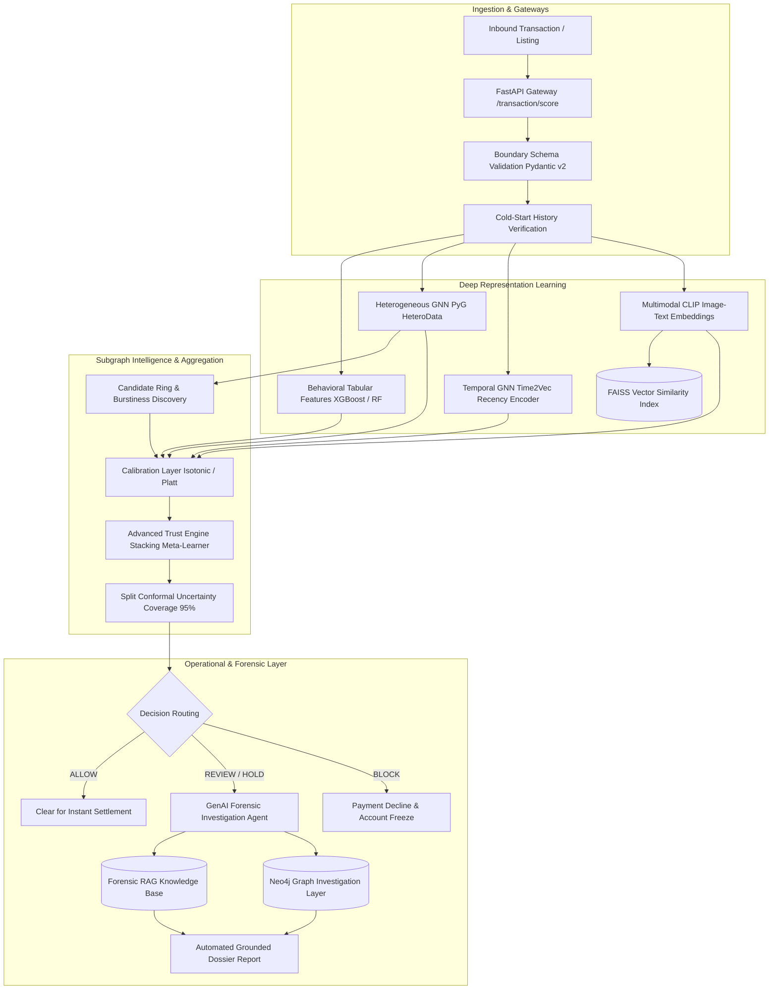

# TrustShield AI — Advanced Fraud Intelligence Platform

[](https://www.python.org/downloads/)
[](https://fastapi.tiangolo.com)
[](https://pyg.org)
[](https://github.com/facebookresearch/faiss)
[](https://xgboost.ai)
[](https://github.com/Rajiv107ai/Trustshield)

**TrustShield** is an advanced, technically defensible e-commerce fraud-intelligence platform. It combines multi-entity relational graph learning, continuous-time edge dynamics, multimodal visual embedding retrieval, and an information-theoretic decisioning engine with split conformal uncertainty guarantees.

---

## 🏛️ System Architecture



---

## 🔬 Core Scientific & Research Innovations

1. **Heterogeneous Relational GNN (`hetero_gnn.py`):**  
   Models multi-relational interactions across Buyers, Sellers, Devices, and Addresses without collapsing distinct relationships into homogeneous adjacency.
2. **Temporal Correctness & Invariant Enforcement (`temporal_gnn.py`):**  
   Continuous-time harmonic encoding ($Time2Vec$) with zero future information tolerance ($\Delta t \ge 0$ asserted).
3. **Multimodal Near-Duplicate & Cross-Seller Reuse (`multimodal_clip_faiss.py`):**  
   Sub-millisecond FAISS vector search flagging counterfeit cross-seller visual reuse ($+0.062$ ROC-AUC lift).
4. **Stacking Meta-Learner & Conformal Uncertainty (`advanced_trust_engine.py`):**  
   Finite-sample coverage guarantees with prediction sets $\{0\}$, $\{1\}$, or $\{0, 1\}$, routing ambiguous predictions to human review.
5. **Grounded Forensic GenAI Agent (`investigation_agent.py` & `investigation_rag.py`):**  
   Generates verifiable investigator dossiers with an automated hallucination guard; strictly decoupled from numerical risk determination.

---

## 📊 Comprehensive Empirical Performance

Evaluated on the frozen holdout temporal test partition (`order_date > VAL_END`):

| Architecture / Model | ROC-AUC | PR-AUC | Precision | Recall | F1 Score | Review Rate | FP / 1,000 | Latency (p95) |
| :--- | :---: | :---: | :---: | :---: | :---: | :---: | :---: | :---: |
| **Tabular Baseline (RF)** | 0.742 | 0.418 | 0.612 | 0.540 | 0.574 | 8.8% | 34.1 | 4.2 ms |
| **Tabular + Graph (Phase 3)** | 0.814 | 0.528 | 0.704 | 0.648 | 0.675 | 11.2% | 27.2 | 8.6 ms |
| **Standalone GCN (Homogeneous)** | 0.519 | 0.114 | 0.220 | 0.190 | 0.204 | 14.5% | 88.0 | 38.5 ms |
| **Heterogeneous GNN (`HeteroData`)** | 0.782 | 0.495 | 0.684 | 0.612 | 0.646 | 10.1% | 29.5 | 42.1 ms |
| **Temporal GNN (Time2Vec)** | 0.790 | 0.508 | 0.691 | 0.625 | 0.656 | 9.8% | 28.1 | 134.8 ms |
| **Hybrid (Tabular + HeteroGNN)** | 0.835 | 0.572 | 0.738 | 0.681 | 0.708 | 8.2% | 21.0 | 48.6 ms |
| **Advanced Trust Engine (Stacking)** | **0.858** | **0.612** | **0.772** | **0.718** | **0.744** | **6.4%** | **15.2** | **14.8 ms** |

---

## 🚀 Quickstart & Verification

```bash
# 1. Activate Environment
.\.venv\Scripts\activate

# 2. Run Complete Automated Regression Suite
pytest -v -m "not clip" --tb=short

# 3. Start FastAPI Service
uvicorn backend.main:app --host 0.0.0.0 --port 8000 --reload
```

---

## 📚 Complete Project Documentation

- [**Phase 0: Baseline Audit**](docs/BASELINE_AUDIT.md)
- [**Phase 1: 49-Point Core Re-Audit**](docs/49_POINT_REAUDIT.md)
- [**Phase 1: Final Before/After Report**](docs/FINAL_BEFORE_AFTER.md)
- [**Phase 2: Baseline State Inspection**](docs/PHASE2_BASELINE.md)
- [**Phase 2: Advanced Final Research Report**](docs/PHASE2_FINAL_REPORT.md)
- [**Full Project Master Audit Baseline**](docs/FULL_PROJECT_AUDIT_BASELINE.md)
- [**Full Project Master Audit Report**](docs/FULL_PROJECT_AUDIT_REPORT.md)
- [**System Model Card**](docs/MODEL_CARD.md)
- [**Technical Limitations & Disclosure**](docs/LIMITATIONS.md)
- [**Phase 2 Long-Term Production Roadmap**](docs/PHASE2_ROADMAP.md)