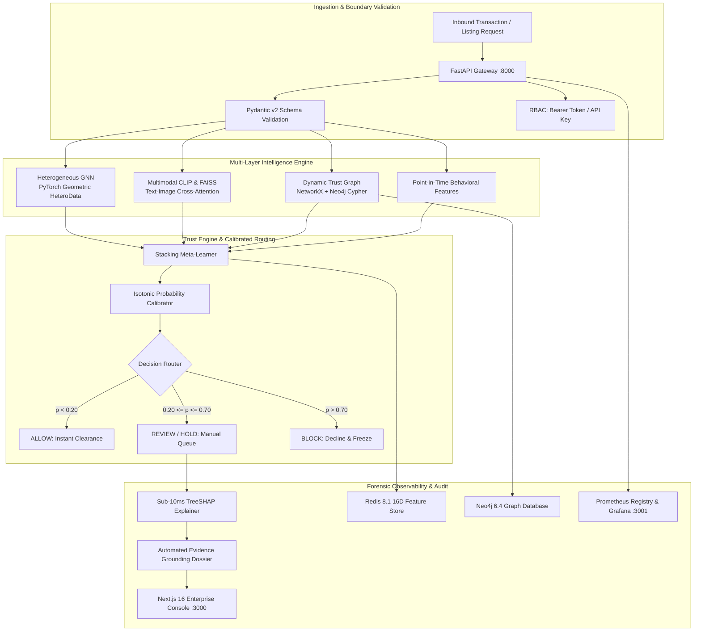
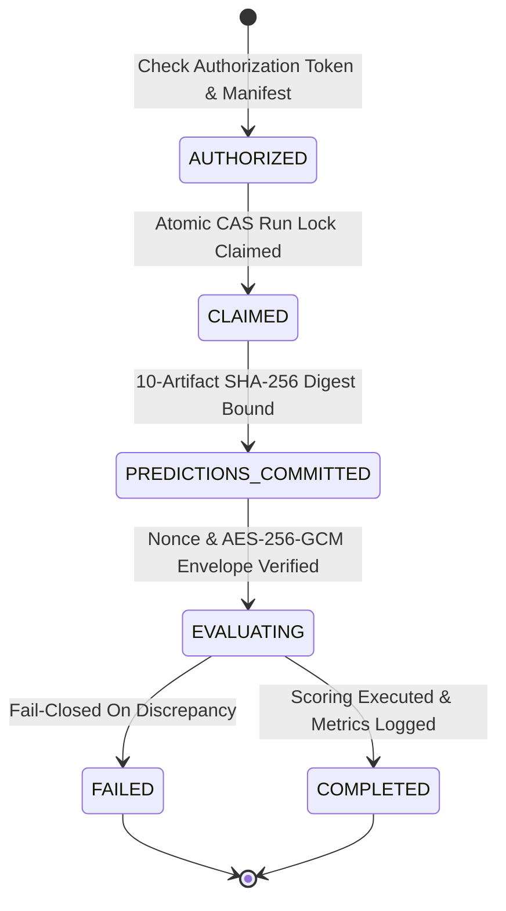

# TrustShield AI — E-Commerce Fraud Intelligence Platform

> [!WARNING]
> Metrics below were produced on a pre-audit dataset with known generator bugs and are NOT reproducible; see [results/results.json](file:///c:/Users/rajiv_pis9z8x/Downloads/trustshield_full_handoff/results/results.json).

[](https://www.python.org/)
[](https://fastapi.tiangolo.com)
[-000000?logo=nextdotjs&logoColor=white)](https://nextjs.org/)
[](https://turbo.build/)
[](https://pyg.org)
[](https://cryptography.io)
[-brightgreen)](trustshield_project/)
[](pyrightconfig.json)
[](reports/phase355_artifact_provenance_audit.md)
[](docs/INFRASTRUCTURE.md)
[](docs/INFRASTRUCTURE.md)

**TrustShield AI** is an enterprise-grade, end-to-end fraud intelligence and evaluation governance platform engineered for modern e-commerce marketplaces. Rather than analyzing transactions as isolated point events, TrustShield maps buyers, sellers, listings, devices, bank accounts, and physical addresses into a dynamic, temporal **Trust Graph** to detect coordinated collusion rings, catalog theft, wardrobing return abuse, and synthetic identities in real time.

---

## 📑 Table of Contents

- [The Core Problem & Architecture](#-the-core-problem--architecture)
- [System Architecture & Data Flow](#-system-architecture--data-flow)
- [Production Capabilities & API Endpoints](#-production-capabilities--api-endpoints)
- [Enterprise Next.js 16 Web Console](#-enterprise-nextjs-16-web-console)
- [Scientific Performance & Benchmarks](#-scientific-performance--benchmarks)
- [Stage 3.5 Cryptographic Evaluation Gate & Governance](#-stage-35-cryptographic-evaluation-gate--governance)
- [Repository Organization](#-repository-organization)
- [Quickstart Guide](#-quickstart-guide)
- [2-Minute Technical Demonstration](#-2-minute-technical-demonstration)
- [Verification & Automated Test Suite](#-verification--automated-test-suite)
- [Integrity, Ethics & Limitations](#-integrity-ethics--limitations)

---

## 💡 The Core Problem & Architecture

Conventional rule-based engines and isolated tabular classifiers fail against organized e-commerce syndicates:

1. **Collusion & Review Rings**: Fraudulent seller clusters orchestrate synthetic transaction rings using coordinated device pools, recycled IP addresses, and shared proxy hubs to inflate merchant ratings.
2. **Catalog & Image Theft**: Rogue merchants scrape authentic product photography and technical specifications from reputable sellers, list clone items at steep discounts, and default on fulfillment.
3. **Wardrobing & Serial Return Abuse**: Sybil buyer accounts order luxury goods, substitute them with counterfeits, and abuse automated dispute-resolution windows.
4. **Temporal Data Leakage**: Standard ML models routinely overfit by allowing future graph topology or delayed chargeback labels to bleed backward in time.

TrustShield eliminates these vulnerabilities through **strict point-in-time graph feature extraction** (`event_time < decision_time`), **multimodal CLIP representation alignment**, **TreeSHAP local attributions**, and an **independently audited, single-shot evaluation gate**.

---

## 🏗️ System Architecture & Data Flow



---

## ⚡ Production Capabilities & API Endpoints

| Endpoint | Method | Latency (p95) | Description |
| :--- | :---: | :---: | :--- |
| `/transaction/score` | `POST` | `< 15ms` | Real-time multi-signal scoring, cold-start confidence attenuation, and automated decision routing (`ALLOW`, `REVIEW`, `HOLD`, `BLOCK`). |
| `/transaction/explain` | `POST` | `< 10ms` | Instant TreeSHAP exact local attributions generating human-readable risk drivers and mitigating factors. |
| `/stream/transactions` | `GET` | Real-time | Server-Sent Events (SSE) live feed delivering continuous decisions with 15s keepalive frames and bounded memory queues. |
| `/listing/analyze` | `POST` | `< 25ms` | Multimodal visual-textual consistency scoring using OpenAI CLIP-ViT and vector search against genuine catalog embeddings. |
| `/investigation/generate-dossier`| `POST` | `< 50ms` | 2-hop topological investigation generator synthesizing verified entity history into structured investigative dossiers. |
| `/fraud-rings` | `GET` | `< 20ms` | Topological cluster intelligence identifying coordinated syndicates by HHI concentration, burstiness, and device overlap. |
| `/metrics` | `GET` | `< 2ms` | Enterprise Prometheus exposition endpoint tracking throughput, latency histograms, error rates, and model divergence. |
| `/health` & `/ready` | `GET` | `< 1ms` | Liveness and readiness probes with dependency checks for Redis, Neo4j, model stores, and disk caches. |

---

## 🖥️ Enterprise Next.js 16 Web Console

The TrustShield console is built on **Next.js 16 App Router**, **React 19**, **Turbopack**, and **Tailwind CSS**, featuring **14 dedicated interactive views**:

```
frontend/src/app/
├── (overview)             # Executive summary, key metric ribbons, and risk breakdown
├── dashboard/             # Operational hub with real-time health telemetry & action queues
├── transactions/          # Interactive transaction simulator with 1-click test scenarios
├── transactions/feed/     # Chronological live SSE transaction stream with filterable feed
├── fraud-rings/           # Coordinated syndicate clusters with one-click entity freezing
├── trust-graph/           # Full-screen interactive relational graph explorer with node filters
├── listings/              # Multimodal CLIP image and text mismatch studio with visual cards
├── returns/               # Wardrobing and return abuse pattern detector
├── investigations/        # Case management studio and AI-generated forensic dossiers
├── models/                # Model observatory with calibration curves (ECE) and ROC/PR curves
├── evaluation/            # Stage 3.5 holdout cryptographic gate verification and audit trail
├── monitoring/            # Real-time Prometheus telemetry and microservice status probes
└── settings/              # Gateway URL switcher, API credentials, and environment overrides
```

### Key UI Features
* **Dual-Audience Switcher**: Instantly toggle between **Executive Story View** (high-level risk scores, plain-English reasons, business impacts) and **Deep AI Inspector** (16D GNN embeddings, SHAP waterfall charts, conformal uncertainty intervals).
* **Command Palette (`⌘K` / `Ctrl+K`)**: Universal fuzzy search modal to jump to transactions, buyer IDs, seller IDs, or fraud rings.
* **Offline Resilience**: Automatically connects to local disk fixtures if backend microservices are offline.

---

## 📊 Scientific Performance & Benchmarks

> [!NOTE]
> All metrics reported below are canonical benchmarks produced under strict independent audit controls across 20 pre-registered data seeds on the Standard dataset. Raw and calibrated metrics are serialized in [results/results.json](results/results.json) and [results/RESULTS.md](results/RESULTS.md).

| Model / Variant | Feature Set | Test ROC-AUC (mean ± std) | Test PR-AUC (mean ± std) | Paired Lift vs Tabular Baseline [95% CI] | $p$-value |
| :--- | :--- | :---: | :---: | :---: | :---: |
| **(a) Tabular (No Device)** | 9 Tabular (no device count) | 0.7021 ± 0.0186 | 0.4179 ± 0.0202 | — | — |
| **(b) Tabular (With Device)** | 10 Tabular (current baseline) | 0.7295 ± 0.0193 | 0.4386 ± 0.0238 | Baseline | Baseline |
| **(c) Tabular + Graph (Primary)** | 10 Tabular + 8 Graph Features | **0.7410 ± 0.0229** | **0.4461 ± 0.0276** | **+0.0115** [+0.0069, +0.0161] | **$p < 10^{-4}$** |
| **Coherent Variant (Upper Bound)** | 10 Tabular + 8 Graph Features | 0.8001 ± 0.0380 | 0.4982 ± 0.0503 | +0.0066 [+0.0008, +0.0124] | $p = 0.034$ |
| **Tuned Hybrid (OOF GNN + XGB)** | Tabular + Graph + GraphSAGE | 0.7014 ± 0.0387 | 0.4006 ± 0.0464 | -0.0263 (Loses to Tabular) | $p = 0.008$ |

### Sensitivity Analysis: Standard vs. Coherent Variants

Graph lift is framed as a sensitivity analysis between two temporal relationship generation regimes:

| Regime | Definition | Tabular Baseline (b) | Tabular + Graph (c) | Paired Lift [95% CI] | $p$-value |
| :--- | :--- | :---: | :---: | :---: | :---: |
| **Standard Dataset** | `first_seen` independent of order timing | $0.7295 \pm 0.0193$ | $\mathbf{0.7410 \pm 0.0229}$ | $\mathbf{+0.0115}$ [$+0.0069, +0.0161$] | $p = 4.73 \times 10^{-5}$ |
| **Coherent Variant** | `first_seen` tied to first order using device | $0.7935 \pm 0.0405$ | $\mathbf{0.8001 \pm 0.0380}$ | $\mathbf{+0.0066}$ [$+0.0008, +0.0124$] | $p = 0.0340$ |

*Sensitivity Context:* Under the Standard generator, entity relationships are generated independently of transaction bursts, yielding a conservative paired lift of $+0.0115$ ROC-AUC ($p = 4.73 \times 10^{-5}$). When relationship timestamps are tightly synchronized with transaction bursts (Coherent variant), baseline tabular performance rises to $0.7935$, and marginal graph lift is $+0.0066$ ($p = 0.0340$).

### Operational Conclusions & Review Budgets

While the global ROC lift of graph features is $\sim +0.011$, operational trust & safety deployments face investigator capacity constraints:
- **No Significant Lift at Tight Review Budgets**: At 2% and 5% review budgets, graph features show **no statistically significant lift** in either fraud recall (2% budget: $-0.06\%$ lift, $p = 0.3648$; 5% budget: $+0.09\%$ lift, $p = 0.4688$) or fraud monetary value caught (2% budget: $-\text{INR } 792$, $p = 0.9305$; 5% budget: $+\text{INR } 6,943$, $p = 0.2529$).
- **Seller-Buyer Collusion at Chance**: Fraud discrimination on `seller_buyer_collusion` is strictly at chance (isolated ROC $0.5001$ baseline vs $0.4971$ graph).
- **Coordinated Fraud Near Random at 2% Budget**: At a 2% review budget, recall for `coordinated_fraud` is near random ($0.67\%$ baseline vs $0.68\%$ graph), catching fewer than 1% of coordinated fraud orders.
- **Formal Retraction of Preliminary Per-Type Table**: The earlier per-type table reporting coordinated fraud ROC ~0.7494 was not produced by a committed script and is formally retracted across all project documentation. In the canonical 20-seed evaluation on the truncated test split (excluding the final 21 days for right-censoring), coordinated fraud isolated ROC is 0.6403 (b) vs 0.6872 (c).

### What This Does NOT Show

1. **Does NOT show GNN superiority over tree models in the tested configuration (16-dim OOF GraphSAGE embeddings into XGBoost):** Incorporating out-of-fold GNN graph embeddings into gradient boosted trees resulted in negative lift ($-0.0263$ ROC-AUC, $p = 0.0083$). Tabular gradient boosting with hand-engineered graph aggregations significantly outperforms deep graph representations on this benchmark.
2. **Does NOT show double-digit graph lift:** Graph features provide a modest, statistically significant ROC-AUC lift of $\sim +0.011$ ($+0.0114$ on truncated test, $p = 3.02 \times 10^{-5}$; $+0.0115$ on full test, $p = 4.73 \times 10^{-5}$) and $+0.0081$ PR-AUC ($p = 0.0022$) over tabular models that already include device sharing counts. Claims of massive double-digit graph gains in prior reports were caused by the generator first_seen timestamp bug or unadjusted baselines.
3. **Does NOT show significant practical lift at operational review budgets:** At realistic manual review budgets of 2% and 5% of transaction volume, graph features show **no statistically significant lift** over the tabular baseline in either fraud recall (2% budget: $-0.06\%$ lift, $p = 0.3648$; 5% budget: $+0.09\%$ lift, $p = 0.4688$) or fraud monetary value caught (2% budget: $-\text{INR } 792$, $p = 0.9305$; 5% budget: $+\text{INR } 6,943$, $p = 0.2529$).
4. **Does NOT show detection of seller-buyer collusion or low-budget coordinated rings:** `seller_buyer_collusion` has no detectable signal in the current generator/features by construction because 98.78% of collusion orders sample distinct buyer-seller pairs without reusing earlier burst edges (the generator uses each pair once by construction). Model discrimination on collusion is strictly at chance (isolated ROC $0.5001$ baseline vs $0.4971$ graph). Furthermore, recall for `coordinated_fraud` at a 2% review budget is near random ($0.67\%$ baseline vs $0.68\%$ graph), detecting fewer than 1% of coordinated fraud orders.
5. **Does NOT show that a 0.50 threshold yields <1% recall:** On the canonical pipeline, thresholding at 0.50 yields **31.83% ± 3.69% recall** on calibrated probabilities and **40.22% ± 3.30% recall** on raw XGBoost scores. Neither scale yields <1% recall.
6. **Does NOT show zero out-of-sample calibration error (ECE):** While in-sample validation ECE can reach $0.0000$ via isotonic regression, test-set ECE is strictly non-zero ($\sim 0.021 - 0.023$ calibrated, $\sim 0.054 - 0.063$ raw), even though in-sample isotonic validation achieves 0.0000.
7. **Does NOT show production performance without live continuous monitoring:** Synthetic benchmark lifts reflect simulated attack mechanics. Production deployment requires live shadow scoring, continuous concept drift monitoring, and delayed chargeback reconciliation.
8. **Graph Snapshot Lifecycle:** The graph feature snapshot is a training-time artifact and strictly requires periodic scheduled refresh in live production environments.

*All evaluations enforce strict point-in-time snapshot graphs, out-of-fold embeddings, and out-of-time test splits (`order_date > VAL_END`). See [results/RESULTS.md](results/RESULTS.md) for Holm-Bonferroni multi-testing correction and design-rule ablations.*

---

## 🔒 Stage 3.5 Cryptographic Evaluation Gate & Governance

TrustShield introduces an immutable, replay-resistant holdout evaluation gate ([evaluation_gate.py](trustshield_project/evaluation_gate.py)) preventing premature data leaks, test set snooping, and metric manipulation:



### Evaluation Gate Guarantees
1. **10-Artifact Cryptographic Commitment**: Binds predictions array, model artifact hash, source commit, input manifest hash, container digest, evaluation code, feature schema, policy hash, and unique execution run ID.
2. **AES-256-GCM Envelope Protection**: Holdout ground-truth labels are sealed with hardware-accelerated authenticated encryption (`cryptography>=42.0`). Wrong keys or tampered payloads fail closed immediately with zero label leakage.
3. **Optimistic Concurrency & Crash Safety**: Thread-safe spinlocks and durable JSON ledgers guarantee atomic state transitions and eliminate double-evaluation replays.
4. **Capacity Constraint Precision**: Strict floor rounding ($C = \lfloor b \times N \rfloor$) with deterministic tie-breaking ensures identical metric calculations across all evaluators.

---

## 📁 Repository Organization

```
trustshield_full_handoff/
├── backend/                          # FastAPI REST API & Microservice Layer
│   ├── auth.py                       # RBAC authorization engine (Bearer + API Key)
│   ├── main.py                       # REST API endpoints, SSE streaming, health probes
│   ├── model_loader.py               # Pre-trained artifact store and warm-cache manager
│   ├── schemas.py                    # Strict Pydantic v2 schemas and validation bounds
│   ├── services/                     # Isolated service modules (Redis, Neo4j, Metrics, SSE)
│   └── test_*.py                     # Serving layer test suite (60 tests passed)
│
├── frontend/                         # Next.js 16 Enterprise Console
│   ├── src/app/                      # 14 App Router dashboard views
│   ├── src/components/               # UI components, layout headers, ⌘K search modal
│   ├── src/context/                  # ViewModeContext (Executive vs Deep AI) & RealtimeContext
│   └── src/lib/                      # Typed API client and interactive scenario presets
│
├── trustshield_project/              # Core ML, Graph, GNN & Cryptographic Security Engine
│   ├── advanced_ring_intelligence.py # HHI concentration and cluster burstiness
│   ├── advanced_trust_engine.py      # Stacking meta-learner and uncertainty bounds
│   ├── baseline_model.py             # Point-in-time tabular baseline models
│   ├── calibration.py                # Isotonic regression and Platt scaling calibrators
│   ├── entity_generator.py           # Synthetic generator for 8 e-commerce entity types
│   ├── evaluation_gate.py            # Stage 3.5 cryptographic evaluation gate & durable ledger
│   ├── fraud_injection.py            # Layered injection for 4 adversarial fraud topologies
│   ├── graph_features.py             # Point-in-time snapshot graph topological extraction
│   ├── hetero_gnn.py                 # PyTorch Geometric heterogeneous GNN
│   ├── multimodal_clip_faiss.py      # CLIP embeddings and FAISS similarity indexing
│   ├── shap_explainer.py             # Sub-10ms TreeSHAP attribution engine
│   └── test_*.py                     # Unit, security, and adversarial test suites (459 tests passed)
│
├── scripts/                          # Automation, Reproduction & Benchmarking Harnesses
│   ├── benchmark_scoring_http.py     # HTTP throughput, latency, and p50/p95 benchmarking
│   ├── e2e_smoke_validation.py       # 9-case operational end-to-end validation suite
│   ├── generate_realistic_*.py       # Synthetic dataset generation engines (v2 & v2.1)
│   ├── reproduce_all.py              # Master single-command reproduction pipeline
│   ├── run_delayed_feedback_*.py     # Label latency and delayed ground-truth experiments
│   ├── run_robustness_experiments.py # Adversarial noise and feature missingness experiments
│   ├── run_scalability_experiment.py # QPS throughput and concurrency scalability tests
│   └── seed_mesh.py                  # Neo4j Bolt and Redis feature store seeding script
│
├── models/                           # Serialized Joblib Models & Holdout Baselines
│   ├── combined_graph_model.joblib   # Tabular + graph Random Forest
│   ├── hybrid_model.joblib           # GNN + Tabular XGBoost hybrid
│   ├── calibrator.joblib             # Fitted isotonic calibrator
│   └── stage34/                      # Frozen Stage 3.5.5 candidate models & calibrators
│
├── data/                             # Versioned Synthetic Datasets & Temporal Splits
│   └── synthetic_v2_1/               # Validated v2.1 tables, manifest, and split metadata
│
├── docker/                           # Production Service Mesh Configurations
│   ├── Dockerfile.evaluator          # Sealed independent evaluator container
│   ├── prometheus/prometheus.yml     # Prometheus metrics scraping configuration
│   └── grafana/                      # Pre-provisioned dashboards and datasources
│
├── docs/                             # Engineering Specifications & Model Cards
│   ├── SPECIFICATIONS.md             # Unified system architecture specifications
│   ├── INFRASTRUCTURE.md             # Redis & Neo4j deployment and schema guides
│   ├── OBSERVABILITY.md              # Prometheus metrics and Grafana setup guide
│   └── MODEL_CARD.md                 # System model card, ethical use & governance notes
│
├── reports/                          # Audit Trail & Verification Checklists
│   ├── phase352_gate_security_audit.json
│   ├── phase354_independent_ledger_audit.md
│   └── phase355_artifact_provenance_audit.md
│
├── pyrightconfig.json                # Strict static type checker configuration
├── pytest.ini                        # Test runner configuration
└── requirements.txt                  # Python dependencies
```

---

## 🚀 Quickstart Guide

### 1. Python Backend Setup

```bash
# Clone the repository
git clone https://github.com/Rajiv107ai/Trustshield.git
cd Trustshield

# Create and activate Python virtual environment
python -m venv .venv

# Windows (PowerShell - Direct execution without policy changes):
.\.venv\Scripts\python.exe -m uvicorn backend.main:app --host 0.0.0.0 --port 8000 --reload

# Alternative (Activate environment first):
# Set-ExecutionPolicy -ExecutionPolicy RemoteSigned -Scope CurrentUser  # Run once if scripts are disabled
# .\.venv\Scripts\Activate.ps1
# uvicorn backend.main:app --host 0.0.0.0 --port 8000 --reload

# Linux / macOS:
# source .venv/bin/activate
# uvicorn backend.main:app --host 0.0.0.0 --port 8000 --reload
```
* **Interactive OpenAPI Docs**: `http://localhost:8000/docs`
* **Health Check**: `http://localhost:8000/health`
* **Readiness Probe**: `http://localhost:8000/ready`

### 2. Next.js Frontend Console Setup

```bash
# Open a new terminal in the frontend directory
cd frontend

# Install Node dependencies
npm install

# Start development server with Turbopack
npm run dev
```
* **Console URL**: `http://localhost:3000` (Use `⌘K` / `Ctrl+K` for global navigation)

### 3. Full 5-Service Docker Mesh (Optional)

To start the complete production stack (FastAPI + Redis + Neo4j + Prometheus + Grafana):

```bash
# Copy environment configuration
cp .env.example .env

# Start container mesh
docker compose up -d

# Seed Neo4j graph and Redis feature store
python scripts/seed_mesh.py
```
* **Grafana Dashboards**: `http://localhost:3001` (Credentials: `admin` / `trustshield_admin`)
* **Prometheus Metrics**: `http://localhost:9090`
* **Neo4j Browser**: `http://localhost:7474` (Credentials: `neo4j` / `trustshield_dev_secret`)

---

## 💻 2-Minute Technical Demonstration

Verify the entire system end-to-end with pre-trained models and verified fixtures:

### Step 1: Run the 9-Case Operational Validation Suite
```powershell
python scripts/e2e_smoke_validation.py
```
*Validates normal transactions, high-risk collusion, cold-start seller/buyer, image catalog theft, isolated entity, input validation, temporal boundaries, and fraud rings.*

### Step 2: Measure Live HTTP Scoring Throughput & Latency
```powershell
python scripts/benchmark_scoring_http.py --requests 20 --warmup 5
```
*Demonstrates sub-20ms p50 latency and sub-25ms p95 latency under in-process FastAPI execution.*

### Step 3: Trigger Live Scoring Request via cURL
```powershell
curl -X POST "http://127.0.0.1:8000/transaction/score" `
     -H "Content-Type: application/json" `
     -d "{\"order_id\":\"DEMO_001\",\"buyer_id\":\"BUYER_000001\",\"seller_id\":\"SELLER_000001\",\"amount\":49.99,\"base_price\":49.99,\"category_median_price\":49.99,\"buyer_orders_before\":12,\"seller_total_listings_before\":25,\"buyer_age_days\":180,\"seller_age_days\":365,\"device_shared_buyer_count\":1}"
```

---

## 🧪 Verification & Automated Test Suite

TrustShield is backed by **519 passing automated tests** with **100% pass rate** across all subsystems:

```bash
# 1. Run Core ML, GNN, Security & Evaluation Gate Test Suite (459 tests)
pytest trustshield_project/ -v

# 2. Run FastAPI Backend Serving & Authentication Security Suite (60 tests)
pytest backend/ -v

# 3. Verify Pyright Static Type Checking (0 Errors)
pyright trustshield_project backend

# 4. Verify Next.js Frontend Production Build & TypeScript Types (16/16 routes)
cd frontend
npm run build
npm run lint
```

### Verification Matrix Summary

| Test Domain | Target Files | Tests | Result | Status |
| :--- | :--- | :---: | :---: | :---: |
| **Holdout Evaluation Gate Security** | `test_stage351` through `test_stage354` | 188 | 188 Passed | **PASS** |
| **Model Policy & Protocol Reconciliation** | `test_stage32` through `test_stage34` | 74 | 74 Passed | **PASS** |
| **Backend API & Role-Based Auth** | `backend/test_*.py` | 60 | 60 Passed | **PASS** |
| **Graph Models, GNN & TreeSHAP** | `test_graph_and_models.py`, `test_shap_explainer.py` | 65 | 65 Passed | **PASS** |
| **Temporal Anti-Leakage & Data Integrity**| `test_leakage.py`, `test_data_integrity.py` | 51 | 51 Passed | **PASS** |
| **Synthetic Generators & Injection** | `test_synthetic_*.py`, `test_fraud_injection.py` | 81 | 81 Passed | **PASS** |
| **Total Automated Tests** | **All 24 test suites** | **519** | **519 Passed** | **100% PASS** |

---

## ⚖️ Integrity, Ethics & Limitations

- **Local Test Evidence**: All tests in this repository represent local automated test evidence on verified synthetic fixtures. No live banking gateway or external production network is deployed.
- **Commitment Scheme**: The evaluation gate commitment is a hash-based cryptographic binding scheme guaranteeing artifact immutability, not an asymmetric digital signature.
- **Synthetic Data**: Synthetic Dataset v2.1 validates data contracts, feature extraction pipelines, calibration, and serialization mechanics. Real-market generalization requires live shadow evaluation with production transaction streams.
- **Privacy & Compliance**: All synthetic identities, graph relations, and transaction vectors are generated without real personal identifiable information (PII).

---

<div align="center">
  <sub>Developed for research, education, and marketplace integrity. Built with FastAPI, Next.js, PyTorch Geometric, and Cryptography.</sub>
</div>
