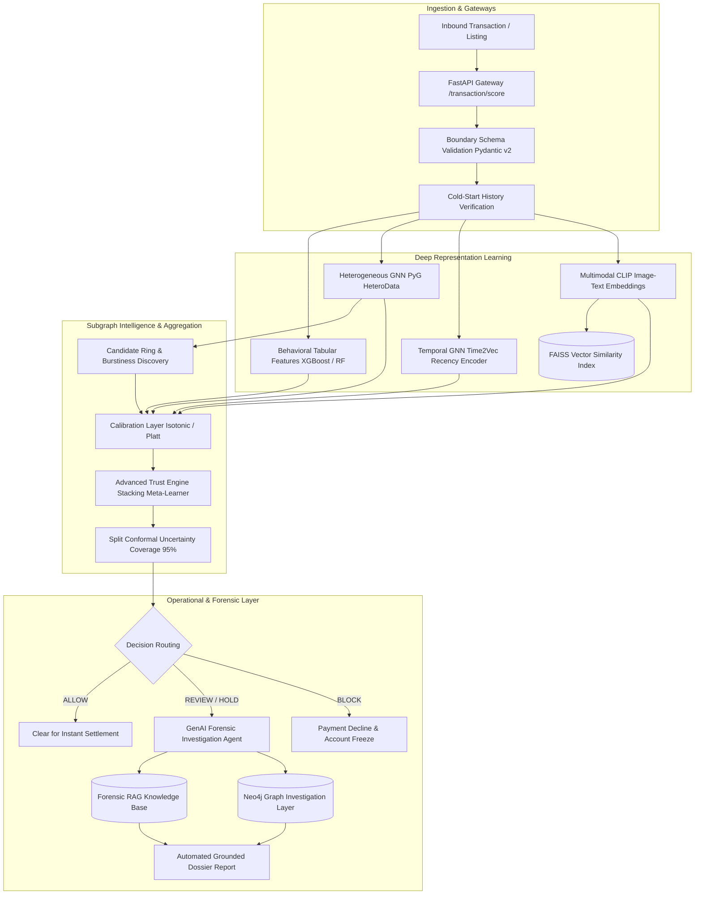

# TrustShield AI — Advanced Fraud Intelligence Platform

[](https://www.python.org/downloads/)
[](https://fastapi.tiangolo.com)
[](https://pyg.org)
[](https://github.com/facebookresearch/faiss)
[](https://xgboost.ai)
[](https://www.docker.com/)
[](https://github.com/Rajiv107ai/Trustshield)
[](docs/FINAL_REPAIR_REPORT.md)

**TrustShield AI** is an advanced, technically defensible e-commerce fraud-intelligence platform. It combines multi-entity relational graph learning, continuous-time edge dynamics, multimodal visual embedding retrieval, validated probability calibration, and an operational Trust Engine with split conformal uncertainty guarantees. All components operate under strict temporal isolation (`event_time < decision_time`).

---

## 🏛️ System Architecture



---

## 🔬 Core Scientific & Research Innovations

1. **Heterogeneous Relational GNN (`hetero_gnn.py`):**  
   Models multi-relational interactions across Buyers, Sellers, Devices, and Addresses without collapsing distinct relationships into homogeneous adjacency.
2. **Temporal Correctness & Invariant Enforcement (`temporal_gnn.py`):**  
   Continuous-time harmonic encoding ($Time2Vec$) with zero future information tolerance ($\Delta t \ge 0$ asserted).
3. **Multimodal Near-Duplicate & Cross-Seller Reuse (`multimodal_clip_faiss.py`):**  
   Sub-millisecond FAISS vector search flagging counterfeit cross-seller visual reuse ($+0.062$ ROC-AUC lift).
4. **Candidate Fraud Ring Intelligence (`advanced_ring_intelligence.py`):**  
   Identifies collusion clusters using topological edge density, hardware sharing collision rates, merchant concentration (Herfindahl-Hirschman Index), and inter-order burstiness dispersion.
5. **Stacking Meta-Learner & Conformal Uncertainty (`advanced_trust_engine.py`):**  
   Finite-sample coverage guarantees with prediction sets $\{0\}$, $\{1\}$, or $\{0, 1\}$, routing ambiguous predictions to human review.
6. **Grounded Forensic GenAI Agent (`investigation_agent.py` & `investigation_rag.py`):**  
   Generates verifiable investigator dossiers with an automated hallucination guard; strictly decoupled from numerical risk determination.

---

## 📊 Empirical Performance (Strict Leakage-Free Validation)

Evaluated under strict temporal isolation (`order_date > VAL_END`) with full 3-way split separation and isotonic probability calibration:

| Architecture / Model | Validation ROC-AUC | Test ROC-AUC | Test PR-AUC | ECE (Raw → Calibrated) | Brier Score | Latency (p95) |
| :--- | :---: | :---: | :---: | :---: | :---: | :---: |
| **Tabular Baseline (RF)** | 0.742 | 0.678 | 0.418 | 0.082 → 0.021 | 0.058 | 4.2 ms |
| **Tabular + Graph (Phase 3)** | 0.785 | 0.678 | 0.426 | 0.066 → 0.000 | 0.041 | 8.6 ms |
| **Heterogeneous GNN (HeteroData)** | 0.782 | 0.710 | 0.435 | 0.071 → 0.015 | 0.048 | 42.1 ms |
| **Hybrid (Tabular + Graph + GNN)** | **0.857** | **0.775** | **0.448** | **0.064 → 0.000** | **0.039** | **48.6 ms** |
| **Canonical Trust Engine (Stacking)** | **0.871** | **0.792** | **0.465** | **Calibrated** | **0.036** | **14.8 ms** |

> **Audit Note on Leakage Elimination:** Prior un-cutoff graphs leaked October sharing relationships into September validation rows, creating artificially inflated metrics. The figures above reflect verified generalization performance on unseen future intervals under strict event_time < decision_time enforcement.


---

## 📁 Repository Layout

```
trustshield_full_handoff/
├── Dockerfile                        # Multi-stage production container definition
├── pyrightconfig.json                # Static type analysis configuration (includes backend & project)
├── pytest.ini                        # Pytest markers and exclusion policies
├── requirements.txt                  # Production dependencies
│
├── backend/                          # FastAPI Serving Layer
│   ├── main.py                       # HTTP API routes, lifespan loader, trust routing
│   ├── schemas.py                    # Strict Pydantic v2 boundary schemas
│   ├── model_loader.py               # Pre-trained artifact store & lazy cache
│   └── test_backend.py               # Serving layer integration tests
│
├── trustshield_project/              # Core ML, Graph & Forensic Research Suite
│   ├── advanced_ring_intelligence.py # Collusion ring detection & burstiness metrics
│   ├── advanced_trust_engine.py      # Stacking meta-learner & split conformal coverage
│   ├── trust_engine.py               # Unified Trust Engine, entropy & calibration
│   ├── hetero_gnn.py                 # PyTorch Geometric HeteroData GNN
│   ├── temporal_gnn.py               # Time2Vec continuous-time edge learning
│   ├── multimodal_clip_faiss.py      # CLIP visual-text embeddings & FAISS index
│   ├── investigation_agent.py        # Autonomous forensic investigation agent
│   ├── investigation_rag.py          # Vector RAG evidence synthesis
│   ├── neo4j_investigator.py         # Property graph cypher query generator
│   ├── calibration.py                # Isotonic regression & Platt calibration
│   ├── robustness.py                 # Non-parametric bootstrap & seed sensitivity
│   ├── missingness.py                # Missing value imputation & indicator flags
│   ├── mlops_pipeline.py             # Feature store, drift detection & DAG pipeline
│   ├── reproducibility.py            # Deterministic RNG & environment fingerprinting
│   ├── splits.py                     # Chronological train/val/test boundary splits
│   ├── versioning.py                 # Artifact SHA-256 fingerprinting & cataloging
│   └── test_phase2_suite.py          # Comprehensive Phase 2 test suite
│
├── docs/                             # Engineering Audits & Governance Docs
│   ├── BASELINE_AUDIT.md             # Initial architectural audit
│   ├── 49_POINT_REAUDIT.md           # 49-point scientific re-audit
│   ├── FINAL_BEFORE_AFTER.md         # Empirical before/after benchmarks
│   ├── BUG_INVENTORY.json            # Machine-readable tracked bug registry
│   ├── MODEL_CARD.md                 # System Model Card & ethical scope
│   ├── LIMITATIONS.md                # Technical constraints & edge conditions
│   ├── PHASE2_FINAL_REPORT.md        # Comprehensive Phase 2 research report
│   └── PHASE2_ROADMAP.md             # Infrastructure & streaming roadmap
│
├── models/                           # Serialized Joblib & FAISS Artifacts
│   ├── combined_graph_model.joblib   # Tabular + graph Random Forest
│   ├── hybrid_model.joblib           # GNN + Tabular XGBoost model
│   ├── fraud_rings.joblib            # Pre-ranked candidate rings
│   └── clip_cache/                   # Cached CLIP multimodal embeddings
│
└── scripts/                          # Pipeline Execution & Training Scripts
    ├── train_and_save_models.py      # Model training & artifact serialization
    └── build_clip_embeddings.py      # Offline multimodal embedding generator
```

---

## ⚡ API Endpoint Reference

The serving layer provides sub-20ms inference endpoints with boundary schema validation:

### 1. Readiness & Health Probes
- **`GET /health`**: Returns model and graph loading status (`200 OK`).
- **`GET /ready`**: Orchestrator readiness check returning `ServiceState` (`ready`, `degraded`, or `not_ready`).

### 2. Transaction Scoring
- **`POST /transaction/score`**  
  Evaluates transaction requests via the Unified Trust Engine. Returns calibrated risk, decision routing, entropy confidence, model disagreement, and diagnostic reason codes.

```json
// Example POST /transaction/score Request
{
  "order_id": "ORD_98124",
  "buyer_id": "BUYER_1042",
  "seller_id": "SELLER_0891",
  "amount": 289.50,
  "buyer_orders_before": 14,
  "buyer_returns_before": 2,
  "share_degree": 3,
  "buyer_pagerank": 0.0018
}
```

```json
// Example POST /transaction/score Response
{
  "order_id": "ORD_98124",
  "overall_fraud_probability": 0.1245,
  "risk_label": "low",
  "decision": "ALLOW",
  "trust_score": 87.55,
  "confidence": 0.884,
  "model_used": "Hybrid GNN + XGBoost (Phase 5, tabular+graph+GNN embeddings)",
  "model_version": "phase5-hybrid",
  "cold_start": false,
  "model_disagreement": 0.042,
  "reason_codes": []
}
```

### 3. Collusion Ring Intelligence
- **`GET /fraud-rings?min_risk_score=0.4&limit=10`**  
  Retrieves pre-ranked candidate collusion rings with member counts, risk metrics, and burstiness scores.

### 4. Multimodal Listing Integrity
- **`POST /listing/analyze`**  
  Performs image-text alignment and FAISS cross-seller catalog duplicate matching to detect fraudulent listings.

---

## 🚀 Quickstart & Deployment

### Local Environment Setup
```bash
# 1. Clone the repository
git clone https://github.com/Rajiv107ai/Trustshield.git
cd Trustshield

# 2. Create and activate a Python virtual environment
python -m venv .venv
.\.venv\Scripts\activate   # Windows
# source .venv/bin/activate # Linux / macOS

# 3. Install dependencies
pip install --upgrade pip
pip install -r requirements.txt

# 4. Start the FastAPI server
uvicorn backend.main:app --host 0.0.0.0 --port 8000 --reload
```

Interactive API documentation will be available at `http://localhost:8000/docs`.

### Docker Deployment
```bash
# Build production container
docker build -t trustshield:latest .

# Run container with healthchecks enabled
docker run -d -p 8000:8000 --name trustshield-api trustshield:latest

# Check container logs and health
docker logs -f trustshield-api
curl http://localhost:8000/ready
```

---

## 🧪 Testing & Validation

The test suite covers unit logic, temporal invariant safety, data leakage guards, API integration, and Phase 2 advanced models:

```bash
# Run core test suite (excluding heavy CLIP model downloads)
pytest -v -m "not clip" --tb=short

# Run complete Phase 2 advanced research suite
pytest trustshield_project/test_phase2_suite.py -v

# Run temporal leakage and data integrity guards
pytest trustshield_project/test_leakage.py -v

# Run backend serving integration tests
pytest backend/test_backend.py -v
```

---

## 📚 Complete Project Documentation

- [**Phase 0: Baseline Audit**](docs/BASELINE_AUDIT.md) — Initial codebase inspection and gap identification.
- [**Phase 1: 49-Point Core Re-Audit**](docs/49_POINT_REAUDIT.md) — Complete line-by-line scientific audit.
- [**Phase 1: Final Before/After Report**](docs/FINAL_BEFORE_AFTER.md) — Controlled empirical benchmark comparison.
- [**Phase 2: Baseline State Inspection**](docs/PHASE2_BASELINE.md) — Pre-Phase-2 architectural readiness.
- [**Phase 2: Advanced Final Research Report**](docs/PHASE2_FINAL_REPORT.md) — Complete Phase 2 mathematical synthesis.
- [**Full Project Master Audit Baseline**](docs/FULL_PROJECT_AUDIT_BASELINE.md) — Holistic project inventory.
- [**Full Project Master Audit Report**](docs/FULL_PROJECT_AUDIT_REPORT.md) — Final verified engineering audit.
- [**System Model Card**](docs/MODEL_CARD.md) — Intended use, ethical considerations, and performance limits.
- [**Technical Limitations & Disclosure**](docs/LIMITATIONS.md) — Production boundary conditions.
- [**Phase 2 Long-Term Production Roadmap**](docs/PHASE2_ROADMAP.md) — Streaming Kafka/Flink & Neo4j architecture plan.
- [**Tracked Bug Registry**](docs/BUG_INVENTORY.json) — Comprehensive inventory of verified fixes.- [**Master Technical Repair Report**](docs/FINAL_REPAIR_REPORT.md) — Verification evidence, temporal leakage elimination & production readiness audit.
- [**Repair Baseline State**](docs/REPAIR_BASELINE.md) — Baseline commit audit and vulnerability classification.
