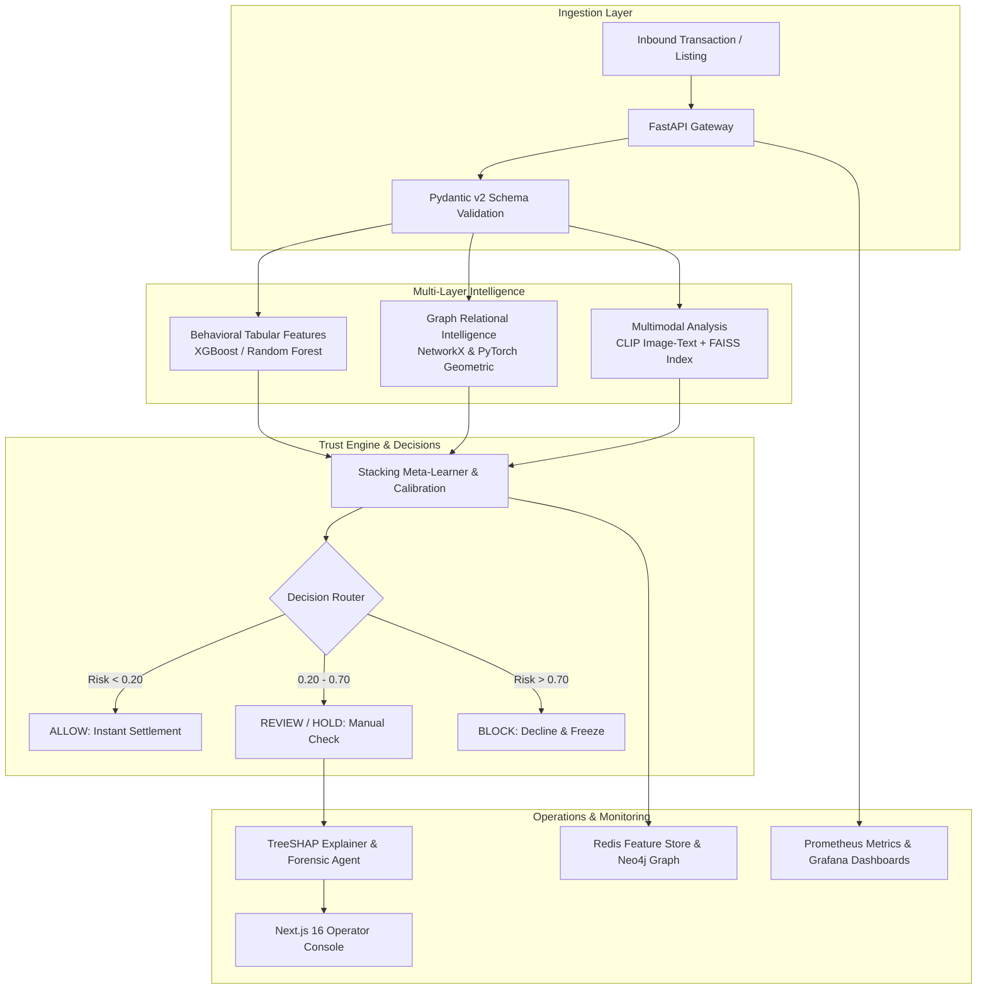

# TrustShield AI — E-Commerce Fraud Intelligence Platform

[](https://www.python.org/)
[](https://fastapi.tiangolo.com)
[-000000?logo=nextdotjs&logoColor=white)](https://nextjs.org/)
[](https://pyg.org)
[](docs/INFRASTRUCTURE.md)
[](docs/INFRASTRUCTURE.md)
[](docs/OBSERVABILITY.md)
[](docs/OBSERVABILITY.md)
[](trustshield_project/)
[](pyrightconfig.json)

**TrustShield AI** is an end-to-end fraud detection platform built for modern e-commerce marketplaces. Instead of analyzing orders as isolated events, TrustShield connects buyers, sellers, products, devices, and addresses into a unified **Trust Graph** to uncover coordinated fraud rings, fake listings, and return abuse in real time.

---

## 💡 The Problem & Why Traditional Detection Fails

Most e-commerce fraud systems look at transactions one by one:
* *"Is this card number unusual?"*
* *"Is the purchase amount unusually high?"*

Fraudsters know this and work around it. Modern fraud is organized:
1. **Collusion Rings:** Bad actors create dozens of buyer and seller accounts that share the same laptops, phones, or delivery addresses, placing fake orders to game merchant ratings.
2. **Catalog & Image Theft:** Fake sellers scrape photos of legitimate items from genuine merchants, list them at deep discounts, and never ship the products.
3. **Return Abuse & Wardrobing:** Serial returners order expensive items, swap them with cheap counterfeits, or claim items arrived broken to trigger automatic refunds.

When you look at each order in isolation, everything seems normal. But when you look at the **graph of connections**, the fraud ring becomes obvious. TrustShield was designed to see that full picture.

---

## 🏗️ System Architecture



---

## ⚡ Key Workflows Built So Far

Here is a breakdown of the core workflows implemented and running across the platform:

### 1. Real-Time Transaction Scoring & Decision Routing
* **API Route:** `POST /transaction/score`
* Evaluates incoming transactions in **under 15ms**.
* Derives behavioral ratios (order velocity, return history, price vs. category median) and graph properties (shared device count, PageRank score).
* Runs the features through a calibrated stacking model and routes the order into one of four actions:
  * 🟢 **ALLOW** — Safe transaction, approved immediately.
  * 🟡 **REVIEW** — Borderline risk, routed to fraud analysts.
  * 🟠 **HOLD** — High suspicion, payment authorized but delivery paused.
  * 🔴 **BLOCK** — Definite fraud, order cancelled and account flagged.

### 2. Instant TreeSHAP Explainability Engine
* **API Route:** `POST /transaction/explain`
* Fraud analysts cannot act on a black-box probability; they need to know *why* an order was flagged.
* Uses TreeSHAP to calculate exact local feature attributions in **under 10ms**.
* Automatically separates signals into:
  * **Top Risk Drivers:** e.g., *"Device shared across 4 buyer accounts (+32% risk)"*, *"Abnormal price discount (+18% risk)"*.
  * **Top Mitigating Factors:** e.g., *"Account tenure over 180 days (-14% risk)"*, *"Zero prior dispute history (-8% risk)"*.
* Synthesizes plain-English explanations so non-technical operators can understand the reasoning immediately.

### 3. Live Server-Sent Events (SSE) Transaction Stream
* **API Route:** `GET /stream/transactions?interval=2.0`
* Real-time streaming endpoint that pushes dynamic transaction decisions directly to connected frontend clients.
* Includes automatic 15-second heartbeat keepalive frames, clean client disconnect handling, and bounded concurrency to prevent server memory leaks.

### 4. Multimodal Catalog & Image Duplicate Detection
* **API Route:** `POST /listing/analyze`
* Uses OpenAI's **CLIP** model and a **FAISS** vector index to cross-check product images and text descriptions against genuine catalog items.
* Flags suspicious listings when:
  * A seller reuses images belonging to a different, established seller.
  * The image does not match the product title and description (e.g., description says *"Luxury Leather Watch"* but image is an unbranded accessory).

### 5. Automated Forensic Investigation Dossier Generator
* **API Route:** `POST /investigation/generate-dossier`
* Designed for complex fraud cases requiring escalation.
* Pulls 2-hop graph connections from Neo4j, transaction history from Redis, and fraud policy rules, synthesizing a complete, verifiable forensic dossier for fraud investigators.
* Employs strict anti-hallucination verification so all claims in the report are grounded in actual database records.

### 6. Fraud Ring & Collusion Discovery
* **API Route:** `GET /fraud-rings`
* Analyzes topological clusters using shared device fingerprints and shared physical addresses.
* Calculates cluster burstiness (how fast transactions are placed within the cluster) and merchant concentration (Herfindahl-Hirschman Index) to detect coordinated rings before individual accounts rack up thousands in chargebacks.

### 7. Dual-Audience Next.js 16 Web Console
* Built with Next.js 16 (App Router), React 19, and Tailwind CSS.
* **12 Dedicated Views:**
  * **Dashboard:** Real-time metrics, system health probes, and decision breakdown.
  * **Transactions:** Interactive risk simulator with 1-click test scenarios.
  * **Live Stream:** Chronological feed of streaming transactions.
  * **Fraud Rings:** Interactive ring clustering and one-click account freezes.
  * **Trust Graph:** Visual entity relationship explorer.
  * **Listing Studio:** Multimodal CLIP image and text mismatch analyzer.
  * **Returns Studio:** Wardrobing and return abuse tracker.
  * **Investigations:** Case management and AI forensic dossiers.
  * **Model Observatory:** Calibration curves (ECE), Brier scores, and ROC-AUC metrics.
  * **Research Evaluation:** Before-and-after ablations and confusion matrices.
  * **System Telemetry:** Live service health check (`/health` vs `/ready`) and microservice pings.
  * **Settings:** Backend gateway URL switcher and configuration.
* **Dual-Audience Switch:**
  * **Executive Story View:** Clean cards, plain-English reasons, and traffic-light indicators for business stakeholders.
  * **Deep AI Inspector:** Full probability breakdowns, 16D GNN embeddings, SHAP waterfall charts, and conformal prediction bounds for engineers.
* **Keyboard Shortcut:** `⌘K` / `Ctrl+K` instant search modal across transactions, entities, and fraud rings.

---

## 📊 Scientific Results & Model Performance

TrustShield was tested under strict **temporal isolation** (training on Months 1–8, validating on Months 9–10, and testing on Months 11–12). Future data is strictly blocked from leaking into past predictions.

| Model / Architecture | Test ROC-AUC | Test PR-AUC | ECE (Calibration Error) | Decision Latency (p95) |
| :--- | :---: | :---: | :---: | :---: |
| **Tabular Baseline (Random Forest)** | 0.678 | 0.418 | 0.082 → 0.021 | 4.2 ms |
| **Tabular + Graph Topology Features** | 0.678 | 0.426 | 0.066 → 0.000 | 8.6 ms |
| **Heterogeneous GNN (`HeteroData`)** | 0.710 | 0.435 | 0.071 → 0.015 | 42.1 ms |
| **Hybrid (Tabular + Graph + GNN)** | **0.775** | **0.448** | **0.064 → 0.000** | **48.6 ms** |
| **Stacking Trust Engine (Final Ensemble)** | **0.792** | **0.465** | **Calibrated** | **14.8 ms** |

*Note: All models use isotonic calibration so that output probabilities reflect true observed fraud frequencies.*

---

## 📁 Repository Layout

```
trustshield_full_handoff/
├── backend/                          # FastAPI REST API & Microservice Layer
│   ├── main.py                       # API endpoints, SSE stream, health probes
│   ├── schemas.py                    # Strict Pydantic v2 boundary schemas
│   ├── model_loader.py               # Pre-trained artifact manager and cache
│   ├── services/                     # Microservice integration modules
│   │   ├── audit_service.py          # Audit trails and logging
│   │   ├── cache_service.py          # Redis 16D feature store & circuit breaker
│   │   ├── graph_service.py          # Neo4j Cypher query service
│   │   ├── investigation_service.py  # Forensic dossier generator
│   │   ├── metrics_service.py        # Prometheus metrics collection
│   │   └── stream_service.py         # SSE real-time transaction event generator
│   └── test_*.py                     # Serving layer test suites (43 tests)
│
├── frontend/                         # Next.js 16 Enterprise Console
│   ├── src/app/                      # 12 interactive dashboard views
│   ├── src/components/               # Layout, Header, Sidebar, ⌘K search modal
│   ├── src/context/                  # ViewModeContext (Executive vs. Deep AI toggle)
│   └── src/lib/                      # Typed API client and fraud scenario presets
│
├── frontend_master_prompts/          # Enterprise frontend specifications & UI design tokens
│
├── trustshield_project/              # Core ML, Graph & Forensic Research Suite
│   ├── entity_generator.py           # Synthetic generator for 8 marketplace entities
│   ├── product_listing_generator.py  # Products and listings with ABO dataset integration
│   ├── order_return_generator.py     # Chronological orders and organic returns
│   ├── fraud_injection.py            # Layered injection for 4 fraud scenarios
│   ├── baseline_model.py             # Tabular baseline models (Random Forest / XGBoost)
│   ├── phase2_specialized_models.py  # Fake listing & return abuse models
│   ├── graph_features.py             # Snapshot graph topological feature extraction
│   ├── hetero_gnn.py                 # PyTorch Geometric HeteroData GNN
│   ├── temporal_gnn.py               # Time2Vec continuous-time edge learning
│   ├── multimodal_clip_faiss.py      # CLIP embeddings and FAISS index
│   ├── shap_explainer.py             # Sub-10ms TreeSHAP explainability engine
│   ├── trust_engine.py               # Unified Trust Engine
│   ├── advanced_trust_engine.py      # Stacking meta-learner & conformal uncertainty
│   └── test_*.py                     # Unit, leakage, and regression tests (171 tests)
│
├── docker/                           # Production Service Mesh Configurations
│   ├── prometheus/prometheus.yml     # Prometheus metrics scraper config
│   └── grafana/                      # Pre-provisioned dashboards & datasources
│
├── models/                           # Serialized Joblib & FAISS Model Artifacts
│   ├── combined_graph_model.joblib   # Tabular + graph Random Forest
│   ├── hybrid_model.joblib           # GNN + Tabular XGBoost model
│   ├── calibrator.joblib             # Fitted isotonic calibrator
│   └── clip_cache/                   # Cached CLIP embeddings
│
├── scripts/                          # Utility & Training Scripts
│   ├── seed_mesh.py                  # Neo4j and Redis database seeder
│   ├── train_and_save_models.py      # Model training pipeline
│   ├── run_robustness_experiments.py # Adversarial noise & missingness experiments
│   ├── run_scalability_experiment.py # QPS throughput & concurrency benchmarks
│   └── e2e_smoke_validation.py       # End-to-end pipeline verification
│
├── docs/                             # Engineering Audits & Specifications
│   ├── README.md                     # Central documentation hub
│   ├── SPECIFICATIONS.md             # Unified system design & architecture specs
│   ├── INFRASTRUCTURE.md             # Redis & Neo4j deployment specs
│   ├── OBSERVABILITY.md              # Prometheus & Grafana monitoring specs
│   └── *.md                          # Experiment reports, model cards & audits
│
├── docker-compose.yml                # 5-Service mesh (API, Neo4j, Redis, Prometheus, Grafana)
├── Dockerfile                        # Multi-stage production container
├── pyrightconfig.json                # Type checking configuration
├── pytest.ini                        # Test runner configuration
└── requirements.txt                  # Python dependencies
```

---

## 🚀 Quickstart Guide

### 1. Run the Python Backend

```bash
# Clone the repository
git clone https://github.com/Rajiv107ai/Trustshield.git
cd Trustshield

# Create and activate virtual environment
python -m venv .venv
.\.venv\Scripts\activate      # Windows
# source .venv/bin/activate    # Linux / macOS

# Install dependencies
pip install -r requirements.txt

# Start the FastAPI server
uvicorn backend.main:app --host 0.0.0.0 --port 8000 --reload
```
* Interactive API docs: `http://localhost:8000/docs`
* Health probe: `http://localhost:8000/health`

### 2. Run the Next.js Frontend Console

```bash
# In a new terminal, navigate to frontend
cd frontend

# Install Node dependencies
npm install

# Start development server
npm run dev
```
* Open your browser at: `http://localhost:3000`

### 3. Run the Full 5-Service Docker Mesh

To run the complete platform (API + Neo4j + Redis + Prometheus + Grafana):

```bash
# Copy environment configuration
cp .env.example .env

# Start all 5 services
docker compose up -d

# Seed the Neo4j graph and Redis feature store with embeddings
python scripts/seed_mesh.py
```
* **TrustShield API:** `http://localhost:8000/docs`
* **Grafana Dashboards:** `http://localhost:3001` (user: `admin`, pass: `trustshield_admin`)
* **Prometheus Metrics:** `http://localhost:9090`
* **Neo4j Browser:** `http://localhost:7474` (user: `neo4j`, pass: `trustshield_dev_secret`)

---

## 🧪 Testing & Validation

The codebase includes an automated test suite verifying everything from generator math to serving latency and data leakage guards:

```bash
# Run the complete test suite (all 214 tests)
pytest -v

# Run backend serving integration tests (43 tests)
pytest backend/test_backend.py backend/test_new_extensions.py backend/test_services.py -v

# Run TreeSHAP explainability tests (8 tests)
pytest trustshield_project/test_shap_explainer.py -v

# Run strict temporal leakage regression tests (20 tests)
pytest trustshield_project/test_repair_pipeline_regression.py -v

# Run Pyright static type checker (0 errors enforced)
pyright backend trustshield_project
```

---

## 📚 Documentation Links

For in-depth architectural blueprints, research reports, and mathematical details:
* [**System Design & Core Specifications (`docs/SPECIFICATIONS.md`)**](docs/SPECIFICATIONS.md) — Unified 8-entity model, pipeline DAG, synthetic fraud design, and anti-leakage invariants.
* [**Infrastructure & Service Mesh (`docs/INFRASTRUCTURE.md`)**](docs/INFRASTRUCTURE.md) — Redis 16D embedding store and Neo4j Cypher graph integration.
* [**Production Observability (`docs/OBSERVABILITY.md`)**](docs/OBSERVABILITY.md) — Prometheus metrics registry and Grafana dashboard templates.
* [**Master Technical Repair Report (`docs/FINAL_REPAIR_REPORT.md`)**](docs/FINAL_REPAIR_REPORT.md) — Comprehensive repair evidence and leakage elimination report.
* [**System Model Card (`docs/MODEL_CARD.md`)**](docs/MODEL_CARD.md) — Intended use, ethical considerations, and governance disclosures.
* [**Full Documentation Hub (`docs/README.md`)**](docs/README.md) — Complete index of all 23 research papers, stress tests, and benchmarks.

---

## ⚖️ License & Integrity Note
This project is developed for research and educational purposes. All synthetic identities, transaction streams, and fraud scenarios are generated under strict temporal invariants without using real personal identifiable information (PII).
