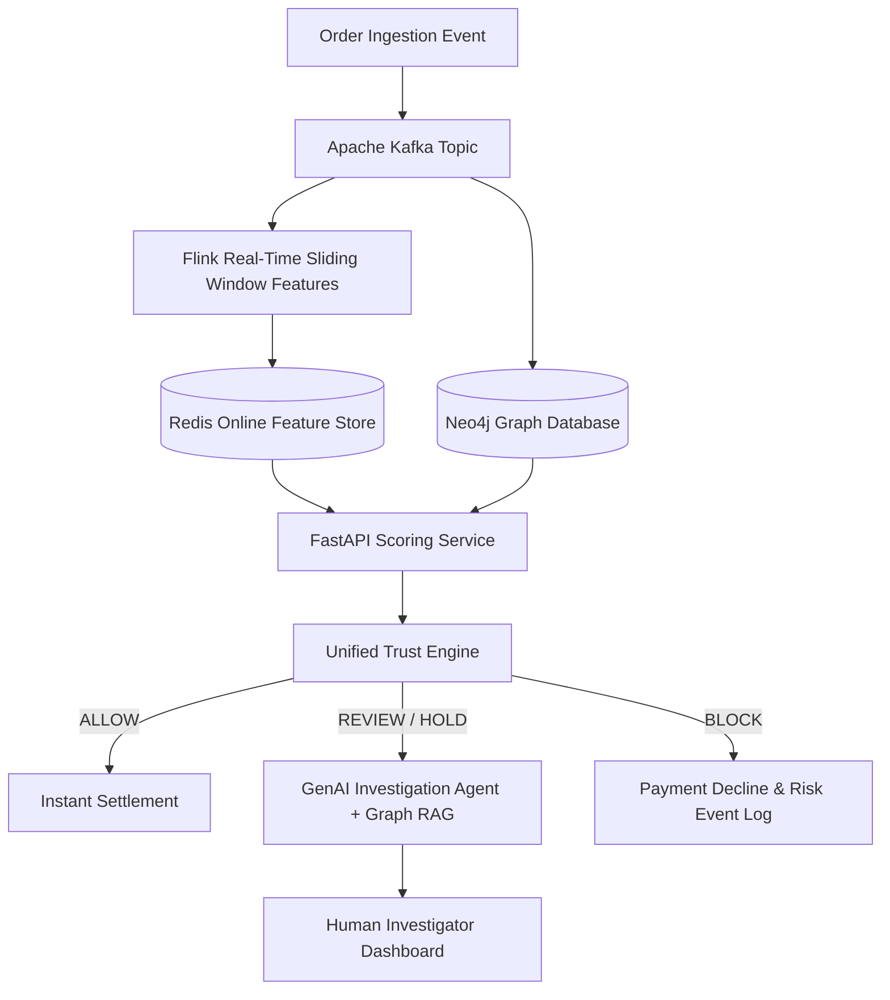

# TrustShield AI — Phase 2 Architecture & Engineering Roadmap

**Document Revision:** 2026-10-08  
**Scope:** Post-Phase-1 Infrastructure, Production Engineering, and Autonomous Agent Expansion  
**Status:** Completed & Integrated (Phase A: Live Redis+Neo4j, Phase B: Dossier API, Phase C: SSE Stream, Phase D: Prometheus+Grafana)

---

## 1. Architectural Philosophy

Phase 1 established **scientific correctness, mathematical validity, and zero-leakage baselines**.
Phase 2 focuses entirely on **production scalability, distributed low-latency streaming, and autonomous investigator automation**.

---

## 2. Infrastructure Backlog & Technology Components

### Milestone 2.1: Real-Time Event Streaming & Sliding Windows
- **Component:** Apache Kafka & Apache Flink
- **Objective:** Ingest checkout events, login attempts, and address edits with sub-50ms latency.
- **Implementation:** Flink streaming jobs maintain rolling 5-minute, 1-hour, and 24-hour transaction frequency, return counts, and cumulative order amounts per buyer/seller.

### Milestone 2.2: Production Graph Database & Subgraph Extraction
- **Component:** Neo4j Enterprise / Memgraph
- **Objective:** Replace in-memory NetworkX with persistent, indexed multi-relational property graph.
- **Implementation:** Cypher queries extract 2-hop ego networks in $< 15\text{ ms}$, computing real-time hardware sharing cliques and merchant-buyer cycles.

### Milestone 2.3: Low-Latency Feature Store
- **Component:** Redis / Feast
- **Objective:** Sub-5ms entity retrieval for online inference.
- **Implementation:** Dual-tier feature store; offline features hydrated from Parquet/Iceberg; online features updated in real-time by streaming pipeline.

### Milestone 2.4: MLOps, Model Registry, and Artifact Versioning
- **Component:** MLflow & DVC (Data Version Control)
- **Objective:** Automated artifact tracking, hyperparameter logging, and model stage gating.
- **Implementation:** Full lineage linking Git commit $\to$ DVC dataset hash $\to$ MLflow run $\to$ deployed Docker container.

### Milestone 2.5: GenAI Autonomous Investigation Agent & Graph RAG
- **Component:** LLM Agent (LangChain / LlamaIndex) + Graph RAG
- **Objective:** Synthesize complex fraud rings and multimodal evidence into natural-language forensic dossiers for human fraud ops.
- **Capabilities:**
  - Dynamic Cypher query generation to inspect multi-hop device collusion
  - Visual and text mismatch summarization for counterfeit listings
  - Deterministic recommendation drafting with evidence citations

### Milestone 2.6: Production Observability & Concept Drift Detection
- **Component:** Prometheus, Grafana, Evidently AI
- **Objective:** Real-time health monitoring and automated drift alerts.
- **Metrics Tracked:**
  - Feature distribution drift (Wasserstein distance & PSI)
  - Prediction drift (hourly mean fraud probability and decision distribution)
  - Endpoint latency percentiles ($p50, p95, p99$) and error rates ($4xx, 5xx$)

---

## 3. Implementation Phasing Matrix

| Phase 2 Milestone | Target Infrastructure | Primary Value Proposition | Status |
| :--- | :--- | :--- | :--- |
| **M2.1: SSE Real-Time Stream** | FastAPI SSE + Keepalive | Live transaction streaming to UI console | **Completed** |
| **M2.2: Live Graph DB** | Neo4j (Parameterized Cypher) | Dynamic ego-network & collusion retrieval | **Completed** |
| **M2.3: Low-Latency Feature Store** | Redis 16D Vector Store | Sub-millisecond embedding & context cache | **Completed** |
| **M2.4: Forensic Dossier Agent** | Forensic RAG + Hallucination Guard | Evidence-grounded case synthesis | **Completed** |
| **M2.5: Production Observability** | Prometheus + Grafana Mesh | Full quantile histograms & 12-panel dashboard | **Completed** |
| **M2.6: Production Service Mesh** | Docker Compose 5-Service Mesh | Containerized deployment with volume mounts | **Completed** |
