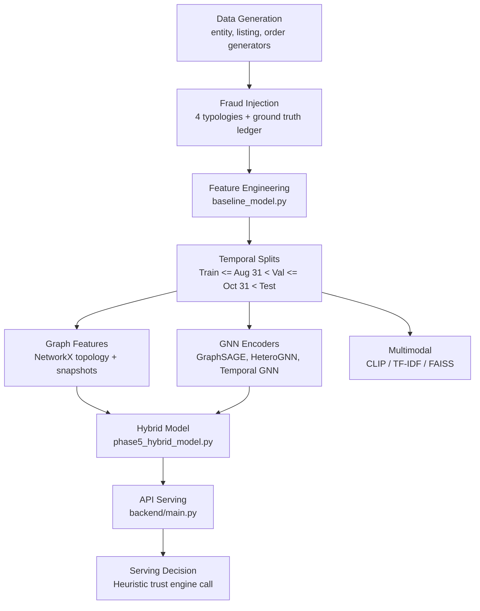

# TrustShield AI — Master Repair Baseline

**Date:** 2026-10-07  
**Operating System:** Windows  
**Corpus Name:** Rajiv107ai/Trustshield  
**Repository Path:** `c:\Users\rajiv_pis9z8x\Downloads\trustshield_full_handoff`

---

## 1. Commit and Version Control Status

- **Branch:** `main`
- **Commit:** `04700448e7` (`fix(robustness): remove redundant int() call on round() in simulate_prevalence_shift`)
- **Status:** Clean working tree, up to date with `origin/main`.
- **Recent Git Log:**
  - `04700448e7` - `fix(robustness): remove redundant int() call on round() in simulate_prevalence_shift`
  - `11d16350d5` - `docs: update root and module READMEs, audit report, and bug inventory`
  - `00fef50927` - `feat: complete Phase 2 fraud intelligence architecture, audit fixes, and serving improvements`
  - `7840edc95c` - `fix(#7,#8): correct API model labels to XGBoost; add TestModelUsedField; exclude CLIP by default in pytest; add venvPath to pyrightconfig; update README (44->89 tests, Phase 4 verified)`
  - `f1814c8c6a` - `fix(#6): remove Phase 5 validation leakage; temporal graph isolation in GNN + TestPhase5TemporalIntegrity`

---

## 2. Environment and Dependency Versions

- **Python Version:** Python 3.14.7 (installed in `.venv\Scripts\python.exe`)
- **Core ML / Graph / Serving Dependencies:**
  - `torch`: 2.14.1
  - `torch-geometric`: 2.8.0.post1
  - `xgboost`: 3.4.1
  - `scikit-learn`: 1.9.1
  - `scipy`: 1.18.1
  - `networkx`: 3.6.1
  - `pandas`: 3.0.5
  - `numpy`: 2.5.3
  - `fastapi`: 0.141.1
  - `pydantic`: 2.13.5
  - `faiss-cpu`: 1.15.1
  - `transformers`: 5.18.0
  - `pillow`: 12.3.0
  - `uvicorn`: 0.52.4
  - `pytest`: 9.1.1

---

## 3. Repository Structure

```
trustshield_full_handoff/
├── backend/
│   ├── main.py                     # FastAPI application and endpoint implementations
│   ├── model_loader.py             # ModelStore singleton loading joblib artifacts
│   ├── schemas.py                  # Pydantic v2 request/response schemas
│   ├── test_backend.py             # Serving and schema integration tests
│   └── __init__.py
├── docs/
│   ├── 49_POINT_REAUDIT.md
│   ├── BASELINE_AUDIT.md
│   ├── BUG_INVENTORY.json
│   ├── FINAL_BEFORE_AFTER.md
│   ├── FULL_PROJECT_AUDIT_REPORT.md
│   ├── MODEL_CARD.md
│   └── ... (additional architecture & specifications)
├── models/
│   ├── combined_graph_model.joblib # Phase 3 tabular + graph model (XGBoost)
│   ├── fake_listing_model.joblib   # Specialized listing detector (XGBoost)
│   ├── return_fraud_model.joblib   # Specialized return detector (XGBoost)
│   ├── hybrid_model.joblib         # Phase 5 tabular + graph + GNN model (XGBoost)
│   ├── fraud_rings.joblib          # Precomputed connected-component rings DataFrame
│   ├── buyer_embeddings.joblib     # Precomputed buyer GNN embeddings dict
│   ├── seller_embeddings.joblib    # Precomputed seller GNN embeddings dict
│   ├── feature_meta.joblib         # Phase 3 feature column list metadata
│   ├── phase5_feature_meta.joblib  # Phase 5 feature column list metadata
│   └── clip_cache/                 # Precomputed CLIP embeddings and metadata
├── scripts/
│   ├── build_clip_embeddings.py    # Offline script to generate CLIP cache
│   ├── smoke_test_api.py           # Real HTTP socket smoke test script
│   ├── train_and_save_models.py    # Training script for Phase 3 models & rings
│   └── train_phase5.py             # Training script for Phase 5 Hybrid model
├── trustshield_project/
│   ├── advanced_ring_intelligence.py
│   ├── advanced_trust_engine.py    # AdvancedTrustEngine, StackingRiskMetaLearner, ConformalPredictor
│   ├── baseline_model.py           # Data merging, tabular feature engineering, XGB baseline
│   ├── calibration.py              # ProbabilityCalibrator (Isotonic, Platt Sigmoid), ECE, Brier
│   ├── entity_generator.py         # Synthetic buyers, sellers, device/address mappings
│   ├── fraud_injection.py          # 4 fraud typologies injection and ground truth ledger
│   ├── gnn_model.py                # Homogeneous GraphSAGE models
│   ├── graph_features.py           # NetworkX graph topology, snapshots, ring detection
│   ├── hetero_gnn.py               # PyG HeteroData heterogeneous GNN
│   ├── investigation_agent.py      # LLM / Dossier generation
│   ├── investigation_rag.py        # Vector search for investigator
│   ├── missingness.py              # Missing data indicator generation
│   ├── multimodal_clip_faiss.py    # FAISS IndexFlatIP & multimodal feature extraction
│   ├── multimodal_scoring.py       # CLIP & TF-IDF multimodal similarity scorers
│   ├── neo4j_investigator.py       # In-memory graph query simulator
│   ├── order_return_generator.py   # Transactions and return events simulation
│   ├── phase2_specialized_models.py# Listing and return feature extractors and models
│   ├── phase5_hybrid_model.py      # Hybrid GNN + XGBoost pipeline
│   ├── product_listing_generator.py# Product catalog and seller listings simulation
│   ├── reproducibility.py          # Seed utilities
│   ├── robustness.py               # Bootstrap CI and prevalence shift simulation
│   ├── splits.py                   # Split validation utilities
│   ├── temporal_gnn.py             # Time2Vec temporal GNN encoder
│   ├── trust_engine.py             # Older TrustEngine implementation
│   ├── utils.py                    # Evaluation metrics and cost-sensitive threshold search
│   ├── versioning.py               # SHA-256 artifact hashing and metadata
│   └── test_*.py                   # 8 test modules
├── pytest.ini
├── requirements.txt
└── README.md
```

---

## 4. Current Test Suite Baseline Results

- Command: `.venv\Scripts\pytest -v`
- Total tests executed: 146 passed, 18 deselected (`-m "not clip"` per `pytest.ini`)
- Time taken: 210.56 seconds
- Failure count: 0 direct test failures under the existing test suite.
- **Critical Caveat:** While existing unit tests pass, the tests themselves encoded previous flawed assumptions (e.g. testing that future validation events are visible to other validation orders under `cutoff_date=VAL_END`, which itself constitutes validation lookahead leakage).

---

## 5. Current Architecture Tracing



---

## 6. Current Model Artifacts on Disk

| Artifact | Size | Description |
|---|---|---|
| `models/combined_graph_model.joblib` | 1,364,800 B | XGBoost model for tabular + graph features |
| `models/fake_listing_model.joblib` | 987,754 B | XGBoost model for fake listing detection |
| `models/return_fraud_model.joblib` | 920,195 B | XGBoost model for return fraud detection |
| `models/hybrid_model.joblib` | 1,341,360 B | XGBoost model trained on tabular + graph + 32-dim GNN embeddings |
| `models/fraud_rings.joblib` | 67,430 B | Precomputed DataFrame of connected component clusters |
| `models/buyer_embeddings.joblib` | 640,178 B | Dict of buyer_id -> 16-dim embedding vector |
| `models/seller_embeddings.joblib` | 64,178 B | Dict of seller_id -> 16-dim embedding vector |
| `models/feature_meta.joblib` | 983 B | Metadata defining Phase 3 feature column lists |
| `models/phase5_feature_meta.joblib` | 1,324 B | Metadata defining Phase 5 feature column lists |
| `models/clip_cache/clip_image_emb.npy` | 20,608 B | Precomputed CLIP visual embeddings |
| `models/clip_cache/clip_text_emb.npy` | 20,608 B | Precomputed CLIP text embeddings |
| `models/clip_cache/clip_meta.npz` | 1,518 B | Precomputed product ID index and cache fingerprint |

---

## 7. Current API Endpoints

- `GET /health`: Liveness probe returning model and ring loaded flags.
- `GET /ready`: Readiness probe returning `ready`, `degraded`, or `not_ready`.
- `POST /transaction/score`: Scores transaction orders using Phase 5 or fallback Phase 3.
- `GET /fraud-rings`: Returns precomputed connected-component rings filtered by risk.
- `POST /listing/analyze`: Scores product listing risk using CLIP embeddings or TF-IDF.

---

## 8. Current Major Technical Deficiencies & Risks Identified

1. **Validation & Test Temporal Lookahead Leakage:**
   - In `scripts/train_and_save_models.py`, `trustshield_project/phase5_hybrid_model.py`, and `trustshield_project/graph_features.py`, graph features for all validation orders were computed using a single cutoff `VAL_END` (`2025-10-31`). For an order occurring early in validation (e.g., September), sharing relationships occurring later in validation (e.g., October) were present in the graph.
   - For test orders (`order_date > VAL_END`), rows were assigned features from `rel_graph_val` with cutoff `VAL_END`, freezing graph topology at `VAL_END` instead of utilizing information up to decision time $T$.
2. **Inconsistent Historical Boundary Filtering:**
   - In `trustshield_project/hetero_gnn.py`, event filters used `<= cutoff_date` rather than strict historical ordering `< cutoff_date`.
   - Codebase mixes `<` and `<=` without standard canonical abstraction.
3. **Dual Competing Trust Engines:**
   - Two separate engines exist: `TrustEngine` in `trust_engine.py` and `AdvancedTrustEngine` in `advanced_trust_engine.py`.
   - `backend/main.py` instantiates `TrustEngine`, ignoring `AdvancedTrustEngine`.
   - Conflicting thresholds exist: `(0.25, 0.60, 0.85)` vs `(0.25, 0.55, 0.85)` vs `(0.3, 0.5)`.
4. **Bypassed Probability Calibration in Production API:**
   - `ProbabilityCalibrator` exists in `calibration.py` but is never persisted as an artifact, never fitted in training scripts, and never called in `backend/main.py`.
   - `backend/main.py` returns raw tree `predict_proba` as `overall_fraud_probability`, despite documentation claims of calibrated risk.
5. **False Monotonicity Claim in Advanced Trust Engine:**
   - `advanced_trust_engine.py` claims in comments that `LogisticRegression(solver="lbfgs")` enforces non-negative constraints. L-BFGS in scikit-learn has no such constraint.
6. **Hardcoded / Heuristic Risk Scores in API:**
   - `backend/main.py` computes heuristic synthetic risks: `req.share_degree * 0.15 + req.buyer_pagerank * 0.35` for graph risk, hardcoded `0.05` for multimodal risk, and uses return rate directly as velocity risk.
7. **Pydantic Response Default Trap:**
   - In `backend/schemas.py`, `TransactionScoreResponse` has default values `decision="ALLOW"`, `trust_score=100.0`, `confidence=1.0`, masking scoring omissions.
8. **FAISS Self-Match Defect:**
   - `multimodal_clip_faiss.py` contains a comment to skip self, but lacks the identity check, causing query items in the index to return self-similarity of 1.0.
9. **Fake Visual Evidence Generation:**
   - In `multimodal_scoring.py`, missing images trigger Gaussian noise perturbation onto text embeddings, which is treated as real visual embedding evidence.
10. **Terminology Inaccuracy:**
    - Raw connected components in bipartite or multi-graph are labeled as confirmed "fraud rings" rather than "candidate suspicious clusters".
