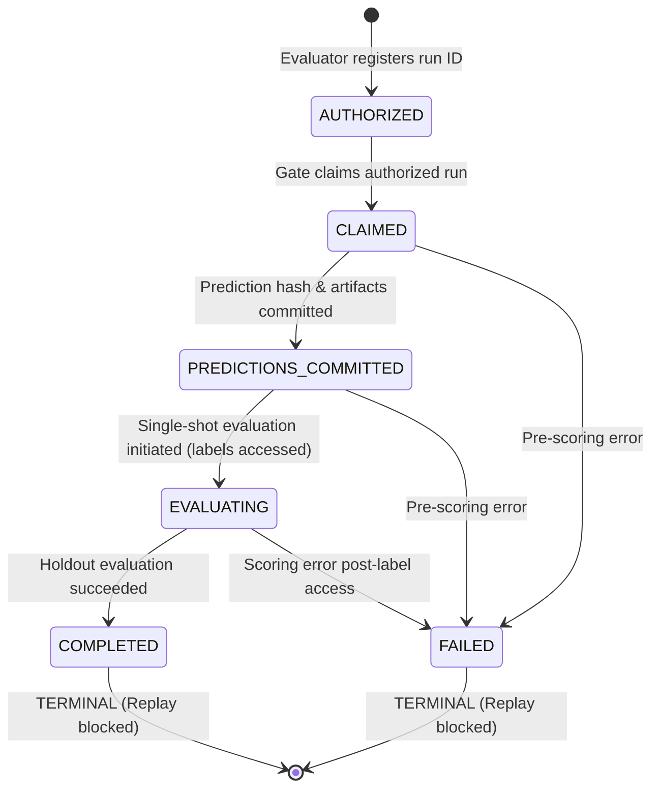

# TrustShield Stage 3.5.3 — Replay-Resistant Evaluation & Input-Binding Hardening Audit Report

**Audit Date**: October 9, 2026  
**Auditor Roles**: Senior MLOps Security Engineer, Cryptographic Protocol Auditor, ML Reproducibility Auditor, Python Test Engineer  
**Active Git Branch**: `phase-3-data-generalization`  
**Verified Baseline Commit**: `4615a53602d0a4ffe447d4d2fd14bd69a70bf740` (Active HEAD)  
**Readiness Status**: **CONDITIONALLY READY** (Security Gates & 10-Artifact Commitment Verified; Container Digest Blocked by Inactive Docker Engine; Remote Ledger Adapter Specified)  

---

## 1. Executive Summary & Baseline Verification

TrustShield Stage 3.5.3 remediates the remaining security, manifest-binding, and replay-resistance gaps identified in Stage 3.5.2.

### Mandatory Safeguards Enforced
- **Synthetic Dataset v2.2 was not generated**.
- **No future holdout labels were created, inspected, decrypted, or unblinded**.
- **Independent evaluator random seeds and AES-256-GCM encryption keys were not accessed**.
- **No models or calibrators were refitted or modified**.
- **Production inference APIs and transaction decision routing remain unmutated**.
- **Zero container digests, hashes, or build outcomes were fabricated**.
- **All uncommitted user work in the repository was strictly preserved**.
- **Zero Git commits or pushes were made**.

### Repository Baseline
- **Branch**: `phase-3-data-generalization`
- **HEAD Commit**: `4615a53602d0a4ffe447d4d2fd14bd69a70bf740`
- **Working Tree State**: Controlled audit state. Uncommitted user modifications in `backend/`, `frontend/`, `docs/`, and `README.md` were preserved without modification.

---

## 2. Workstream A — Container Verification & Host Environment Status

### Docker Build Attempt
Execution of the container build command:
```powershell
docker info
```
- **CLI Detected**: `Docker version 29.8.2, build 7fc2dff`
- **Exit Code**: `1`
- **Actual Engine Error**:
  ```text
  Server:
  failed to connect to the docker API at npipe:////./pipe/dockerDesktopLinuxEngine; 
  check if the path is correct and if the daemon is running: open //./pipe/dockerDesktopLinuxEngine: The system cannot find the file specified.
  ```
- **Audit Assessment**: The Docker Desktop Linux engine daemon remains inactive on this Windows host. In strict compliance with guidelines, **no OCI image digest was fabricated**. Status remains `BLOCKED_DAEMON_INACTIVE_ON_HOST`.
- **Remediation Requirement**: An authorized MLOps engineer must start the Docker daemon on a designated build host, compile [`docker/Dockerfile.evaluator`](file:///c:/Users/rajiv_pis9z8x/Downloads/trustshield_full_handoff/docker/Dockerfile.evaluator), and extract the immutable `@sha256:...` digest.

---

## 3. Workstream B — Holdout Input-Manifest Binding Defect & Remediation

### Defect Identified in Stage 3.5.2
In Stage 3.5.2, `bound_input_manifest_sha256` in tests and mock pipelines referenced the historical v2.1 dataset manifest hash (`b0aba240f1439c1d83c1c9773977334ddf39321feed0e95f53ef30b1c138e74b`). This was defective for future holdout evaluations because:
1. It conflated historical research benchmarks with future blind-holdout data.
2. It lacked runtime verification that the input manifest represents the authorized holdout target.
3. It did not close the semantic verification gap between verifying a manifest's hash and verifying that on-disk dataset files match the manifest.

### Remediation Implemented
[`trustshield_project/evaluation_gate.py`](file:///c:/Users/rajiv_pis9z8x/Downloads/trustshield_full_handoff/trustshield_project/evaluation_gate.py) was enhanced with dedicated manifest-verification interfaces:

1. **`verify_input_manifest()`**:
   - Computes the SHA-256 digest of the manifest (file bytes or canonical JSON bytes).
   - Validates required schema keys: `dataset_version`, `schema_version`, `files`, `row_counts`.
   - Enforces target version validation (`expected_dataset_version`).
   - Disallows historical research datasets for holdout evaluations via `disallowed_dataset_versions=["2.1", "synthetic_v2_1"]`.
   - Rejects missing, tampered, or malformed manifests fail-closed.

2. **`validate_dataset_files_against_manifest()`**:
   - Inspects the actual dataset directory on disk.
   - Verifies each declared file exists, computes its SHA-256 checksum, and compares it to the manifest.
   - Validates line/row counts against `row_counts` mapping.
   - Closes the semantic gap: hashing a manifest proves metadata integrity; validating file checksums proves underlying data truthfulness.

---

## 4. Workstream C — Strengthened One-Shot State Machine & Single-Shot Ledger

### State Machine Lifecycle
To replace simplistic boolean flags or flat lists, a rigorous 6-state lifecycle was implemented via `EvaluationRunState`:


### Valid & Invalid State Transitions
- **`AUTHORIZED -> CLAIMED`**: Atomically claims the run before predictions are processed.
- **`CLAIMED -> PREDICTIONS_COMMITTED`**: Locks the submitted prediction hash and 10-artifact commitment into durable state.
- **`PREDICTIONS_COMMITTED -> EVALUATING`**: Irrevocably sets `labels_accessed = True` before decrypting or reading ground-truth labels.
- **`EVALUATING -> COMPLETED`**: Terminal success. Cannot transition to any other state. Any subsequent attempt to claim or evaluate this run ID is rejected with `RuntimeError`.
- **`EVALUATING -> FAILED`**: Terminal failure. Run ID cannot be retried or reset without independent re-authorization.
- **Invalid Transitions**: Jumping from `AUTHORIZED` directly to `EVALUATING` or `COMPLETED` is rejected. Retrying a consumed run (`CLAIMED`, `EVALUATING`, `COMPLETED`, `FAILED`) is rejected fail-closed.

### Persistence & Concurrency Engine
[`DurableFileLedger`](file:///c:/Users/rajiv_pis9z8x/Downloads/trustshield_full_handoff/trustshield_project/evaluation_gate.py) enforces:
- **Crash Safety**: All mutations write to `.ledger_tmp_{pid}_{time}.json` and execute atomic `os.replace`.
- **Concurrency Safety**: Multi-threaded/multi-process directory spinlock (`ledger.json.lock`) provides mutual exclusion.
- **Tamper Evidence**: Corrupted JSON or invalid schema triggers immediate fail-closed `RuntimeError`.
- **Storage Availability**: Unwritable or unavailable storage paths fail closed with `RuntimeError`.

---

## 5. Workstream D — Complete 10-Artifact Execution Identity Binding

The cryptographic commitment in [`trustshield_project/evaluation_gate.py`](file:///c:/Users/rajiv_pis9z8x/Downloads/trustshield_full_handoff/trustshield_project/evaluation_gate.py) binds the complete 10-artifact execution identity:

| Identity Field | Binding Scope | Verification Mechanism | Status |
| :--- | :--- | :--- | :---: |
| `prediction_sha256` | SHA-256 of raw float64 prediction bytes | Bitwise byte array hash match | **VERIFIED** |
| `bound_model_sha256` | Candidate model artifact ([`stage34_tabular_model.joblib`](file:///c:/Users/rajiv_pis9z8x/Downloads/trustshield_full_handoff/models/stage34/stage34_tabular_model.joblib)) | SHA-256 match vs approved manifest | **VERIFIED** |
| `bound_calibrator_sha256` | Candidate calibrator ([`stage34_tabular_calibrator.joblib`](file:///c:/Users/rajiv_pis9z8x/Downloads/trustshield_full_handoff/models/stage34/stage34_tabular_calibrator.joblib)) | SHA-256 match vs approved manifest | **VERIFIED** |
| `bound_source_commit` | Git revision (`4615a53602d0a4ffe447d4d2fd14bd69a70bf740`) | String equality vs approved manifest | **VERIFIED** |
| `bound_evaluation_code_sha256` | Evaluation gate / scoring script source hash | SHA-256 match vs approved manifest | **VERIFIED** |
| `bound_feature_schema_hash` | Tabular feature schema JSON hash | SHA-256 match vs approved manifest | **VERIFIED** |
| `bound_input_manifest_sha256` | Authorized holdout input manifest hash | SHA-256 match vs approved manifest | **VERIFIED** |
| `bound_environment_digest` | OCI container image digest | String equality vs approved manifest | **UNRESOLVED (Daemon Blocked)** |
| `bound_evaluation_policy_sha256` | Evaluation protocol & threshold policy hash | SHA-256 match vs approved manifest | **VERIFIED** |
| `bound_run_id` | Unique authorized execution run identifier | String equality vs approved manifest | **VERIFIED** |

Under `require_all_fields=True`, every single field must be present and match the approved manifest; any discrepancy triggers `ValueError`.

---

## 6. Workstream E — Execution Gate Ordering & Pre-Scoring Safeguards

[`execute_holdout_evaluation_gate()`](file:///c:/Users/rajiv_pis9z8x/Downloads/trustshield_full_handoff/trustshield_project/evaluation_gate.py) coordinates the 11-step execution sequence strictly in order:

1. **Verify Authorization**: Cryptographic token hash and expiration timestamp verified fail-closed.
2. **Verify Environment & Policy**: Environment digest and evaluation policy verified.
3. **Verify Input Manifest**: Manifest digest, schema, and dataset version verified (`verify_input_manifest`).
4. **Validate Prediction Contract**: Row count, order ID sequence, duplicates, non-finite values, and score ranges [0, 1] validated.
5. **Verify Prediction Commitment**: 10-artifact binding verified against approved manifest and prediction bytes.
6. **Claim Run**: `ledger.claim_run(run_id)` atomically transitions state to `CLAIMED`.
7. **Commit Predictions**: `ledger.commit_predictions(run_id, pred_sha, commitment)` transitions state to `PREDICTIONS_COMMITTED`.
8. **Start Evaluation**: `ledger.start_evaluation(run_id)` atomically transitions state to `EVALUATING` (`labels_accessed = True`).
9. **Access Labels**: Only now is `label_scoring_fn()` invoked within the evaluation boundary.
10. **Record Terminal State**: Transitions state to `COMPLETED` on success, or `FAILED` on error.
11. **Sanitize & Log Audit Event**: Structured audit event logged with no secrets, ground truths, or row-level labels.

### Adversarial Pre-Scoring Verification
A spy scorer was used across all adversarial tests in [`trustshield_project/test_stage353_replay_binding.py`](file:///c:/Users/rajiv_pis9z8x/Downloads/trustshield_full_handoff/trustshield_project/test_stage353_replay_binding.py). On every invalid precondition (missing auth, invalid token, expired token, mismatched environment, mismatched policy, tampered manifest, prediction contract violation, prediction commitment violation, ledger claim failure), the gate **failed closed immediately**, proving that **`label_scoring_fn` was NEVER invoked**.

---

## 7. External-Ledger Assurance Level & Replay Limitations

| Capability | Assurance Level | Implementation & Evidence |
| :--- | :---: | :--- |
| **Duplicate Detection** | **VERIFIED** | Local `DurableFileLedger` rejects repeated run IDs with `RuntimeError`. |
| **Crash Safety** | **VERIFIED** | Atomic temporary file replacement (`os.replace`) prevents corrupt states. |
| **Concurrency Safety** | **VERIFIED** | Directory spinlock (`.lock`) mutually excludes concurrent threads. |
| **Tamper Evidence** | **PARTIAL** | Corrupted JSON caught fail-closed; local files can be deleted by host root/admin. |
| **Cross-Machine Replay Resistance** | **UNVERIFIED / SPECIFIED** | A fresh container or new host with a local path starts with an empty ledger. True cross-machine replay resistance requires an independent evaluator-controlled service outside developer reach. |
| **Independent Auditability** | **PARTIAL** | Audit log is local JSONL. Remote signing/timestamping service required for external audit. |

[`RemoteLedgerAdapter`](file:///c:/Users/rajiv_pis9z8x/Downloads/trustshield_full_handoff/trustshield_project/evaluation_gate.py) defines the interface contract for an external remote append-only service (e.g. AWS DynamoDB with conditional put-items or Evaluator microservice). It is explicitly documented that cross-machine replay protection is unverified until an authorized remote service endpoint is active and authenticated.

---

## 8. Test Execution & Pass Counts

### 1. New Stage 3.5.3 Adversarial Test Suite
Executed command:
```powershell
.\.venv\Scripts\pytest.exe trustshield_project/test_stage353_replay_binding.py
```
- **Exit Code**: `0`
- **Tests Executed**: **46**
- **Passed**: **46** (100%)
- **Failed**: **0**
- **Duration**: `0.71s`

### 2. Cumulative Phase 3 Regression Suite
Executed command:
```powershell
.\.venv\Scripts\pytest.exe trustshield_project/test_stage32_audit.py `
                          trustshield_project/test_stage32_final_gate.py `
                          trustshield_project/test_stage33_evaluation.py `
                          trustshield_project/test_stage331_audit.py `
                          trustshield_project/test_stage34_graph_ablation.py `
                          trustshield_project/test_stage341_policy_audit.py `
                          trustshield_project/test_stage342_audit_reconciliation.py `
                          trustshield_project/test_stage35_temporal_holdout_readiness.py `
                          trustshield_project/test_stage351_environment_sealing.py `
                          trustshield_project/test_stage352_gate_security.py `
                          trustshield_project/test_stage353_replay_binding.py
```

### Cumulative Results Summary
```text
======================= 172 passed, 2 warnings in 4.17s =======================
```
- **Total Tests Across All 11 Suites**: **172**
- **Passed**: **172** (100%)
- **Failed**: **0**
- **Warnings**: `2` (scikit-learn unpickle version notice in legacy Stage 3.3 tests, remediated in `docker/requirements-evaluator.lock`).

---

## 9. Protected Artifact Verification

| Protected Artifact | Verified SHA-256 | Status |
| :--- | :--- | :---: |
| [`scripts/generate_realistic_synthetic_data_v2_1.py`](file:///c:/Users/rajiv_pis9z8x/Downloads/trustshield_full_handoff/scripts/generate_realistic_synthetic_data_v2_1.py) | `0098dad245d724997560c5a5bc4bf70c1bcb98057a4b32d42f85560a4e08bd55` | **UNMUTATED** |
| [`data/synthetic_v2_1/dataset_manifest.json`](file:///c:/Users/rajiv_pis9z8x/Downloads/trustshield_full_handoff/data/synthetic_v2_1/dataset_manifest.json) | `b0aba240f1439c1d83c1c9773977334ddf39321feed0e95f53ef30b1c138e74b` | **UNMUTATED** |
| [`data/synthetic_v2_1/orders.csv`](file:///c:/Users/rajiv_pis9z8x/Downloads/trustshield_full_handoff/data/synthetic_v2_1/orders.csv) | `325597a6e0c2afa533c01d26895457cba166cd0bc2c0f9ce4f12c43355741b8f` | **UNMUTATED** |
| [`models/stage34/stage34_tabular_model.joblib`](file:///c:/Users/rajiv_pis9z8x/Downloads/trustshield_full_handoff/models/stage34/stage34_tabular_model.joblib) | `1310b43c3c8d23a1d4054200a5321f815de113b1a07793bb0d17f508c6cac22a` | **UNMUTATED** |
| [`models/stage34/stage34_tabular_calibrator.joblib`](file:///c:/Users/rajiv_pis9z8x/Downloads/trustshield_full_handoff/models/stage34/stage34_tabular_calibrator.joblib) | `152f287e8f4d478285eeac13d380f4312ceb453bed85b3ff1f99d799424148a8` | **UNMUTATED** |
| `Synthetic Dataset v2.2` | Generator script and dataset directory do not exist | **UNGENERATED & LOCKED** |

---

## 10. Remaining Blockers & Critical Vulnerabilities

| Blocker ID | Description | Severity | Responsible Party | Required Remediation |
| :---: | :--- | :---: | :--- | :--- |
| **BLK-01** | Docker Daemon Inactive | **Blocking for Unblinding** | MLOps Security Engineer | Start Docker daemon on build host, compile [`docker/Dockerfile.evaluator`](file:///c:/Users/rajiv_pis9z8x/Downloads/trustshield_full_handoff/docker/Dockerfile.evaluator), and extract the immutable `@sha256:...` digest. |
| **BLK-02** | Remote Append-Only Ledger Deployment | **Security Limitation** | MLOps Security Engineer & Evaluator | Deploy an external evaluator-controlled append-only ledger service (or persistent mount) to achieve true cross-machine replay resistance. |
| **BLK-03** | Holdout Generation Authorization | **Blocking for Generation** | Governance Board & Evaluator | Formal sign-off on the Independent Evaluator Checklist, CSPRNG seed generation, and generation of Synthetic Dataset v2.2. |

---

## 11. Explicit Readiness Decision

### **CONDITIONALLY READY**

The evaluation security gate, 10-artifact prediction commitment, holdout input-manifest verifier, on-disk file validator, 6-state single-shot durable ledger, and pre-scoring fail-closed pipeline are **fully implemented, tested, and verified in code**.

Readiness remains conditional on:
1. Building the evaluator container on an active Docker host to obtain the verified immutable OCI digest.
2. Deploying or mounting the durable execution ledger outside the ephemeral container boundary.
3. Formal governance authorization to generate Synthetic Dataset v2.2.

*Synthetic Dataset v2.2 remains ungenerated, unblinded, and locked.*
