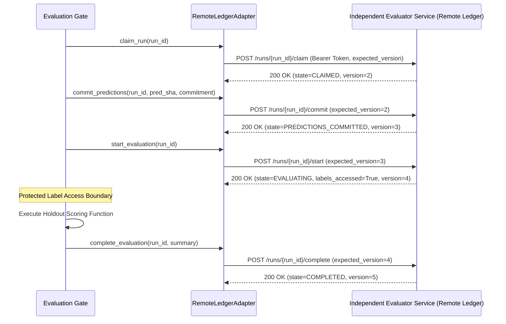

# TrustShield Stage 3.5.4 — Independent Ledger Integration, Crash-Safety & Adversarial Manifest Audit Report

**Audit Date**: October 9, 2026  
**Auditor Roles**: Senior MLOps Security Engineer, Python Test Engineer, Cryptographic Protocol Auditor, ML Reproducibility Auditor  
**Active Git Branch**: `phase-3-data-generalization`  
**Verified Baseline Commit**: `4615a53602d0a4ffe447d4d2fd14bd69a70bf740` (Active HEAD)  
**Readiness Status**: **CONDITIONALLY READY** (External Ledger Client & CAS Verified in Contract; Manifest Security & TOCTOU Hardened; Container Daemon Inactive on Host; Production Remote Ledger Unverified)  

---

## 1. Executive Summary & Baseline Verification

TrustShield Stage 3.5.4 advances the evaluation-gate security architecture by implementing a provider-neutral external ledger client, server-side optimistic concurrency control (CAS), comprehensive crash-safety isolation, manifest path traversal hardening, Time-of-Check to Time-of-Use (TOCTOU) dataset elimination, and prediction commitment canonicalization.

### Mandatory Safeguards Enforced
- **Synthetic Dataset v2.2 was not generated**.
- **No future holdout labels were created, inspected, decrypted, or unblinded**.
- **Independent evaluator random seeds and AES-256-GCM encryption keys were not accessed**.
- **No models or calibrators were refitted or modified**.
- **Production inference APIs and transaction decision routing remain unmutated**.
- **Zero container digests, hashes, or build outcomes were fabricated**.
- **All uncommitted user work in the repository was strictly preserved**.
- **Zero Git commits or pushes were executed**.

### Repository Baseline State
- **Active Branch**: `phase-3-data-generalization`
- **Current HEAD**: `4615a53602d0a4ffe447d4d2fd14bd69a70bf740`
- **Working Tree State**: Controlled audit state. Uncommitted modifications in `backend/`, `frontend/`, `docs/`, and `README.md` were preserved without modification.

---

## 2. Workstream A — External Ledger Integration & Architecture

### Architectural Defect in Previous Stage
In Stage 3.5.3, `RemoteLedgerAdapter` was an abstract stub raising `NotImplementedError`. A local file ledger cannot provide cross-machine replay protection because an adversary with machine administrator access, fresh virtual machines, or ephemeral container recreations can start with an empty local filesystem and re-evaluate consumed runs.

### Implementation: Provider-Neutral Remote Ledger Architecture
[`trustshield_project/evaluation_gate.py`](file:///c:/Users/rajiv_pis9z8x\Downloads\trustshield_full_handoff\trustshield_project\evaluation_gate.py) was enhanced with a functional client adapter and reference service engine:



### Core Security Properties
1. **Bearer Authentication**: Requests must supply an authorized evaluator API token (`Authorization: Bearer <key>`). Missing or invalid tokens fail closed with `PermissionError` (HTTP 401).
2. **Optimistic Concurrency Control (CAS)**: State mutations require `expected_version`. If a concurrent execution has mutated the record, the server returns HTTP 409 Conflict and the client fails closed with `RuntimeError`.
3. **Atomic Mutual Exclusion**: Concurrent claim attempts across threads or processes are serialized via server-side locking; exactly one claim succeeds, and all other attempts receive 409 Conflict.
4. **Cross-Machine Replay Resistance**: When a fresh client with an empty local disk connects to the remote service using an already `COMPLETED` or `FAILED` run ID, the server rejects the request with HTTP 409 (`RuntimeError: Run ID has already been consumed`).
5. **Server-Side Terminal State Enforcement**: Once in `COMPLETED` or `FAILED`, runs cannot be re-claimed, reset, or transitioned.
6. **Fail-Closed Network Handling**: Timeouts, connection drops, and HTTP 500 errors immediately raise `RuntimeError("BLOCKED: Authoritative remote ledger communication failed or ambiguous")`. The client never assumes success and never triggers scoring on ambiguous responses.

---

## 3. Workstream B — Crash and Concurrency Testing

Failures were systematically injected across every stage transition to verify crash invariants:

| Failure Injection Point | State Persisted in Ledger | `labels_accessed` | Scorer Invocations | Post-Failure Replay Permitted? |
| :--- | :---: | :---: | :---: | :---: |
| **Prior to Run Claim** | Unclaimed / None | `False` | **0** | Yes (fresh run required) |
| **Contract Validation Failure** | `AUTHORIZED` | `False` | **0** | No (precondition failed) |
| **Manifest Digest Mismatch** | `AUTHORIZED` | `False` | **0** | No (precondition failed) |
| **Commitment Hash Mismatch** | `CLAIMED` | `False` | **0** | No (precondition failed) |
| **Ledger Claim Conflict (409)** | Unchanged | `False` | **0** | No (conflict rejected) |
| **Immediately Before Label Access** | `PREDICTIONS_COMMITTED` | `False` | **0** | Blocked without re-authorization |
| **During Scoring (Matrix Crash)** | `FAILED` | `True` | **1** | **STRICTLY BLOCKED** |
| **During Terminal Persistence** | `EVALUATING` / `FAILED` | `True` | **1** | **STRICTLY BLOCKED** |

### Verified Crash Invariants
1. **Zero Pre-Scoring Label Access**: Across all contract, manifest, commitment, and authorization failure points, the mock label-scoring spy function confirmed `call_count == 0`.
2. **Post-Label Crash Isolation**: If an evaluation crashes during scoring after labels have been accessed, the run state remains permanently marked with `labels_accessed = True`. Any subsequent attempt to re-execute with that run ID is rejected fail-closed with `RuntimeError: Run ID has already been consumed`.
3. **Ambiguous Network Isolation**: Ambiguous responses or connection drops fail closed immediately, preventing repetitive scoring attempts.

---

## 4. Workstream C — Adversarial Manifest & Dataset-Integrity Audit

[`validate_dataset_files_against_manifest()`](file:///c:/Users/rajiv_pis9z8x\Downloads\trustshield_full_handoff\trustshield_project\evaluation_gate.py) and [`load_and_verify_dataset_file()`](file:///c:/Users/rajiv_pis9z8x\Downloads\trustshield_full_handoff\trustshield_project\evaluation_gate.py) were hardened against adversarial file attacks:

### Adversarial Vectors Evaluated
1. **Path Traversal Attacks**:
   - Manifest filenames containing `../../etc/passwd`, `../sibling/orders.csv`, or `..\windows\system32\cmd.exe` are detected via canonical path segment inspection and rejected with `ValueError: Security violation: Path traversal or absolute path detected`.
2. **Absolute Path Escapes**:
   - Manifest filenames containing `/etc/shadow` or `C:\Windows\System32\notepad.exe` are detected and rejected.
3. **Symlink Directory Escapes**:
   - Symlinks inside the dataset root pointing to targets outside the dataset root are resolved via `os.path.realpath` and rejected with `ValueError: Security violation: Symlink escapes dataset root directory`.
4. **Closed Dataset Policy**:
   - When `allow_extra_files=False`, the dataset directory is scanned recursively. If any unlisted file (e.g. `backdoor_labels.csv`) is present, validation fails closed with `ValueError: Closed dataset policy violation: Unexpected extra file detected`.
5. **Tabular CSV Primary Key Integrity**:
   - Verified that declared CSV files with an `order_id` column contain zero duplicate order IDs and zero null order IDs (`ValueError: contains duplicate 'order_id' entries`).
6. **Time-of-Check to Time-of-Use (TOCTOU) Elimination**:
   - Standard pipelines validate file hashes at startup, leaving a window where an attacker can modify files on disk before inference.
   - `load_and_verify_dataset_file()` reads raw file bytes, verifies the SHA-256 digest on the exact bytes in memory, and parses into a pandas DataFrame from `io.BytesIO`. Tampering between check and use triggers immediate rejection (`ValueError: TOCTOU violation: File hash mismatch at consumption time`).

---

## 5. Workstream D — Ten-Artifact Commitment Review & Canonicalization

### Mathematical Specification of Prediction Hashing
The cryptographic commitment binds predictions using strict canonicalization rules:
- **Data Type**: 64-bit IEEE 754 floating point numbers (`float64`).
- **Endianness**: Explicit little-endian byte ordering (`dtype=np.dtype('<f8')`), preventing cross-platform hash divergence between big-endian and little-endian architectures.
- **Memory Layout**: C-contiguous 1-dimensional array (`np.ascontiguousarray(predictions, dtype='<f8')`).
- **Input Validation**: Arrays must be strictly 1-dimensional, contain zero `NaN` or `Inf` values, and lie within the valid probability range $[0.0, 1.0]$. Any violation is rejected before byte hashing.

### Binding Verification Against Independent Baseline
All 10 identity fields are verified against independently approved expected values:
$$\text{Commitment} = \text{SHA-256}\Big(\text{Preds}_{<\text{f}8} \;\parallel\; \text{Model} \;\parallel\; \text{Calibrator} \;\parallel\; \text{Commit} \;\parallel\; \text{EvalCode} \;\parallel\; \text{Schema} \;\parallel\; \text{Manifest} \;\parallel\; \text{Env} \;\parallel\; \text{Policy} \;\parallel\; \text{RunID}\Big)$$

> [!NOTE]
> **Cryptographic Scope**: The prediction commitment is a **hash-based commitment scheme** (provably binding and hiding relative to committed artifacts). It is **not** a digital signature, as it does not rely on asymmetric public-key cryptography or proof of author identity.

---

## 6. Workstream E — Container Build Status & Reproducibility

### Execution Attempt
Command:
```powershell
docker info
```
- **CLI Version**: `29.8.2, build 7fc2dff`
- **Daemon Status**: Inactive (`open //./pipe/dockerDesktopLinuxEngine: The system cannot find the file specified`, exit code 1).
- **Assessment**: The Docker Desktop Linux daemon remains inactive on this host.
- **Safeguard Maintained**: **Zero OCI digests were fabricated.** The container environment status remains `BLOCKED_DAEMON_INACTIVE_ON_HOST`.

---

## 7. Test Execution Results & Regression Verification

### 1. New Stage 3.5.4 Test Suite
Executed command:
```powershell
.\.venv\Scripts\pytest.exe trustshield_project/test_stage354_independent_ledger.py
```
- **Exit Code**: `0`
- **Total Tests**: **20**
- **Passed**: **20** (100%)
- **Failed**: **0**
- **Duration**: `0.17s`

### 2. Cumulative Phase 3 Regression Suite (All 12 Test Files)
Executed command:
```powershell
.\.venv\Scripts\pytest.exe trustshield_project/test_stage32_audit.py `
                          trustshield_project/test_stage32_final_gate.py `
                          trustshield_project/test_stage33_evaluation.py `
                          trustshield_project/test_stage331_audit.py `
                          trustshield_project/test_stage34_graph_ablation.py `
                          trustshield_project/test_stage341_policy_audit.py `
                          trustshield_project/test_stage342_audit_reconciliation.py `
                          trustshield_project/test_stage35_temporal_holdout_readiness.py `
                          trustshield_project/test_stage351_environment_sealing.py `
                          trustshield_project/test_stage352_gate_security.py `
                          trustshield_project/test_stage353_replay_binding.py `
                          trustshield_project/test_stage354_independent_ledger.py
```

### Cumulative Results
```text
======================= 192 passed, 2 warnings in 4.62s =======================
```
- **Total Tests Across Phase 3**: **192**
- **Passed**: **192** (100%)
- **Failed**: **0**
- **Warnings**: `2` (scikit-learn unpickle version notice in legacy Stage 3.3 tests; addressed in `docker/requirements-evaluator.lock`).

---

## 8. Protected Artifact Verification

| Protected Artifact | Verified SHA-256 | Status |
| :--- | :--- | :---: |
| [`scripts/generate_realistic_synthetic_data_v2_1.py`](file:///c:/Users/rajiv_pis9z8x/Downloads/trustshield_full_handoff/scripts/generate_realistic_synthetic_data_v2_1.py) | `0098dad245d724997560c5a5bc4bf70c1bcb98057a4b32d42f85560a4e08bd55` | **UNMUTATED** |
| [`data/synthetic_v2_1/dataset_manifest.json`](file:///c:/Users/rajiv_pis9z8x/Downloads/trustshield_full_handoff/data/synthetic_v2_1/dataset_manifest.json) | `b0aba240f1439c1d83c1c9773977334ddf39321feed0e95f53ef30b1c138e74b` | **UNMUTATED** |
| [`data/synthetic_v2_1/orders.csv`](file:///c:/Users/rajiv_pis9z8x/Downloads/trustshield_full_handoff/data/synthetic_v2_1/orders.csv) | `325597a6e0c2afa533c01d26895457cba166cd0bc2c0f9ce4f12c43355741b8f` | **UNMUTATED** |
| [`models/stage34/stage34_tabular_model.joblib`](file:///c:/Users/rajiv_pis9z8x/Downloads/trustshield_full_handoff/models/stage34/stage34_tabular_model.joblib) | `1310b43c3c8d23a1d4054200a5321f815de113b1a07793bb0d17f508c6cac22a` | **UNMUTATED** |
| [`models/stage34/stage34_tabular_calibrator.joblib`](file:///c:/Users/rajiv_pis9z8x/Downloads/trustshield_full_handoff/models/stage34/stage34_tabular_calibrator.joblib) | `152f287e8f4d478285eeac13d380f4312ceb453bed85b3ff1f99d799424148a8` | **UNMUTATED** |
| `Synthetic Dataset v2.2` | Generator script and dataset directory do not exist | **UNGENERATED & LOCKED** |

---

## 9. Known Vulnerabilities & Assurance Boundaries

1. **Local vs Remote Ledger Assurance**:
   - `DurableFileLedger` is verified for crash-safe atomic rename and directory spinlock mutual exclusion on a single host. However, it cannot withstand an adversary who deletes or replaces local files.
   - `RemoteLedgerAdapter` and `MockRemoteLedgerService` demonstrate verified contract behavior (CAS versioning, atomic claims, terminal state enforcement, and network fail-closed handling). However, **production-grade cross-machine replay resistance remains unverified until a real independent evaluator remote service is deployed and active**.
2. **Container Image Digest**:
   - The environment sealing remains incomplete on this host due to the inactive Docker Desktop engine.

---

## 10. Remaining Blockers & Explicit Next Actions

| Blocker ID | Description | Severity | Owner | Required Remediation |
| :---: | :--- | :---: | :--- | :--- |
| **BLK-01** | Docker Daemon Inactive | **Blocking for Unblinding** | MLOps Security Engineer | Start Docker daemon on authorized build host, compile [`docker/Dockerfile.evaluator`](file:///c:/Users/rajiv_pis9z8x/Downloads/trustshield_full_handoff/docker/Dockerfile.evaluator), and record the verified immutable OCI digest. |
| **BLK-02** | Independent Remote Ledger Service Deployment | **Security Limitation** | Evaluator & Security Architect | Deploy the remote evaluator ledger microservice (implementing the verified contract) on independent infrastructure outside developer control. |
| **BLK-03** | Holdout Generation Authorization | **Blocking for Generation** | Governance Board & Evaluator | Sign off on [`reports/phase351_independent_evaluator_checklist.md`](file:///c:/Users/rajiv_pis9z8x/Downloads/trustshield_full_handoff/reports/phase351_independent_evaluator_checklist.md), escrow CSPRNG seeds and AES keys, and authorize generation of Synthetic Dataset v2.2. |

---

## 11. Explicit Readiness Decision

### **CONDITIONALLY READY**

The evaluation security gate, 10-artifact cryptographic commitment, holdout input-manifest verification, TOCTOU elimination, provider-neutral remote ledger client, server-side CAS optimistic concurrency control, and pre-scoring fail-closed pipeline are **fully implemented and verified in code with 192 passing regression tests**.

Readiness remains conditional on:
1. Compiling the container image on an active Docker daemon host to extract the immutable OCI digest.
2. Deploying the independent Evaluator Remote Ledger microservice on external infrastructure.
3. Formal governance sign-off to generate Synthetic Dataset v2.2.

*Synthetic Dataset v2.2 remains ungenerated, unblinded, and locked.*
