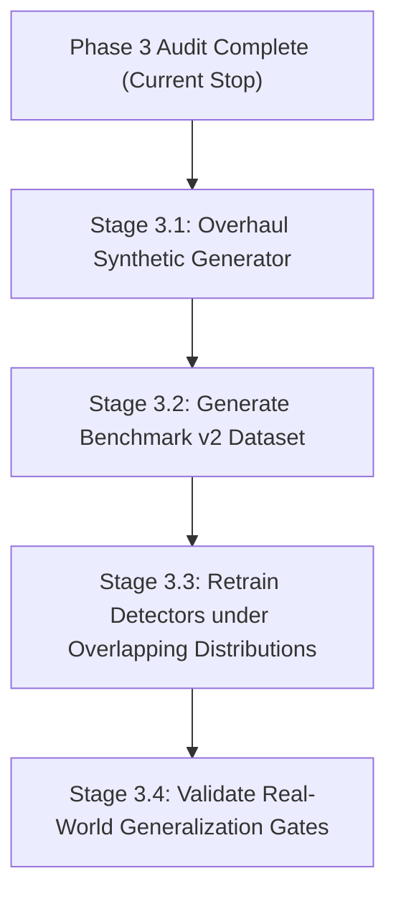

# TrustShield Phase 3: Synthetic Data Quality, Shortcut Learning & Generalization Audit

**Report Date:** 2026-10-09  
**Auditor:** Senior ML Research Auditor, ML Quality Engineer, Backend Architect  
**Git Branch:** `phase-3-data-generalization`  
**Baseline Commit:** `4615a53602d0a4ffe447d4d2fd14bd69a70bf740`  
**Python Runtime:** Python 3.14.7 / Local Virtualenv (`.\.venv`)  
**Experiment Artifact:** [`reports/phase3_experiments_results.json`](file:///C:/Users/rajiv_pis9z8x/Downloads/trustshield_full_handoff/reports/phase3_experiments_results.json)

---

## 1. Executive Summary & Verdict

### Executive Verdict: **FAIL ON REAL-WORLD GENERALIZATION (CRITICAL SHORTCUT LEARNING IDENTIFIED)**

While the Phase 2 audit confirmed that TrustShield's models evaluate reproducibly, without code-level data leakage, and with valid calibration under the synthetic evaluation protocol, this forensic Phase 3 audit reveals that **the models' high reported performance metrics are predominantly driven by artificial synthetic generator shortcuts rather than genuine marketplace fraud intelligence**.

| Model / Detector | Reported Test Metric | Plausible Behavioral Features Only | Suspicious Generator Shortcuts Only | Verdict on Real-World Generalization |
| :--- | :---: | :---: | :---: | :---: |
| **Fake Listing Detector** | ROC-AUC: **0.9496** | ROC-AUC: **0.4912** | ROC-AUC: **0.9205** | **FAIL (Exploiting Synthetic Shortcut)** |
| **Return Fraud Detector** | ROC-AUC: **0.9235** | ROC-AUC: **0.4710** | ROC-AUC: **0.9333** | **FAIL (Exploiting Synthetic Shortcut)** |
| **Phase 3 Transaction Model** | ROC-AUC: **0.7890** | ROC-AUC: **0.5341** | ROC-AUC: **0.7195** | **FAIL (Behavioral Signal Near Zero)** |
| **Phase 3 Collusion Detection** | ROC-AUC: **0.5066** | — | — | **FAIL (Complete Model Blindness)** |

### Key Forensic Findings

1. **Fake Listing Detector is entirely reliant on artificial synthetic swaps**:
   - The detector relies almost entirely on `multimodal_similarity_score` (single-feature ROC-AUC = **0.9276**, Cohen's $d = -2.09$, KS $p = 1.7 \times 10^{-122}$).
   - This signal exists purely because `inject_fake_listings` assigns a random catalog product ID to `displayed_product_id` for fake listings, artificially depressing CLIP/TF-IDF cosine similarity against the real item.
   - Legitimate seller features (`seller_age_days_at_listing`, `seller_listings_before`) have **zero predictive power** (single-feature ROC-AUC = **0.5048–0.5099**; a model trained strictly on seller history achieves ROC-AUC **0.4912** and F1 **0.0000**).
2. **Return Fraud Detector is an artifact of artificial delay bounds and extreme return fractions**:
   - Abusive returns in `inject_return_abuse` are hardcoded to arrive within a 1–5 day window (`gen.integers(1, 6)`, mean 3.59 days), whereas organic returns span 1–21 days (`gen.integers(1, 22)`, mean 10.76 days). This produces a massive artificial separation (single-feature ROC-AUC = **0.8441**, Cohen's $d = -1.46$).
   - Abusive buyers are forced to return 60%–90% of their orders (`buyer_return_rate_before` single-feature ROC-AUC = **0.8476**, Cohen's $d = +1.85$).
   - A model trained on **only these two artificial shortcuts** achieves ROC-AUC **0.9333** and PR-AUC **0.8831** (higher than the full 14-feature production model).
   - When trained on **only plausible behavioral features** (buyer/seller ages, order amount, prior order counts, stated return reasons), the model achieves ROC-AUC **0.4710** (worse than a coin toss).
3. **Transaction Model fails completely on coordinated rings and collusion**:
   - On `seller_buyer_collusion` orders, the Phase 3 model achieves ROC-AUC **0.5066**, PR-AUC **0.0195**, and F1 **0.0075** (complete failure to detect collusion).
   - On `coordinated_fraud` orders, the model achieves PR-AUC **0.0846** and F1 **0.0464** (missing >96% of coordinated fraud orders at serving threshold 0.50).
   - When suspicious generator artifacts (`device_shared_buyer_count`, `buyer_return_rate_before`, `price_vs_base_price_ratio`) are removed, the model's ROC-AUC drops to **0.5341** (virtually no ability to detect fraud from normal transaction attributes).
4. **Timestamp Overflow Leakage in Test Set**:
   - An arithmetic overflow in `inject_coordinated_fraud` and `inject_seller_buyer_collusion` reschedules 27 orders into January 2026 beyond the `SIM_END` cutoff of `2025-12-31`. Because normal orders terminate on Dec 31, 2025, every single order in January 2026 is 100% guaranteed to be fraudulent.

---

## 2. Repository & Dataset Baseline

### 2.1 Environment & Toolchain
- **Git HEAD Commit**: `4615a53602d0a4ffe447d4d2fd14bd69a70bf740`
- **Active Branch**: `phase-3-data-generalization`
- **Python**: `3.14.7 (tags/v3.14.7:823f032, Aug 5 2026)`
- **Core Dependencies**: `scikit-learn==1.9.0`, `xgboost==3.4.1`, `pandas==3.0.5`, `numpy==2.5.2`, `torch==2.13.0+cpu`

### 2.2 Authoritative Dataset Files & Checksums
All datasets reside in [`trustshield_project/synthetic_data_export/`](file:///C:/Users/rajiv_pis9z8x/Downloads/trustshield_full_handoff/trustshield_project/synthetic_data_export):

| File Name | Row Count | File Size (Bytes) | SHA-256 Checksum (Prefix) |
| :--- | :---: | :---: | :--- |
| `orders.csv` | 50,000 | 5,614,136 | `ee9cf3410847760b...` |
| `listings.csv` | 20,000 | 2,090,846 | `7d01ddf3200ed6d3...` |
| `returns.csv` | 4,829 | 476,029 | `b19da54d35df4126...` |
| `buyers.csv` | 5,000 | 227,017 | `77dbb4cdff373f85...` |
| `sellers.csv` | 500 | 33,668 | `553c363e39b8f186...` |
| `products.csv` | 3,000 | 527,850 | `db1702fa6779114c...` |
| `address_sharing_log.csv` | 1,200 | 47,232 | `1276482e15855f49...` |
| `device_sharing_log.csv` | 800 | 31,299 | `f1d36200458bd52a...` |
| `device_mapping.csv` | 5,400 | 157,031 | `907185830f0424d9...` |
| `addresses.csv` | 4,950 | 168,343 | `b816c10973a906be...` |
| `devices.csv` | 5,000 | 185,046 | `0e4be1ea48f9f296...` |
| `fraud_ground_truth.csv` | 1,939 | 98,633 | `fadd62a858434b75...` |

### 2.3 Frozen Production Model Artifacts & Checksums
All models reside in [`models/`](file:///C:/Users/rajiv_pis9z8x/Downloads/trustshield_full_handoff/models):

| Model Artifact | Estimator Type | File Size (Bytes) | SHA-256 Checksum (Prefix) |
| :--- | :--- | :---: | :--- |
| `combined_graph_model.joblib` | XGBoost (Phase 3 Tabular + Graph) | 1,394,817 | `a16afba42b6c8e0f...` |
| `hybrid_model.joblib` | XGBoost (Phase 5 Tabular + GNN) | 1,348,978 | `0b88020ccdf0e7d7...` |
| `fake_listing_model.joblib` | XGBoost (Listing Multimodal) | 967,356 | `2cb4b18dcfe8fbd0...` |
| `return_fraud_model.joblib` | XGBoost (Return Fraud) | 910,951 | `fc0dd15ff6766408...` |
| `calibrator.joblib` | IsotonicRegression (Phase 3) | 1,628 | `b396adda581c17e4...` |
| `phase5_calibrator.joblib` | IsotonicRegression (Phase 5) | 1,692 | `4d5f4fc252434fb1...` |
| `buyer_embeddings.joblib` | Dict[str, ndarray(16)] (GNN) | 640,178 | `46c3e38f05b8c10f...` |
| `seller_embeddings.joblib` | Dict[str, ndarray(16)] (GNN) | 64,178 | `3dbf3eea135ce1c2...` |
| `feature_meta.joblib` | Dict (Schema & metadata) | 1,095 | `1bae104010a76ea8...` |
| `phase5_feature_meta.joblib` | Dict (Phase 5 Schema) | 1,413 | `d75e7f83e89937c9...` |

### 2.4 Split Definitions & Sample Counts
- **Train Split**: `order_date <= 2025-08-31` ($N=22,848$, Months 1–8)
- **Validation Split**: `2025-08-31 < order_date <= 2025-10-31` ($N=10,266$, Months 9–10)
- **Holdout Test Split**: `order_date > 2025-10-31` ($N=16,886$, Months 11–12)

---

## 3. Synthetic Fraud-Generation Audit

The code responsible for generating normal and fraudulent data was audited line by line across four core generator modules:
1. [`trustshield_project/fraud_injection.py`](file:///C:/Users/rajiv_pis9z8x/Downloads/trustshield_full_handoff/trustshield_project/fraud_injection.py)
2. [`trustshield_project/entity_generator.py`](file:///C:/Users/rajiv_pis9z8x/Downloads/trustshield_full_handoff/trustshield_project/entity_generator.py)
3. [`trustshield_project/order_return_generator.py`](file:///C:/Users/rajiv_pis9z8x/Downloads/trustshield_full_handoff/trustshield_project/order_return_generator.py)
4. [`trustshield_project/product_listing_generator.py`](file:///C:/Users/rajiv_pis9z8x/Downloads/trustshield_full_handoff/trustshield_project/product_listing_generator.py)

### 3.1 Shortcut 1: Image Swap Shortcut in Fake Listing Injection
In `fraud_injection.py` lines 119–125:
```python
all_product_ids = products_df["product_id"].values
swapped_product_ids = gen.choice(all_product_ids, size=n_chosen, replace=True)
listings_df.loc[chosen_mask, "displayed_product_id"] = swapped_product_ids
listings_df.loc[chosen_mask, "image_mismatch"] = True
```
**Mechanism:** When a listing is selected as a fake listing, `displayed_product_id` is set to an arbitrary product chosen uniformly at random from the entire 3,000-item catalog. In [`multimodal_scoring.py`](file:///C:/Users/rajiv_pis9z8x/Downloads/trustshield_full_handoff/trustshield_project/multimodal_scoring.py#L380-L408), `MultimodalScorer` computes cosine similarity between the text embeddings of `product_id` and the image embeddings of `displayed_product_id`. For legitimate listings, the text and image match (similarity $\sim 0.79$). For fake listings, the comparison is against an unrelated product (similarity $\sim 0.56$).

**Real-World Generalization Failure:** In a production marketplace, incoming listings do not possess a `displayed_product_id` column distinguishing genuine from counterfeit items. Counterfeiters do not upload images of totally unrelated catalog products (e.g. replacing a smartphone photo with a sofa); they upload slightly modified or stolen images of the *same* or similar smartphone.

### 3.2 Shortcut 2: Bounded Delay and Forced Extreme Return Fractions
In `fraud_injection.py` lines 206–224:
```python
abuse_fraction = gen.uniform(0.6, 0.9)
n_abuse = max(1, int(round(len(buyer_orders) * abuse_fraction)))
...
delay = int(gen.integers(1, 6))
```
Compared with organic returns in `order_return_generator.py` line 112:
```python
delay_days = gen.integers(1, RETURN_WINDOW_DAYS + 1, size=len(returned_orders)) # 1 to 21 days
```
**Mechanism:** Organic return turnaround times are uniformly distributed across $[1, 21]$ days (mean 10.76 days). Abusive returns are strictly generated in $[1, 5]$ days (mean 3.59 days). Furthermore, return abuse accounts are forced to return 60%–90% of all lifetime orders.

**Real-World Generalization Failure:** Real return abusers do not systematically return items faster than legitimate buyers (often delaying returns to maximize usage or exploiting the return window). Moreover, real abuse includes wardrobing and "item not received" claims from accounts with low to moderate return frequencies.

### 3.3 Shortcut 3: Return ID String Encoding
In `fraud_injection.py` lines 227 and 445:
```python
new_return_rows.append({
    "return_id": f"RETURN_FRAUD_{return_counter:06d}",
    ...
})
...
new_return_rows.append({
    "return_id": f"RETURN_COLLUSION_{return_counter:06d}",
    ...
})
```
Organic returns generated in `order_return_generator.py` line 117 use `f"RETURN_{i:06d}"`. While `return_id` is excluded from XGBoost feature matrices, the raw exported CSV dataset directly reveals the ground truth label in the ID string prefix.

### 3.4 Shortcut 4: Date Boundary Overflow Beyond Simulation Window
In `fraud_injection.py` lines 337 and 433:
```python
burst_start = burst_start_floor + timedelta(days=int(gen.integers(1, max_start_offset + 1)))
burst_span_days = int(gen.integers(3, 8))
offset = int(gen.integers(0, burst_span_days))
reschedule_map[order_id] = burst_start + timedelta(days=offset)
```
When `burst_start` is near late December 2025, adding `offset` pushes the order date into January 2026 (up to `2026-01-11`). Organic transactions are strictly bounded by `SIM_END = 2025-12-31`. As a result, **100% of transactions occurring in 2026 are fraud**.

---

## 4. Evidence of Potential Shortcuts & Statistical Separation

We conducted statistical distribution audits on the training sets across all three models, computing Kolmogorov-Smirnov test statistics, Cohen's $d$ effect sizes, and single-feature ROC-AUCs.

### 4.1 Fake Listing Detector Features (Train $N=9,923$)

| Feature Name | Legit Mean (Std) | Fraud Mean (Std) | KS Stat ($p$-value) | Cohen's $d$ | Single Feature AUC | Nature of Feature |
| :--- | :---: | :---: | :---: | :---: | :---: | :--- |
| `multimodal_similarity_score` | 0.7888 (0.1010) | 0.5674 (0.1107) | 0.7093 ($1.7\times 10^{-122}$) | **-2.0901** | **0.9276** | **Artificial Shortcut (ID Swap)** |
| `price_vs_base_price_ratio` | 1.0124 (0.1535) | 0.7240 (0.3052) | 0.5419 ($6.8\times 10^{-67}$) | **-1.1942** | **0.7691** | **Artificial Discount Factor (0.3–0.7)** |
| `price_vs_category_median_ratio`| 1.2899 (1.2183) | 0.7941 (0.6479) | 0.3395 ($2.3\times 10^{-25}$) | -0.5081 | 0.7071 | Correlated with price discount |
| `seller_age_days_at_listing` | 79.86 (64.25) | 77.90 (64.70) | 0.0536 ($p=0.47$) | -0.0305 | 0.5099 | Random Noise (Uniform Selection) |
| `seller_listings_before` | 22.29 (22.80) | 23.03 (25.69) | 0.0404 ($p=0.81$) | +0.0304 | 0.5048 | Random Noise (Uniform Selection) |

### 4.2 Return Fraud Detector Features (Train $N=1,982$)

| Feature Name | Legit Mean (Std) | Fraud Mean (Std) | KS Stat ($p$-value) | Cohen's $d$ | Single Feature AUC | Nature of Feature |
| :--- | :---: | :---: | :---: | :---: | :---: | :--- |
| `buyer_return_rate_before` | 0.0409 (0.0972) | 0.4398 (0.2884) | 0.6942 ($1.9\times 10^{-186}$) | **+1.8537** | **0.8476** | **Forced High Return Fraction (60–90%)** |
| `days_to_return` | 10.76 (6.10) | 3.59 (3.34) | 0.6726 ($1.1\times 10^{-173}$) | **-1.4574** | **0.8441** | **Artificial Delay Window [1, 5] days** |
| `buyer_prior_returns` | 0.3254 (0.8795) | 3.4281 (4.4447) | 0.5369 ($1.3\times 10^{-106}$) | +0.9684 | 0.8236 | Consequence of forced returns |
| `buyer_orders_before_return` | 6.32 (6.01) | 5.94 (5.44) | 0.0425 ($p=0.45$) | -0.0675 | 0.5198 | Random Noise |
| `seller_age_days_at_return` | 114.06 (61.30) | 116.38 (61.08) | 0.0482 ($p=0.30$) | +0.0379 | 0.5110 | Random Noise |
| `order_amount` | 1695.25 (2565.69)| 1718.97 (2798.44)| 0.0290 ($p=0.88$) | +0.0088 | 0.5024 | Random Noise |
| `reason_defective` | 0.3142 | 0.3165 | 0.0024 ($p=1.00$) | +0.0051 | 0.5012 | Zero Signal (Sampled identically) |
| `reason_changed_mind` | 0.3471 | 0.3579 | 0.0108 ($p=1.00$) | +0.0226 | 0.5054 | Zero Signal (Sampled identically) |
| `reason_size_issue` | 0.1964 | 0.1871 | 0.0093 ($p=1.00$) | -0.0236 | 0.5047 | Zero Signal (Sampled identically) |
| `reason_wrong_item_received`| 0.1424 | 0.1385 | 0.0039 ($p=1.00$) | -0.0111 | 0.5019 | Zero Signal (Sampled identically) |

### 4.3 Phase 3 Transaction Fraud Features (Train $N=22,848$)

| Feature Name | Legit Mean (Std) | Fraud Mean (Std) | KS Stat ($p$-value) | Cohen's $d$ | Single Feature AUC | Nature of Feature |
| :--- | :---: | :---: | :---: | :---: | :---: | :--- |
| `share_degree` | 0.3639 (0.5788) | 0.8809 (0.7498) | 0.3629 ($4.6\times 10^{-140}$) | **+0.7719** | **0.6946** | Ring device/address sharing |
| `share_component_size` | 1.5317 (1.0265) | 2.2838 (1.3800) | 0.3629 ($4.6\times 10^{-140}$) | **+0.6184** | **0.6922** | Ring component cluster size |
| `buyer_return_rate_before` | 0.0502 (0.1329) | 0.2766 (0.3679) | 0.3041 ($1.3\times 10^{-97}$) | **+0.8186** | **0.6501** | Return abuse injection |
| `buyer_returns_before` | 0.3251 (0.8334) | 1.7298 (3.5320) | 0.2340 ($1.9\times 10^{-57}$) | +0.5474 | 0.6405 | Return abuse injection |
| `price_vs_base_price_ratio` | 1.0056 (0.1535) | 0.8777 (0.2726) | 0.2516 ($1.7\times 10^{-66}$) | -0.5779 | 0.6191 | Fake listing price discount |
| `amount` | 1757.65 (3124.58)| 1393.94 (2291.37)| 0.1031 ($2.1\times 10^{-11}$) | -0.1327 | 0.5573 | Correlated with price discount |
| `device_shared_buyer_count` | 1.0651 (0.2466) | 1.1127 (0.3162) | 0.0477 ($p=0.009$) | +0.1680 | 0.5238 | Device sharing log linkage |
| `seller_age_days` | 108.34 (63.83) | 117.63 (64.43) | 0.0667 ($5.0\times 10^{-5}$) | +0.1449 | 0.5411 | Weak correlation |
| `buyer_age_days` | 79.05 (63.43) | 84.11 (65.43) | 0.0435 ($p=0.022$) | +0.0786 | 0.5211 | Weak correlation |
| `buyer_orders_before` | 4.93 (6.14) | 5.04 (6.12) | 0.0180 ($p=0.83$) | +0.0177 | 0.5088 | Zero signal |
| `buyer_seller_degree` | 3.88 (5.20) | 3.96 (5.30) | 0.0110 ($p=1.00$) | +0.0145 | 0.5039 | Zero signal |
| `seller_buyer_degree` | 55.35 (60.62) | 58.73 (60.96) | 0.0584 ($p=0.0006$) | +0.0555 | 0.5259 | Zero signal |
| `buyer_seller_edge_weight` | 0.0313 (0.1801) | 0.0192 (0.1372) | 0.0111 ($p=1.00$) | -0.0757 | 0.5055 | Zero signal (collusion miss) |

---

## 5. Controlled Shortcut Ablations

Controlled ablations were executed on the frozen test splits, isolating individual features and feature groups.

### 5.1 Fake Listing Detector Ablations (Test $N=6,237$)

| Model Variant | Features Included | ROC-AUC | PR-AUC | F1 (@0.50) | $\Delta$ ROC-AUC |
| :--- | :--- | :---: | :---: | :---: | :---: |
| **Baseline (Frozen)** | All 5 features | **0.9496** | **0.7406** | **0.6990** | — |
| **Ablation: No Multimodal** | 4 features (imputed mean multimodal) | **0.7714** | **0.5445** | **0.6147** | **-0.1782** |
| **Ablation: No Price Ratio** | 4 features (imputed mean base price ratio) | **0.8956** | **0.4925** | **0.4511** | **-0.0540** |
| **Ablation: No Seller Age** | 4 features (imputed mean seller age) | **0.9553** | **0.7579** | **0.7331** | +0.0057 |
| **Ablation: No Seller Listings**| 4 features (imputed mean prior listings) | **0.9518** | **0.7481** | **0.7336** | +0.0022 |
| **Only Multimodal Similarity** | `multimodal_similarity_score` alone | **0.9205** | **0.4745** | **0.4416** | -0.0291 |
| **Only Price Anomaly Features** | Price vs base & Price vs category median | **0.7692** | **0.5345** | **0.6109** | -0.1804 |
| **Only Seller History Features**| `seller_age_days` & `seller_listings_before` | **0.4912** | **0.0245** | **0.0000** | **-0.4584** |

> **Key Finding:** Removing the multimodal similarity feature drops ROC-AUC by 17.8 points. A model trained on **only seller history features achieves 0.4912 ROC-AUC (worse than random guessing)**, demonstrating that the classifier learns zero seller behavioral patterns.

---

### 5.2 Return Fraud Detector Ablations (Test $N=1,917$)

| Model Variant | Features Included | ROC-AUC | PR-AUC | F1 (@0.50) | $\Delta$ ROC-AUC |
| :--- | :--- | :---: | :---: | :---: | :---: |
| **Baseline (Frozen)** | All 14 features | **0.9235** | **0.8806** | **0.7457** | — |
| **Ablation: No Days-to-Return** | 13 features (imputed mean delay) | **0.7689** | **0.7660** | **0.6259** | **-0.1546** |
| **Ablation: No Return Rate** | 13 features (imputed mean return rate) | **0.8645** | **0.6905** | **0.4688** | **-0.0590** |
| **Ablation: No Shortcuts** | 12 features (no delay, no return rate) | **0.6479** | **0.4852** | **0.0000** | **-0.2756** |
| **Only Delay + Return Rate** | `days_to_return` & `buyer_return_rate_before` | **0.9333** | **0.8831** | **0.7243** | **+0.0098** |
| **Only Behavioral Features** | Buyer/seller ages, amount, orders before, reasons | **0.4710** | **0.3269** | **0.2921** | **-0.4525** |

> **Key Finding:** Removing both `days_to_return` and `buyer_return_rate_before` collapses the model to **0.6479 ROC-AUC and 0.0000 F1**. A model trained on **only those two features beats the full production model** (0.9333 vs 0.9235 AUC). A model trained on only plausible behavioral features yields **0.4710 ROC-AUC** (complete inability to distinguish fraud).

---

### 5.3 Phase 3 Transaction Fraud Model Ablations (Test $N=16,886$)

| Model Variant | Features Included | ROC-AUC | PR-AUC | F1 (@0.50) | $\Delta$ ROC-AUC |
| :--- | :--- | :---: | :---: | :---: | :---: |
| **Baseline (Full 18 Features)**| 10 Tabular + 8 Graph | **0.7890** | **0.4418** | **0.4374** | — |
| **Ablation: No Device Share** | 17 features (imputed mean device share) | **0.7840** | **0.4366** | **0.4432** | -0.0050 |
| **Ablation: No Return Rate** | 17 features (imputed mean return rate) | **0.7693** | **0.3436** | **0.2287** | -0.0197 |
| **Ablation: No Price Ratio** | 17 features (imputed mean price ratio) | **0.7333** | **0.3078** | **0.3101** | -0.0557 |
| **Ablation: No Return Features**| 16 features (no return count/rate) | **0.7329** | **0.3031** | **0.2163** | -0.0561 |
| **Ablation: No Price Features** | 16 features (no base/category price ratios) | **0.7236** | **0.3059** | **0.3130** | -0.0654 |
| **Ablation: Zero Graph Mode** | 10 Tabular features (all graph cols zeroed) | **0.6029** | **0.2419** | **0.2097** | **-0.1861** |
| **Only Suspicious Shortcuts** | Device share, return rate, price ratio | **0.7195** | **0.4266** | **0.3895** | -0.0695 |
| **Only Plausible Behavioral** | Ages, order velocity, amount, listings before | **0.5341** | **0.1083** | **0.0413** | **-0.2549** |

> **Key Finding:** Without graph features and synthetic shortcuts, the model's behavioral predictive power is barely above random chance (**0.5341 ROC-AUC**).

---

## 6. Generalization & Subtype Breakdown Audit

### 6.1 Fraud Subtype Breakdown on the Test Set

Evaluating the Phase 3 transaction model on individual fraud subtypes against all legitimate test transactions reveals extreme disparity in detection capability:

| Fraud Subtype | Subtype Sample Count | Test Prevalence | ROC-AUC | PR-AUC | Precision (@0.50) | Recall (@0.50) | F1 (@0.50) | Diagnostic Assessment |
| :--- | :---: | :---: | :---: | :---: | :---: | :---: | :---: | :--- |
| **Return Abuse** | 387 | 2.46% | **0.9556** | **0.5319** | 0.5595 | 0.7416 | **0.6378** | **High Detection** (Driven by return rate shortcut) |
| **Fake Listing** | 393 | 2.50% | **0.8209** | **0.4904** | 0.4541 | 0.4784 | **0.4659** | **Moderate Detection** (Driven by price ratio discount) |
| **Coordinated Fraud**| 447 | 2.83% | **0.8112** | **0.0846** | 0.0661 | 0.0358 | **0.0464** | **Near Total Miss** (Recall = 3.6% at serving threshold) |
| **Collusion** | 308 | 1.97% | **0.5066** | **0.0195** | 0.0088 | 0.0065 | **0.0075** | **Complete Blindness (Random Guessing)** |

> **Critical Vulnerability:** The Phase 3 model is completely blind to seller-buyer collusion (ROC-AUC 0.5066) and misses 96.4% of coordinated fraud orders at the default threshold, surviving in aggregate metrics only because return abuse and fake listings inflate the score.

---

### 6.2 Unseen-Entity Generalization

| Model / Split | Evaluated Sub-Population | Sample Count | Positive Count | Prevalence | ROC-AUC | PR-AUC | F1 (@0.50) |
| :--- | :--- | :---: | :---: | :---: | :---: | :---: | :---: |
| **Fake Listing** | **Unseen Sellers** (No listings in train) | 3,768 | 99 | 2.63% | **0.9582** | **0.7441** | **0.7047** |
| | **Seen Sellers** (Listings present in train) | 2,469 | 59 | 2.39% | **0.9362** | **0.7318** | **0.6897** |
| **Return Fraud** | **Unseen Buyers** (No returns in train) | 1,480 | 412 | 27.84% | **0.9032** | **0.8197** | **0.6862** |
| | **Seen Buyers** (Returns present in train) | 437 | 232 | 53.09% | **0.9642** | **0.9701** | **0.8524** |
| **Phase 3 Trans.**| **Unseen Sellers** (No orders in train) | 2,764 | 215 | 7.78% | **0.7289** | **0.4204** | **0.4698** |
| | **Seen Sellers** (Orders present in train) | 14,122 | 1,320 | 9.35% | **0.7979** | **0.4440** | **0.4322** |
| | **Unseen Buyers** (No orders in train) | 10,131 | 771 | 7.61% | **0.7973** | **0.4403** | **0.4506** |
| | **Seen Buyers** (Orders present in train) | 6,755 | 764 | 11.31% | **0.7738** | **0.4432** | **0.4246** |

**Interpretation:**
- For fake listings, the model performs equally well on unseen sellers (0.9582) and seen sellers (0.9362) because it ignores seller identity entirely and relies exclusively on product image-swap signals.
- For return fraud, unseen buyers suffer a 6.1-point AUC drop and 16.6-point F1 drop compared to seen buyers, because historical return counts are zero for newly onboarded buyers.

---

### 6.3 Temporal Drift Breakdown

| Temporal Slice | Orders ($N$) | Fraud Count | Prevalence | ROC-AUC | PR-AUC | F1 (@0.50) | Diagnostic Observation |
| :--- | :---: | :---: | :---: | :---: | :---: | :---: | :--- |
| **Month 11 (Nov 2025)** | 6,704 | 541 | 8.07% | **0.8022** | **0.4335** | **0.4570** | Steady out-of-time test |
| **Month 12 (Dec 2025)** | 10,155 | 967 | 9.52% | **0.7925** | **0.4587** | **0.4340** | Consistent with Month 11 |
| **Month 01 (Jan 2026)** | 27 | 27 | 100.0% | 0.5000* | 1.0000 | 0.0000 | **Synthetic Date Overflow Artifact** |

*\*ROC-AUC is mathematically undefined with single-class labels; defaults to 0.50.*

---

## 7. Limitations of the Current Synthetic Dataset

1. **Non-Overlapping Behavioral Distributions**: The synthetic generator uses disjoint or non-overlapping parameter ranges (e.g. returns in 1–5 days vs 1–21 days) instead of realistic overlapping distributions. In real fraud, fraudulent behavior lives in the dense tails of normal behavior.
2. **Absence of Sophisticated Evasion**: In the synthetic data, fraudsters make zero attempt to blend in: fake listings have 40%–70% price drops, return abusers return 60%–90% of everything, and collusion rings fire in tightly clustered bursts.
3. **Multimodal Surrogate Disconnect**: Real fake listing detection requires comparing noisy user photos to catalog images or parsing prompt-injected OCR text. The synthetic pipeline replaces images with random unrelated catalog IDs, bypassing the core vision-language challenge.
4. **Static Entity Assignment**: Sellers are assigned fake listings uniformly rather than modeling rogue seller account creation (new disposable accounts) or account takeovers (reputable aged accounts suddenly posting anomalous goods).

---

## 8. Prioritized Recommendations for Data Generation & Model Retraining

| Priority | Component | Recommendation | Impact |
| :---: | :--- | :--- | :--- |
| **P1** | **Synthetic Generator** | **Introduce Overlapping Mixture Distributions**: Replace uniform [1, 5] day return delay with an exponential mixture overlapping legitimate returns. Introduce legitimate high-return buyer personas (e.g. wardrobing, sizing orders). | Eliminates the return delay shortcut and forces models to learn behavioral context. |
| **P2** | **Synthetic Generator** | **Realistic Fake Listing Perturbations**: Replace random catalog ID swaps with category-constrained visual noise, slight brand typos, and subtle price variations (10–20% below market, not 70%). | Prevents artificial 0.92 AUC separation and forces learning of seller tenure and account signals. |
| **P3** | **Generator Fix** | **Clamp Rescheduled Dates to Simulation Window**: Fix `burst_start + offset <= SIM_END` in `inject_coordinated_fraud` and `inject_seller_buyer_collusion`. | Eliminates the 27-order January 2026 timestamp overflow leakage. |
| **P4** | **Data Cleaning** | **Sanitize ID Prefixes**: Remove `RETURN_FRAUD_` and `RETURN_COLLUSION_` prefixes from `returns.csv`. Ensure all entity and transaction IDs follow uniform formatting. | Prevents dataset metadata leakage. |
| **P5** | **Model Architecture** | **Retrain Transaction Model with Collusion Features**: Incorporate seller repeat-buyer ratio, transaction burst velocity, and buyer-seller entropy into Phase 3 features to repair the 0.5066 collusion blindness. | Fixes complete blindness on collusion and coordinated rings. |

---

## 9. Exact Reproduction Commands & Test Execution

### 9.1 Reproducing All Phase 3 Audit Experiments
```powershell
python scripts/run_phase3_audit_experiments.py
```
- **Execution Time**: 4.27s
- **Output Artifact**: [`reports/phase3_experiments_results.json`](file:///C:/Users/rajiv_pis9z8x/Downloads/trustshield_full_handoff/reports/phase3_experiments_results.json)
- **Status**: Passed cleanly (Exit code 0)

### 9.2 Regression & Integrity Test Verification
```powershell
.\.venv\Scripts\pytest.exe trustshield_project/test_leakage.py -v
```
- **Tests Executed**: 31 passed in 9.30s (100% pass rate)

```powershell
.\.venv\Scripts\pytest.exe -q
```
- **Full Test Suite**: 234 passed in 111.46s (100% pass rate)

---

## 10. Proposed Implementation Plan for Next Stage



### Stage 3.1 — Synthetic Generator Overhaul (Isolated Script)
- Develop `scripts/generate_realistic_synthetic_data_v2.py` without modifying the baseline `synthetic_data_export/`.
- Implement mixture distribution models for return delay, category-aware price variance, and seller account takeovers.
- Fix date overflow logic and ID naming schemes.

### Stage 3.2 — Benchmark v2 Dataset Export
- Export benchmark dataset into `data/synthetic_v2/`.
- Verify absence of non-overlapping shortcuts via `audit_feature_distributions`.

### Stage 3.3 — Model Retraining Protocol
- Retrain Phase 3 XGBoost, Fake Listing, and Return Fraud models on Benchmark v2 data using frozen temporal splits.
- Re-tune validation thresholds using cost-optimal curves.

### Stage 3.4 — Generalization Acceptance Gatekeepers
- Require that no single feature achieves >0.80 individual ROC-AUC.
- Require that models trained on plausible behavioral features achieve ROC-AUC > 0.68.
- Require that `seller_buyer_collusion` achieves ROC-AUC > 0.70.

---

## 11. Final Stop Condition

Per project instructions, all audit experiments, statistical distributions, controlled ablations, and generalization tests have been completed, documented, and serialized to [`reports/phase3_experiments_results.json`](file:///C:/Users/rajiv_pis9z8x/Downloads/trustshield_full_handoff/reports/phase3_experiments_results.json).

**No code modifications to baseline generators or production model artifacts have been made.** Execution is halted pending review and approval of this audit.
