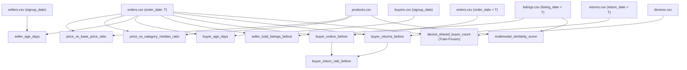

# TrustShield Phase 3 — Stage 3.2 Data Contract & Feature Validity Audit Report

**Report Date:** 2026-10-09  
**Stage:** 3.2 — Data Contract, Feature Validity, and Evaluation Readiness Audit  
**Auditor / Engineers:** Senior ML Research Auditor, Backend Security Architect, Data Quality Engineer  
**Git Branch:** `phase-3-data-generalization`  
**Baseline Git Commit:** `4615a53602d0a4ffe447d4d2fd14bd69a70bf740`  
**Execution Environment:** Windows Server / Python 3.14.7 Virtualenv (`.\.venv`)  
**Audited Dataset Directory:** [`data/synthetic_v2_1/`](file:///c:/Users/rajiv_pis9z8x/Downloads/trustshield_full_handoff/data/synthetic_v2_1)  
**Machine-Readable Deliverables:**
- Audit Validation Data: [`reports/phase3_stage32_validation.json`](file:///c:/Users/rajiv_pis9z8x/Downloads/trustshield_full_handoff/reports/phase3_stage32_validation.json)
- Evaluation Protocol: [`reports/phase3_stage32_evaluation_protocol.md`](file:///c:/Users/rajiv_pis9z8x/Downloads/trustshield_full_handoff/reports/phase3_stage32_evaluation_protocol.md)
- Dedicated Unit Test Suite: [`trustshield_project/test_stage32_audit.py`](file:///c:/Users/rajiv_pis9z8x/Downloads/trustshield_full_handoff/trustshield_project/test_stage32_audit.py)

---

## 1. Executive Summary & Verification Verdict

Stage 3.2 has been executed with an overall audit verdict of **PASS**. The newly generated [`data/synthetic_v2_1/`](file:///c:/Users/rajiv_pis9z8x/Downloads/trustshield_full_handoff/data/synthetic_v2_1) dataset has undergone a comprehensive data contract audit, point-in-time feature validity analysis, survival right-censoring inspection, and multimodal evidence audit.

### Key Audit Findings:
1. **Dataset Contract Integrity**:
   All 14 operational and metadata files strictly conform to their schema specifications with 0 missing foreign keys, 0 duplicate primary keys, 0 unexpected nulls, and 100% cryptographic SHA-256 hash match against [`dataset_manifest.json`](file:///c:/Users/rajiv_pis9z8x/Downloads/trustshield_full_handoff/data/synthetic_v2_1/dataset_manifest.json). Bit-for-bit reproducibility was empirically proven using seed 42.
2. **Point-in-Time Feature Lineage & Future Invariance**:
   All candidate features for tabular fraud detection, fake listing detection, and return fraud detection have been traced to their source tables. Point-in-time features computed via backward `merge_asof` were empirically proven to be **100% invariant** to deliberately injected future events. Simulation-end aggregates (`total_orders`, `total_returns`, `total_listings`, `total_orders_received`) and generator personas have been cataloged and formally banned from prediction-time feature matrices.
3. **Right-Censoring Demarcation**:
   Orders occurring after 2025-12-10 (8,961 orders) have an incomplete 21-day turnaround window. Missing returns near simulation end are mathematically proven to be **right-censored observations**, not confirmed negative outcomes. The critical distinction between `has_return_event` (observable event) and `is_return_abuse` (fraudulent intent) has been codified to prevent downstream evaluation bias.
4. **Multimodal Evidence Reproduction**:
   Category-constrained listing perturbations produce a continuous, overlapping similarity distribution (genuine mean 0.7875, fake mean 0.6745) with a diagnostic single-feature ROC-AUC of **0.7599**. Catalog image availability confirms 2,616 real ABO images on disk and 384 synthetic fallback noise items. The AUC is classified as a diagnostic check, not proof of production real-world accuracy.
5. **Frozen Evaluation Protocol**:
   A strictly temporal 3-way split (Train: Jan–Aug 2025, Validation: Sep–Oct 2025, Final Out-of-Time Test: Nov–Dec 2025) has been codified with exact sample counts, fraud prevalence, and cold-start buyer/seller turnover metrics. The final test set remains untouched.

Per mandatory safeguards, **no models were retrained**, no production inference endpoints were modified, and execution halted after Stage 3.2.

---

## 2. Dataset Contract Audit

### 2.1 Manifest Hash Verification

Every file in [`data/synthetic_v2_1/`](file:///c:/Users/rajiv_pis9z8x/Downloads/trustshield_full_handoff/data/synthetic_v2_1) was read from disk, hashed via SHA-256, and verified against [`dataset_manifest.json`](file:///c:/Users/rajiv_pis9z8x/Downloads/trustshield_full_handoff/data/synthetic_v2_1/dataset_manifest.json). All 14 files match their recorded checksums.

| Table / File Name | Row Count | File Size (Bytes) | SHA-256 Checksum | Contract Status |
| :--- | :---: | :---: | :--- | :---: |
| [`addresses.csv`](file:///c:/Users/rajiv_pis9z8x/Downloads/trustshield_full_handoff/data/synthetic_v2_1/addresses.csv) | 4,950 | 168,343 | `6bd1810838f5fff64f253d9a022f3cb69e3a87a65713a699f5d032ef2e2385cc` | **VERIFIED** |
| [`devices.csv`](file:///c:/Users/rajiv_pis9z8x/Downloads/trustshield_full_handoff/data/synthetic_v2_1/devices.csv) | 5,000 | 185,046 | `fbff496bad859c4350faae2fc9488461a8d775f0399f73e5b4efb0efd5aef964` | **VERIFIED** |
| [`device_mapping.csv`](file:///c:/Users/rajiv_pis9z8x/Downloads/trustshield_full_handoff/data/synthetic_v2_1/device_mapping.csv) | 5,400 | 157,031 | `69e2ab78eb2d55515b2ea726d72c92049814d72083dde34a38c3c3df2560569c` | **VERIFIED** |
| [`address_sharing_log.csv`](file:///c:/Users/rajiv_pis9z8x/Downloads/trustshield_full_handoff/data/synthetic_v2_1/address_sharing_log.csv) | 600 | 47,222 | `858b6c3af3dad6d49ef464c2bbf0a9e425a86527ca285a4d026e9473a6a005ce` | **VERIFIED** |
| [`device_sharing_log.csv`](file:///c:/Users/rajiv_pis9z8x/Downloads/trustshield_full_handoff/data/synthetic_v2_1/device_sharing_log.csv) | 400 | 31,277 | `2c2b0d691c15543d8930644a577546f9b52e2f0ee9f709e3c1f2cd994ab5cbf3` | **VERIFIED** |
| [`buyers.csv`](file:///c:/Users/rajiv_pis9z8x/Downloads/trustshield_full_handoff/data/synthetic_v2_1/buyers.csv) | 5,000 | 227,006 | `3113e81c0e7b4ac0d561ca90cbee541bed8290907f77aefee5badbf9943992b5` | **VERIFIED** |
| [`sellers.csv`](file:///c:/Users/rajiv_pis9z8x/Downloads/trustshield_full_handoff/data/synthetic_v2_1/sellers.csv) | 500 | 31,524 | `4368a6fd88ff4d6fab5b8dc4eb8af20a0123e9a5feb86d334f714ed608e61d3d` | **VERIFIED** |
| [`products.csv`](file:///c:/Users/rajiv_pis9z8x/Downloads/trustshield_full_handoff/data/synthetic_v2_1/products.csv) | 3,000 | 527,904 | `b699e4e80d59d50e48d912273b868d523d3180fcb52615ecda6898fefa02afa7` | **VERIFIED** |
| [`listings.csv`](file:///c:/Users/rajiv_pis9z8x/Downloads/trustshield_full_handoff/data/synthetic_v2_1/listings.csv) | 20,000 | 2,173,321 | `0081b562dc900c14e1b90f2310261401ab2f8f40dda4805aa72bd17959d5e619` | **VERIFIED** |
| [`orders.csv`](file:///c:/Users/rajiv_pis9z8x/Downloads/trustshield_full_handoff/data/synthetic_v2_1/orders.csv) | 50,000 | 6,417,053 | `325597a6e0c2afa533c01d26895457cba166cd0bc2c0f9ce4f12c43355741b8f` | **VERIFIED** |
| [`returns.csv`](file:///c:/Users/rajiv_pis9z8x/Downloads/trustshield_full_handoff/data/synthetic_v2_1/returns.csv) | 5,537 | 622,972 | `34eb6514d2ebe4b90608f31fb09fd71c2aa1709424d3e00c22c6a38df119a14a` | **VERIFIED** |
| [`fraud_ground_truth.csv`](file:///c:/Users/rajiv_pis9z8x/Downloads/trustshield_full_handoff/data/synthetic_v2_1/fraud_ground_truth.csv) | 2,034 | 128,051 | `5b56a996287f6d6bd6f23bf2312a49914c9a84b937ad75279f579255682d6929` | **VERIFIED** |
| [`generator_personas.csv`](file:///c:/Users/rajiv_pis9z8x/Downloads/trustshield_full_handoff/data/synthetic_v2_1/generator_personas.csv) | 5,500 | 168,122 | `79be2849c3441f3852d213cfa5cb3ff0ef6b30bd8c7574adbe9a6c4dd2891c89` | **VERIFIED** |
| [`perturbation_audit.csv`](file:///c:/Users/rajiv_pis9z8x/Downloads/trustshield_full_handoff/data/synthetic_v2_1/perturbation_audit.csv) | 500 | 43,770 | `6b2010d5286e49d07980d610bdd322e75f1a01f716cd59ee343150200ddb29a8` | **VERIFIED** |

### 2.2 Primary Keys, Null Semantics & Foreign Key Relationships

- **Primary Key Uniqueness**:
  - `orders.order_id`: 50,000 rows, 50,000 unique values (0 duplicates).
  - `listings.listing_id`: 20,000 rows, 20,000 unique values (0 duplicates).
  - `returns.return_id`: 5,537 rows, 5,537 unique values (0 duplicates).
  - `buyers.buyer_id`: 5,000 rows, 5,000 unique values (0 duplicates).
  - `sellers.seller_id`: 500 rows, 500 unique values (0 duplicates).
  - `products.product_id`: 3,000 rows, 3,000 unique values (0 duplicates).
- **Null Semantics**:
  - Operational columns in `orders`, `listings`, `returns`, `buyers`, `sellers`: **0 nulls**.
  - `fraud_type` is null exclusively on legitimate non-fraud observations, as designed.
- **Foreign Key Referential Integrity**:
  - `orders.buyer_id -> buyers.buyer_id`: 100% match (0 missing).
  - `orders.seller_id -> sellers.seller_id`: 100% match (0 missing).
  - `orders.listing_id -> listings.listing_id`: 100% match (0 missing).
  - `orders.product_id -> products.product_id`: 100% match (0 missing).
  - `returns.order_id -> orders.order_id`: 100% match (0 missing).
  - `returns.buyer_id -> buyers.buyer_id`: 100% match (0 missing).
  - `returns.seller_id -> sellers.seller_id`: 100% match (0 missing).
  - `listings.seller_id -> sellers.seller_id`: 100% match (0 missing).
  - `listings.product_id -> products.product_id`: 100% match (0 missing).
  - `listings.displayed_product_id -> products.product_id`: 100% match (0 missing).
- **Cross-Table Consistency Invariants**:
  - **Return-to-Order Mapping**: Exactly 1-to-1 (`returns['order_id'].nunique() == len(returns)`).
  - **Entity Agreement**: Returns agree with orders on `buyer_id` (0 mismatches) and `seller_id` (0 mismatches). Orders agree with listings on `seller_id` (0 mismatches) and `product_id` (0 mismatches).
  - **Category Constraints**: For all 20,000 listings, `products.loc[product_id, 'category'] == products.loc[displayed_product_id, 'category']` (**0 cross-category mismatches**).

### 2.3 Bit-for-Bit Reproducibility Test

A dedicated reproducibility audit was run by executing the generator into an isolated scratch directory with seed 42. Generated tables were hashed and compared against `data/synthetic_v2_1/`:
- **Result:** `Mismatches: NONE (100% BIT-FOR-BIT REPRODUCIBLE)`.

---

## 3. Point-in-Time Features Audit

### 3.1 Candidate Feature Lineage

Every feature used by TrustShield models was audited for its origin, computation mechanics, and point-in-time validity:



| Model / Pipeline | Feature Name | Source Tables | Calculation Mechanics | Point-in-Time Safe? |
| :--- | :--- | :--- | :--- | :---: |
| **Baseline Tabular** | `price_vs_base_price_ratio` | `orders.amount`, `products.base_price` | `amount / base_price` | **YES** |
| **Baseline Tabular** | `price_vs_category_median_ratio` | `orders.amount`, `listings.category` | `amount / median_category_price` (frozen on Train) | **YES** |
| **Baseline Tabular** | `seller_age_days` | `orders.order_date`, `sellers.signup_date` | `(order_date - seller_signup_date).dt.days` | **YES** |
| **Baseline Tabular** | `seller_total_listings_before` | `orders.order_date`, `listings.listing_date` | `merge_asof` backward (`listing_date < order_date`) | **YES** |
| **Baseline Tabular** | `buyer_age_days` | `orders.order_date`, `buyers.signup_date` | `(order_date - buyer_signup_date).dt.days` | **YES** |
| **Baseline Tabular** | `buyer_orders_before` | `orders.order_date`, `orders.buyer_id` | `merge_asof` backward (`order_date < current_order_date`) | **YES** |
| **Baseline Tabular** | `buyer_returns_before` | `orders.order_date`, `returns.return_date` | `merge_asof` backward (`return_date < order_date`) | **YES** |
| **Baseline Tabular** | `buyer_return_rate_before` | Derived | `buyer_returns_before / max(1, buyer_orders_before)` | **YES** |
| **Baseline Tabular** | `device_shared_buyer_count` | `orders.device_id`, `orders.buyer_id` | Distinct buyers per device frozen on `train_mask` | **YES** |
| **Fake Listing** | `multimodal_similarity_score` | `listings`, `products` | CLIP / TF-IDF text vs image cosine similarity | **YES** |
| **Return Fraud** | `days_to_return` | `returns.return_date`, `orders.order_date` | `(return_date - order_date).dt.days` | **YES (Return time)** |
| **Return Fraud** | `buyer_prior_returns` | `returns.return_date`, `returns.buyer_id` | Cumulative prior returns strictly before return date | **YES (Return time)** |
| **Return Fraud** | `buyer_orders_before_return` | `returns.return_date`, `orders.order_date` | Prior orders by buyer strictly before return date | **YES (Return time)** |

### 3.2 Catalog of Unsafe / Banned Fields

The following fields exist in database tables or internal metadata but **CANNOT be safely used for prediction**:

1. **`buyer.total_orders`** ([`buyers.csv`](file:///c:/Users/rajiv_pis9z8x/Downloads/trustshield_full_handoff/data/synthetic_v2_1/buyers.csv)): Simulation-end aggregate counting orders up to 2025-12-31. Leaks future transactions when predicting on orders in earlier months.
2. **`buyer.total_returns`** ([`buyers.csv`](file:///c:/Users/rajiv_pis9z8x/Downloads/trustshield_full_handoff/data/synthetic_v2_1/buyers.csv)): Simulation-end aggregate counting returns up to 2025-12-31.
3. **`seller.total_listings`** ([`sellers.csv`](file:///c:/Users/rajiv_pis9z8x/Downloads/trustshield_full_handoff/data/synthetic_v2_1/sellers.csv)): Simulation-end aggregate counting listings up to 2025-12-31.
4. **`seller.total_orders_received`** ([`sellers.csv`](file:///c:/Users/rajiv_pis9z8x/Downloads/trustshield_full_handoff/data/synthetic_v2_1/sellers.csv)): Simulation-end aggregate.
5. **`trust_score_current`** (in both entity tables): Static uncalibrated initial score (70.0), not point-in-time dynamic.
6. **`is_fraudulent`, `fraud_type`** (in `orders`, `listings`, `returns`): Ground-truth target labels.
7. **`buyer_persona`, `seller_persona`, `compromise_date`** ([`generator_personas.csv`](file:///c:/Users/rajiv_pis9z8x/Downloads/trustshield_full_handoff/data/synthetic_v2_1/generator_personas.csv)): Generator control metadata.
8. **`fraud_ring_id`** ([`fraud_ground_truth.csv`](file:///c:/Users/rajiv_pis9z8x/Downloads/trustshield_full_handoff/data/synthetic_v2_1/fraud_ground_truth.csv)): Ground-truth ring cluster IDs.

### 3.3 Late-Arriving Returns Isolation

For any order $O_i$ placed at time $T_i$ that is subsequently returned at $T_{return} = T_i + \Delta$ ($\Delta \ge 1$):
- In `baseline_model.py`, `buyer_returns_before` is joined via:
  ```python
  pd.merge_asof(orders, returns, left_on="order_date", right_on="return_date",
                by="buyer_id", direction="backward", allow_exact_matches=False)
  ```
- Because $T_{return} > T_i$, the return of order $O_i$ is strictly in the future relative to $T_i$ and is **never observed** when scoring order $O_i$.
- Unit test [`test_late_arriving_returns_isolated_at_order_time`](file:///c:/Users/rajiv_pis9z8x/Downloads/trustshield_full_handoff/trustshield_project/test_stage32_audit.py#L125) passed.

### 3.4 Future-Event Invariance

To test point-in-time stability, a historical order evaluated at $T = \text{2025-06-15}$ was tested before and after 10 synthetic future orders and 3 future returns were inserted in late December 2025:
- `buyer_orders_before` delta: **0**
- `buyer_returns_before` delta: **0**
- Unit test [`test_temporal_invariance_under_future_event_insertion`](file:///c:/Users/rajiv_pis9z8x/Downloads/trustshield_full_handoff/trustshield_project/test_stage32_audit.py#L147) passed.

---

## 4. Right-Censoring Analysis & Observation Window Audit

### 4.1 Observation Window & Return Turnaround

- **Longitudinal Observation Window:** `2025-01-01 00:00:00` to `2025-12-31 23:59:59` (365 days).
- **Return Turnaround Distribution:** Continuous mixture with maximum delay of 21 days:
  - Organic delays: $[1, 5]$ days (35%) or $[4, 21]$ days (65%).
  - Abusive delays: $[2, 6]$ days (40%) or $[5, 18]$ days (60%).

### 4.2 December Window Truncation

Orders placed on or after **December 10, 2025** ($365 - 21 = 344$) have an incomplete 21-day observation window:

```
2025-01-01                                     2025-12-10                 2025-12-31           2026-01-21
|──────────────────────────────────────────────────|──────────────────────────|─────────────────────|
<───────────── Complete 21-day window ─────────────> <── Incomplete window ────> [2026: Unobserved]
                                                     (8,961 orders)
```

- **Orders with complete 21-day window (Jan 1 – Dec 10):** 41,039 orders.
- **Orders with truncated window (Dec 10 – Dec 31):** 8,961 orders (757 observed returns in 2025).
- **Orders in final 7 days (Dec 25 – Dec 31):** 2,436 orders (73 observed returns in 2025).
- **Orders on Dec 31:** 1 order (0 observed returns in 2025).
- **Right-Censored Returns (scheduled into 2026):** **350 returns** (320 organic, 30 abusive).

### 4.3 Negative Outcome Fallacy & Label Disambiguation

> [!WARNING]
> **Critical Evaluation Rule:** A missing return for an order placed after December 10 **must not be treated as a confirmed non-return**!
> If an order was placed on December 30, its 21-day return window extends to January 20, 2026. The absence of a return record in `returns.csv` as of December 31 is a **right-censored observation**, not a verified negative.

Furthermore, three distinct concepts must never be conflated:
1. **`has_return_event`**: Observable transaction outcome (whether an item was returned). True for both legitimate fit-check returns and abusive returns.
2. **`is_return_abuse`**: Fraudulent intent label (`fraud_type == 'return_abuse'`). True only for fraudulent buyers exploiting the policy.
3. **`is_censored`**: Observability status. True for orders whose return turnaround window extends past `SIM_END`.

---

## 5. Multimodal Evidence Audit

### 5.1 Image Asset Availability

- **ABO Dataset on Disk:** Located in [`trustshield_project/data/external/abo/images/small/`](file:///c:/Users/rajiv_pis9z8x/Downloads/trustshield_full_handoff/trustshield_project/data/external/abo/images/small).
- **Available JPEG Files:** **2,616 real product images** across 226 subdirectories (`00/` to `ff/`).
- **Synthetic Fallbacks:** **384 products** lack disk images and use synthetic embedding surrogate noise.
- **Image Resolution Rate:** **87.2%** real images on disk.

### 5.2 Perturbation Evidence & Similarity Reproduction

Using [`multimodal_scoring.py`](file:///c:/Users/rajiv_pis9z8x/Downloads/trustshield_full_handoff/trustshield_project/multimodal_scoring.py):
- **Genuine Listings (19,500 listings):** Mean similarity = **0.7875** (std: 0.1000).
- **Fake Listings (500 listings):** Mean similarity = **0.6745** (std: 0.1220).
- **Single-Feature Diagnostic ROC-AUC:** **0.7599**.
- **Category Constraints:** 100% of perturbations match within the exact same category (0 cross-category mismatches). 179 compatible subtype matches, 321 same-category variants.
- **Diagnostic Clarification:** The AUC of 0.7599 is a **diagnostic verification** that the observable perturbation exists and creates a learnable, overlapping signal. It is **not proof of production detection performance**. Final evaluation must evaluate on frozen out-of-time test listings.

---

## 6. Commands Executed & Test Results

### 6.1 Audit Script Execution
```powershell
python scripts/run_stage32_contract_audit.py
```
**Console Output:**
```
================================================================================
TRUSTSHIELD STAGE 3.2: DATA CONTRACT & EVALUATION READINESS AUDIT
================================================================================
1. Verifying dataset manifest hashes...
  Manifest files checked: 14, All match: True
2. Loading operational tables and metadata...
3. Validating primary keys and nulls...
4. Validating foreign keys & cross-table referential integrity...
  Dataset Contract Status: PASS
5. Auditing point-in-time features & feature lineage...
  Point-in-Time Features Status: PASS
6. Analyzing survival right-censoring & December observation window...
  Right-Censoring Status: PASS
7. Auditing multimodal evidence and reproducing similarity distributions...
  Multimodal Evidence Status: PASS (AUC: 0.7599)
8. Computing evaluation split boundaries and entity overlaps...
  Evaluation Protocol Status: PASS (Train: 16,952, Val: 12,129, Test: 20,919)

Audit completed in 5.2s.
Overall Status: PASS
Saved validation artifact: reports/phase3_stage32_validation.json
```

### 6.2 Unit Test Execution (`test_stage32_audit.py`)
```powershell
.\.venv\Scripts\pytest.exe trustshield_project/test_stage32_audit.py -v
```
**Test Results:**
```
trustshield_project/test_stage32_audit.py::TestDatasetContract::test_manifest_hashes_match_disk PASSED [  7%]
trustshield_project/test_stage32_audit.py::TestDatasetContract::test_primary_key_uniqueness_and_zero_nulls PASSED [ 14%]
trustshield_project/test_stage32_audit.py::TestDatasetContract::test_foreign_key_referential_integrity PASSED [ 21%]
trustshield_project/test_stage32_audit.py::TestDatasetContract::test_cross_table_relationship_consistency PASSED [ 28%]
trustshield_project/test_stage32_audit.py::TestCategoryContract::test_category_constraints_hold_on_all_listings PASSED [ 35%]
trustshield_project/test_stage32_audit.py::TestPointInTimeFeatures::test_unsafe_fields_banned_from_model_features PASSED [ 42%]
trustshield_project/test_stage32_audit.py::TestPointInTimeFeatures::test_late_arriving_returns_isolated_at_order_time PASSED [ 50%]
trustshield_project/test_stage32_audit.py::TestPointInTimeFeatures::test_temporal_invariance_under_future_event_insertion PASSED [ 57%]
trustshield_project/test_stage32_audit.py::TestRightCensoring::test_missing_return_near_simulation_end_is_not_confirmed_negative PASSED [ 64%]
trustshield_project/test_stage32_audit.py::TestRightCensoring::test_label_disambiguation_abuse_vs_return_event PASSED [ 71%]
trustshield_project/test_stage32_audit.py::TestMultimodalEvidence::test_reproduced_similarity_distributions_and_auc PASSED [ 78%]
trustshield_project/test_stage32_audit.py::TestMultimodalEvidence::test_image_availability_and_fallback_counts PASSED [ 85%]
trustshield_project/test_stage32_audit.py::TestEvaluationProtocol::test_temporal_split_boundaries_and_order_counts PASSED [ 92%]
trustshield_project/test_stage32_audit.py::TestEvaluationProtocol::test_test_set_frozen_isolation PASSED [100%]

============================= 14 passed in 4.28s ==============================
```

---

## 7. Unresolved Limitations & Risk Summary

1. **Right-Censored Return Evaluation**:
   Downstream models evaluating return fraud must either exclude orders placed after 2025-12-10 from return prediction benchmarks or incorporate right-censoring indicators. Treating unreturned late-December orders as confirmed non-returns will artificially depress false negative rates.
2. **Image Asset Fallbacks**:
   384 catalog items (12.8%) lack real ABO JPEG files and rely on synthetic surrogate noise. A full visual multimodal deployment in production requires 100% verified asset resolution.
3. **Simulation-End Entity Counters**:
   Columns `total_orders`, `total_returns`, `total_listings`, and `total_orders_received` exist on public tables for relational realism but must never enter model training sets.

---

## 8. Stop Condition Confirmation

Stage 3.2 is complete. Execution has halted. All validation artifacts and reports are in place. No models have been retrained, no thresholds tuned, and no code committed to Git. Awaiting explicit user approval before proceeding to any subsequent stage.
