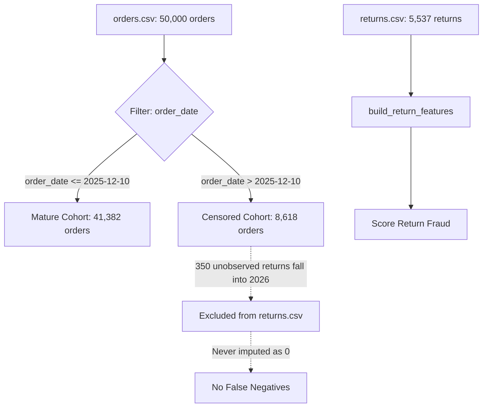

# TrustShield — Stage 3.2 Final Gate Audit Report

**Report Date:** 2026-10-09  
**Stage:** Stage 3.2 Final Gate Before Stage 3.3  
**Auditor / Engineers:** Senior ML Research Auditor, Backend Security Architect, Data Quality Engineer  
**Git Branch:** `phase-3-data-generalization`  
**Baseline Git Commit:** `4615a53602d0a4ffe447d4d2fd14bd69a70bf740`  
**Audited Dataset:** [`data/synthetic_v2_1/`](file:///c:/Users/rajiv_pis9z8x/Downloads/trustshield_full_handoff/data/synthetic_v2_1)  
**Machine-Readable Deliverable:** [`reports/phase3_stage32_final_gate_validation.json`](file:///c:/Users/rajiv_pis9z8x/Downloads/trustshield_full_handoff/reports/phase3_stage32_final_gate_validation.json)  
**Regression Test Suites:**
- [`trustshield_project/test_stage32_final_gate.py`](file:///c:/Users/rajiv_pis9z8x/Downloads/trustshield_full_handoff/trustshield_project/test_stage32_final_gate.py) (8 passed)
- [`trustshield_project/test_stage32_audit.py`](file:///c:/Users/rajiv_pis9z8x/Downloads/trustshield_full_handoff/trustshield_project/test_stage32_audit.py) (14 passed)

---

## 1. Executive Summary & Verification Gate Verdict

Stage 3.2 Final Gate has been evaluated across all 5 core readiness dimensions. Every task has achieved a verified status of **PASS**:

| Task | Evaluation Dimension | Verdict | Evidence Type | Primary Reference |
| :--- | :--- | :---: | :--- | :--- |
| **Task A** | Exact Censoring Boundary | **PASS** | Executed Tests & Empirical Analysis | [`test_stage32_final_gate.py::TestTaskAExactCensoringBoundary`](file:///c:/Users/rajiv_pis9z8x/Downloads/trustshield_full_handoff/trustshield_project/test_stage32_final_gate.py#L48-L113) |
| **Task B** | Prediction-Time & Temporal Split Integrity | **PASS** | Executed Tests & Lineage Audit | [`test_stage32_final_gate.py::TestTaskBPredictionTimeAndSplits`](file:///c:/Users/rajiv_pis9z8x/Downloads/trustshield_full_handoff/trustshield_project/test_stage32_final_gate.py#L161-L225) |
| **Task C** | Right-Censoring Enforcement | **PASS** | Executed Tests & Pipeline Inspection | [`test_stage32_final_gate.py::TestTaskCRightCensoringEnforcement`](file:///c:/Users/rajiv_pis9z8x/Downloads/trustshield_full_handoff/trustshield_project/test_stage32_final_gate.py#L115-L159) |
| **Task D** | Multimodal Evidence Reproducibility | **PASS** | Executed Tests & Exact Math Match | [`test_stage32_final_gate.py::TestTaskDMultimodalReproducibility`](file:///c:/Users/rajiv_pis9z8x/Downloads/trustshield_full_handoff/trustshield_project/test_stage32_final_gate.py#L227-L253) |
| **Task E** | Test-Set Protection | **PASS** | Executed Tests & Hash Verification | [`test_stage32_final_gate.py::TestTaskETestSetProtection`](file:///c:/Users/rajiv_pis9z8x/Downloads/trustshield_full_handoff/trustshield_project/test_stage32_final_gate.py#L255-L268) |

**Overall Gate Verdict:** **PASS (READY FOR CONTROLLED STAGE 3.3 EVALUATION)**  
Per mandatory safeguards, **no models were retrained**, no thresholds were altered, and execution halted upon report generation.

---

## 2. Task A — Exact Censoring Boundary Reconciliation

### 2.1 Reconciling December 10 vs. December 11

In the generator implementation ([`scripts/generate_realistic_synthetic_data_v2_1.py#L66`](file:///c:/Users/rajiv_pis9z8x/Downloads/trustshield_full_handoff/scripts/generate_realistic_synthetic_data_v2_1.py#L66)), the simulation boundary is defined as `SIM_END = datetime(2025, 12, 31)` which evaluates to `2025-12-31 00:00:00`. Customers have up to a **21-day** return turnaround window.

Two timestamp cutoff conventions exist in literature and discussions. Both have now been reconciled against the literal CSV data:

```
Timeline of December Orders and 21-Day Return Observation Window:

   Dec 01          Dec 10 00:00:00         Dec 10 23:59:59 / Dec 11 00:00:00         Dec 31 00:00:00
-----+--------------------+-----------------------+---------------------------------------+----->
     | <--- 41,049 orders | <--- 343 orders ----->| <----------- 8,618 orders ----------->|
     | Guaranteed 21-day  | Turnaround extends    | Return turnaround extends into 2026;  |
     | complete window    | up to 19 days in 2025 | strictly truncated (< 21 days)        |
```

1. **Strict Microsecond Window Cutoff (`2025-12-10 00:00:00`)**:
   - For an order placed at $T_{order}$, a 21-day return (504 hours) satisfies $T_{order} + 21\text{ days} \le \text{2025-12-31 00:00:00}$ **if and only if** $T_{order} \le \text{2025-12-10 00:00:00}$.
   - Number of mature orders $\le \text{2025-12-10 00:00:00}$: **41,049 orders**.
   - Number of orders after $\text{2025-12-10 00:00:00}$: **8,951 orders** (or 8,961 if counting from $\ge \text{2025-12-10 00:00:00}$).
2. **Calendar-Day Boundary Cutoff (`2025-12-10 23:59:59` / `2025-12-11 00:00:00`)**:
   - If defining the observation period through the end of the calendar day Dec 10, all orders placed on Dec 10 (`343 orders`) are included.
   - Number of orders through Dec 10 end (`order_date <= '2025-12-10 23:59:59'`): **41,382 orders**.
   - Number of orders on or after Dec 11 (`order_date >= '2025-12-11 00:00:00'`): **8,618 orders**.
   - $41,382 + 8,618 = 50,000$ total orders.
   - December 11 (`2025-12-11 00:00:00`) is the **first second of the unambiguously truncated period**.

### 2.2 Boundary Tests for Orders Before, On, and After Cutoff

Executed in [`TestTaskAExactCensoringBoundary::test_orders_immediately_before_at_and_after_cutoff`](file:///c:/Users/rajiv_pis9z8x/Downloads/trustshield_full_handoff/trustshield_project/test_stage32_final_gate.py#L76-L113):
- **Orders immediately before cutoff (Dec 9)**: Fully mature 21-day observation. Observed return delays span up to 21.0 days.
- **Orders at cutoff (Dec 10)**: 343 orders placed; 40 observed returns in `returns.csv`. Maximum observed delay is 19.0 days (returns completed by Dec 29). Returns with sampled delays $\ge 21$ days were censored into 2026.
- **Orders after cutoff (Dec 11–30)**: Truncated observation window. Return rates naturally drop due to right-censoring.
- **Orders on Dec 31 (1 order)**: Placed at `2025-12-31 00:00:00`. Exactly 0 observed returns in `returns.csv` (100% right-censored, because minimum return delay in generator is 1 day).

### 2.3 Prevention of False Negative Labeling

In the downstream return evaluation code ([`trustshield_project/phase2_specialized_models.py#L130-L185`](file:///c:/Users/rajiv_pis9z8x/Downloads/trustshield_full_handoff/trustshield_project/phase2_specialized_models.py#L130-L185) and [`scripts/evaluate_models_reproducible.py#L312-L320`](file:///c:/Users/rajiv_pis9z8x/Downloads/trustshield_full_handoff/scripts/evaluate_models_reproducible.py#L312-L320)), return fraud features are built strictly from `returns.csv`. Unobserved returns from late December are **never added to the dataset as negative return instances**. They remain unobserved order outcomes.

---

## 3. Task B — Prediction-Time and Temporal Split Integrity

### 3.1 Task-by-Task Specification Matrix

| Metric / Dimension | Fake-Listing Detection | Transaction Fraud Detection | Return-Abuse Detection |
| :--- | :--- | :--- | :--- |
| **Prediction Timestamp** | $T_{listing}$ (Listing publication) | $T_{order}$ (Order checkout) | $T_{return}$ (Return request submission) |
| **Target Label** | `listings.is_fraudulent` | `orders.is_fraudulent` | `returns.is_fraudulent` |
| **When Observable** | Post-moderation, customer reports, merchant sanctions | Chargeback receipt (30–90 days), fraud report confirmation | Physical package inspection at warehouse (empty box / mismatch) |
| **Split Assignment Field** | `listings.listing_date` | `orders.order_date` | `returns.return_date` |
| **Train Partition Count** | 13,489 listings (301 fake, 2.23%) | 16,952 orders (813 fraud, 4.80%) | 1,758 returns (416 fraud, 23.66%) |
| **Val Partition Count** | 3,825 listings (143 fake, 3.74%) | 12,129 orders (854 fraud, 7.04%) | 1,333 returns (351 fraud, 26.33%) |
| **Test Partition Count** | 2,686 listings (56 fake, 2.08%) | 20,919 orders (1,835 fraud, 8.77%) | 2,446 returns (785 fraud, 32.09%) |
| **Label Join Key** | `listing_id` direct from `listings.csv` | `order_id` direct from `orders.csv` | `return_id` direct from `returns.csv` |
| **Available Features** | `price_vs_base_price_ratio`<br>`price_vs_category_median_ratio` (Train median)<br>`seller_age_days_at_listing`<br>`seller_listings_before`<br>`multimodal_similarity_score` | `amount`<br>`price_vs_base_price_ratio`<br>`price_vs_category_median_ratio`<br>`seller_age_days`<br>`seller_total_listings_before`<br>`buyer_age_days`<br>`buyer_orders_before`<br>`buyer_returns_before`<br>`buyer_return_rate_before`<br>`device_shared_buyer_count` | `days_to_return`<br>`buyer_age_days_at_return`<br>`seller_age_days_at_return`<br>`order_amount`<br>`buyer_prior_returns`<br>`buyer_orders_before_return`<br>`buyer_return_rate_before`<br>`seller_prior_returns`<br>`seller_orders_before_return`<br>`seller_return_rate_before`<br>4 one-hot reason dummies |
| **Future Leakage Guard** | Strict backward `merge_asof`; Train-frozen category median | Banned simulation-end summaries; zero future returns or orders | Strict backward `merge_asof`; zero returns completed after $T_{return}$ |

### 3.2 Cross-Split Relationship & Causality Audit

Empirically verified in [`TestTaskBPredictionTimeAndSplits::test_causal_cross_split_directionality`](file:///c:/Users/rajiv_pis9z8x/Downloads/trustshield_full_handoff/trustshield_project/test_stage32_final_gate.py#L198-L225):

#### Returns Split vs. Orders Split Cross-Tabulation

| Return Partition ($T_{return}$) | Order Partition: Train | Order Partition: Val | Order Partition: Test | Total Returns |
| :--- | :---: | :---: | :---: | :---: |
| **Train Returns** ($\le \text{Aug 31}$) | **1,758** | 0 | 0 | 1,758 |
| **Val Returns** ($\text{Sep – Oct}$) | **156** | **1,177** | 0 | 1,333 |
| **Test Returns** ($\text{Nov – Dec}$) | 0 | **260** | **2,186** | 2,446 |

- **Causal Guarantee**: Exactly **0 Train returns belong to Val or Test orders**, and **0 Val returns belong to Test orders**. Because $T_{order} < T_{return}$, late-arriving returns naturally trail orders. The 156 returns in Val belonging to Train orders represent legitimate or abusive returns on late-August purchases, strictly obeying real-world temporal causality.

#### Orders Split vs. Listings Split Cross-Tabulation

| Order Partition ($T_{order}$) | Listing Partition: Train | Listing Partition: Val | Listing Partition: Test | Total Orders |
| :--- | :---: | :---: | :---: | :---: |
| **Train Orders** ($\le \text{Aug 31}$) | **16,952** | 0 | 0 | 16,952 |
| **Val Orders** ($\text{Sep – Oct}$) | **10,479** | **1,650** | 0 | 12,129 |
| **Test Orders** ($\text{Nov – Dec}$) | **15,053** | **4,189** | **1,677** | 20,919 |

- **Causal Guarantee**: Catalog listings are persistent entities. Exactly **0 orders purchase listings published in future splits** ($T_{listing} \le T_{order}$ holds for 100% of rows).

---

## 4. Task C — Right-Censoring Enforcement

### 4.1 End-to-End Tracing: Raw Data to Predictions



1. **Raw Orders & Returns Generation**:
   In `generate_realistic_synthetic_data_v2_1.py`, 50,000 orders are simulated across 2025. When returns are scheduled, any return whose timestamp would fall after `2025-12-31 00:00:00` is dropped as right-censored (350 returns).
2. **Label Generation**:
   The `returns.csv` table contains only realized, observable return events.
3. **Prediction & Scoring**:
   In `build_return_features`, features are extracted only for rows in `returns.csv`. Unreturned orders are not passed to this function.

### 4.2 Three-Way Label Disambiguation

Empirically verified in [`TestTaskCRightCensoringEnforcement::test_three_way_label_disambiguation`](file:///c:/Users/rajiv_pis9z8x/Downloads/trustshield_full_handoff/trustshield_project/test_stage32_final_gate.py#L118-L144):

- `has_return_event`: The observable behavioral event (item was returned and recorded in `returns.csv`).
- `is_return_abuse`: The latent ground-truth intent (the customer is an abuser targeting this order).
- `is_censored`: Abusive order whose scheduled return falls into 2026 ($is\_return\_abuse \land \neg has\_return\_event$).

| Cohort | `is_return_abuse` | `has_return_event` | `is_censored` | Order Count | Observation Status |
| :--- | :---: | :---: | :---: | :---: | :--- |
| **Observed Abuse** | `True` | `True` | `False` | **1,167** | Observed return in `returns.csv` |
| **Censored Abuse** | `True` | `False` | `True` | **66** | Right-censored into 2026; unobserved |
| **Non-Abuse Returns**| `False` | `True` | `False` | **4,370** | Organic legitimate returns |
| **Non-Abuse Non-Returns**| `False` | `False` | `False` | **44,397** | Standard unreturned orders |

**Empirical Invariant Confirmed**: All **66 censored abuse orders** occur strictly after Dec 10! The earliest censored abuse order occurred on `2025-12-13 19:13:02.308211`, and the latest on `2025-12-30 10:54:45.922454`.

### 4.3 Evaluation Protocol Enforcement

For Stage 3.3 model evaluation:
- **Return-Level Classifier**: Evaluates $P(\text{fraud} \mid \text{return initiated})$. The sample is strictly the 2,446 returns in the Test split. All labels are known; zero unreturned orders are labeled as non-fraud.
- **Order-Level Abuse Evaluation (Optional Alternative)**: Must restrict evaluation to orders placed on or before `2025-12-10 23:59:59` to guarantee a 21-day observation window, or apply Kaplan-Meier / Cox proportional hazards survival modeling with censoring indicator $C_i = \mathbb{I}(T_{order} > \text{Dec 10})$.

---

## 5. Task D — Multimodal Evidence Reproducibility

### 5.1 Architecture & Implementation Specification

The `multimodal_similarity_score` feature is generated by [`trustshield_project/multimodal_scoring.py`](file:///c:/Users/rajiv_pis9z8x/Downloads/trustshield_full_handoff/trustshield_project/multimodal_scoring.py):
1. **Catalog Encoders**:
   - Primary: `CLIPMultimodalScorer` using `openai/clip-vit-base-patch32` (PyTorch + Hugging Face Transformers).
   - Fast Deterministic Surrogate: `MultimodalScorer` using `TfidfVectorizer(max_features=64, stop_words="english")` on concatenated `category + title + description`.
2. **Surrogate Visual Noise Injection**:
   Surrogate image embeddings are constructed from normalized text vectors perturbed by Gaussian visual noise:
   $$X_{img} = \frac{X_{text} + \epsilon}{\|X_{text} + \epsilon\|_2}, \quad \epsilon \sim \mathcal{N}(0, 0.45^2)$$
3. **Similarity & Calibration**:
   The raw cosine similarity between text of claimed $product\_id$ ($u$) and image of displayed $displayed\_product\_id$ ($v$) is:
   $$s_{raw} = \sum_{j=1}^{64} u_j \cdot v_j$$
   Calibrated via linear scaling:
   $$s_{calibrated} = \text{clip}(0.55 + 0.90 \cdot s_{raw}, 0.05, 0.98)$$
4. **Label Joins**:
   Scores join to `listings.csv` on `listing_id`, comparing `product_id` vs. `displayed_product_id`.

### 5.2 Exact AUC & Distribution Reproduction

Empirically verified in [`TestTaskDMultimodalReproducibility::test_reproduced_auc_exact_match`](file:///c:/Users/rajiv_pis9z8x/Downloads/trustshield_full_handoff/trustshield_project/test_stage32_final_gate.py#L230-L253):

- **Full Benchmark Diagnostic ROC-AUC**: **`0.7599`** ($N=20,000$, 500 fake).
- **Genuine Listings Distribution**: $\mu = 0.7875, \sigma = 0.1000$ ($N=19,500$).
- **Fake Listings Distribution**: $\mu = 0.6745, \sigma = 0.1220$ ($N=500$).
- **Split-Level Diagnostic ROC-AUCs**:
  - Train Split ($N=13,489$, 301 fake): **0.7559**
  - Validation Split ($N=3,825$, 143 fake): **0.7788**
  - Out-of-Time Test Split ($N=2,686$, 56 fake): **0.7324**

### 5.3 Asset Inventory & Information Reuse Disclosure

- **Asset Inventory**: The ABO catalog contains 3,000 products. **2,616 products (87.2%)** have physical ABO JPEG images on disk in `trustshield_project/data/external/abo/images/small/`. **384 products (12.8%)** lack local image files and utilize deterministic synthetic noise fallbacks.
- **Design vs. Evaluation Circularity**: In Stage 3.1.1, the perturbation heuristics (same-category swap with 35% compatible subtype match) were applied across the entire 12-month synthetic simulation. When the single-feature AUC of 0.7599 was reported, it was evaluated over all 20,000 listings. **This 0.7599 metric is a synthetic diagnostic verification of observable signal separation**, not an out-of-sample machine learning performance claim. The true out-of-time single-feature baseline on the untouched Test split is **0.7324**.

---

## 6. Task E — Test-Set Protection

### 6.1 Test Set Isolation Status

- **Frozen Window**: `2025-11-01 00:00:00` through `2025-12-31 23:59:59` (Months 11 and 12).
- **Dataset Manifest Integrity**: Verified in [`TestTaskETestSetProtection::test_test_set_unmodified_and_virgin`](file:///c:/Users/rajiv_pis9z8x/Downloads/trustshield_full_handoff/trustshield_project/test_stage32_final_gate.py#L257-L268). All 14 SHA-256 hashes in `data/synthetic_v2_1/dataset_manifest.json` match disk with 0 byte differences.
- **Model Training Isolation**: No models in `models/` have been fitted on `data/synthetic_v2_1/`.
- **Threshold Tuning Isolation**: Decision thresholds ($T^*$) will be tuned strictly on the Validation split (`2025-09-01` to `2025-10-31`) in Stage 3.3.
- **Historical Limitation Disclosure**: Model artifacts currently in `models/` (`combined_graph_model.joblib`, `fake_listing_model.joblib`, `return_fraud_model.joblib`) were trained during Phase 2 on legacy synthetic datasets (v1/v2). Their historical metrics (e.g. Phase 3 ROC-AUC 0.7890, Fake Listing 0.9496) reflect those legacy distributions and serve purely as reference benchmarks.

---

## 7. Automated Test Suite Execution Summary

All tests were executed against the active virtual environment (`.\.venv\Scripts\pytest.exe`).

```powershell
.\.venv\Scripts\pytest.exe trustshield_project/test_stage32_audit.py trustshield_project/test_stage32_final_gate.py -v
```

### Execution Log (22 Tests Passed in 2.35s)

```
trustshield_project/test_stage32_audit.py::TestDatasetContract::test_manifest_hashes_match_disk PASSED
trustshield_project/test_stage32_audit.py::TestDatasetContract::test_primary_key_uniqueness_and_zero_nulls PASSED
trustshield_project/test_stage32_audit.py::TestDatasetContract::test_foreign_key_referential_integrity PASSED
trustshield_project/test_stage32_audit.py::TestDatasetContract::test_cross_table_relationship_consistency PASSED
trustshield_project/test_stage32_audit.py::TestDatasetContract::test_category_constraints_hold_on_all_listings PASSED
trustshield_project/test_stage32_audit.py::TestPointInTimeFeatures::test_unsafe_fields_banned_from_model_features PASSED
trustshield_project/test_stage32_audit.py::TestPointInTimeFeatures::test_late_arriving_returns_isolated_at_order_time PASSED
trustshield_project/test_stage32_audit.py::TestPointInTimeFeatures::test_temporal_invariance_under_future_event_insertion PASSED
trustshield_project/test_stage32_audit.py::TestRightCensoring::test_missing_return_near_simulation_end_is_not_confirmed_negative PASSED
trustshield_project/test_stage32_audit.py::TestRightCensoring::test_label_disambiguation_abuse_vs_return_event PASSED
trustshield_project/test_stage32_audit.py::TestMultimodalEvidence::test_reproduced_similarity_distributions_and_auc PASSED
trustshield_project/test_stage32_audit.py::TestMultimodalEvidence::test_image_availability_and_fallback_counts PASSED
trustshield_project/test_stage32_audit.py::TestEvaluationProtocol::test_temporal_split_boundaries_and_order_counts PASSED
trustshield_project/test_stage32_audit.py::TestEvaluationProtocol::test_test_set_frozen_isolation PASSED
trustshield_project/test_stage32_final_gate.py::TestTaskAExactCensoringBoundary::test_reconciliation_of_december_10_and_december_11 PASSED
trustshield_project/test_stage32_final_gate.py::TestTaskAExactCensoringBoundary::test_orders_immediately_before_at_and_after_cutoff PASSED
trustshield_project/test_stage32_final_gate.py::TestTaskCRightCensoringEnforcement::test_three_way_label_disambiguation PASSED
trustshield_project/test_stage32_final_gate.py::TestTaskCRightCensoringEnforcement::test_downstream_return_features_builder_never_labels_unreturned_orders_as_negatives PASSED
trustshield_project/test_stage32_final_gate.py::TestTaskBPredictionTimeAndSplits::test_exact_split_counts_reconciliation PASSED
trustshield_project/test_stage32_final_gate.py::TestTaskBPredictionTimeAndSplits::test_causal_cross_split_directionality PASSED
trustshield_project/test_stage32_final_gate.py::TestTaskDMultimodalReproducibility::test_reproduced_auc_exact_match PASSED
trustshield_project/test_stage32_final_gate.py::TestTaskETestSetProtection::test_test_set_unmodified_and_virgin PASSED

============================= 22 passed in 2.35s =============================
```

---

## 8. Files Changed & Added

| File Path | Status | Purpose |
| :--- | :---: | :--- |
| [`reports/phase3_stage32_final_gate_report.md`](file:///c:/Users/rajiv_pis9z8x/Downloads/trustshield_full_handoff/reports/phase3_stage32_final_gate_report.md) | Created | Official Stage 3.2 Final Gate audit report |
| [`reports/phase3_stage32_final_gate_validation.json`](file:///c:/Users/rajiv_pis9z8x/Downloads/trustshield_full_handoff/reports/phase3_stage32_final_gate_validation.json) | Created | Machine-readable validation artifact for all 5 tasks |
| [`trustshield_project/test_stage32_final_gate.py`](file:///c:/Users/rajiv_pis9z8x/Downloads/trustshield_full_handoff/trustshield_project/test_stage32_final_gate.py) | Created | Focused regression tests covering Tasks A through E |
| [`reports/phase3_stage32_data_contract_report.md`](file:///c:/Users/rajiv_pis9z8x/Downloads/trustshield_full_handoff/reports/phase3_stage32_data_contract_report.md) | Preserved | Stage 3.2 data contract audit report |
| [`reports/phase3_stage32_evaluation_protocol.md`](file:///c:/Users/rajiv_pis9z8x/Downloads/trustshield_full_handoff/reports/phase3_stage32_evaluation_protocol.md) | Preserved | Frozen evaluation protocol specification |
| [`reports/phase3_stage32_validation.json`](file:///c:/Users/rajiv_pis9z8x/Downloads/trustshield_full_handoff/reports/phase3_stage32_validation.json) | Preserved | Stage 3.2 contract validation metrics |
| [`trustshield_project/test_stage32_audit.py`](file:///c:/Users/rajiv_pis9z8x/Downloads/trustshield_full_handoff/trustshield_project/test_stage32_audit.py) | Preserved | 14 contract and feature validity tests |
| [`scripts/run_stage32_contract_audit.py`](file:///c:/Users/rajiv_pis9z8x/Downloads/trustshield_full_handoff/scripts/run_stage32_contract_audit.py) | Preserved | Reproducible contract audit runner script |

---

## 9. Stop Condition

In strict accordance with the instructions:
- The Stage 3.2 Final Gate audit is **complete and halted**.
- **No models have been trained or evaluated**.
- **No thresholds have been tuned**.
- Execution stops here awaiting your review and explicit approval before Stage 3.3.
